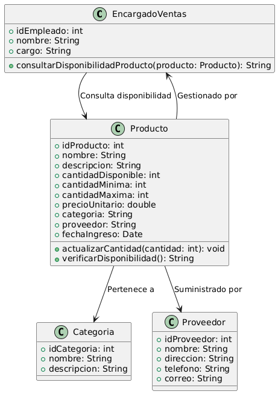

# GESTIÓN DE INVENTARIO 

------

## Caso de uso historia 
Carlos, encargado de ventas, recibe una solicitud de un cliente interesado en varios productos. Para verificar si están disponibles, accede al sistema de gestión de inventarios y busca los productos solicitados.El sistema muestra el stock actual de cada producto, permitiéndole confirmar su disponibilidad. Con esta información, Carlos informa al cliente sobre qué productos están en stock y puede proceder a gestionar el pedido.

---

<table id="customers">
  <tr class="idtext principal">
    <td>ID SYN-15</td>
  </tr>
  <tr class="single text">
    <td><strong>Requerimiento</strong>:Consultar la disponibilidad de productos. ID SYN-15</td>
  </tr>
  <tr class="single gray">
    <td><strong>Historia de usuario</strong></td>
  </tr>
  <tr class="single text">
    <td>Como encargado de ventas quiero consultar la disponibilidad de productos para verificar si los productos están en stock y poder informar a los clientes sobre su disponibilidad.
</td>
  </tr>
  <tr class="duo">
    <th class="gray"><strong>Estado de la tarea</strong></th>
    <th>En desarrollo</th>
  </tr>
  <tr class="single gray">
    <td><strong>Caso de uso (Pasos)</strong></td>
  </tr>
  <tr class="single text">
    <td>
        <ol>
            <li>El encargado de ventas accede al sistema y selecciona la opción "Consultar Disponibilidad de Productos".</li>
            <li>El sistema solicita al encargado que ingrese el nombre del producto o código que desea consultar.</li>
            <li>El encargado ingresa el nombre o código del producto y confirma la búsqueda.</li>
            <li>El sistema muestra la disponibilidad del producto.</li>
            <li>El encargado puede revisar la disponibilidad y tomar decisiones para informar al cliente o realizar una nueva orden de compra.</li>
        </ol>
    </td>
  </tr>
  <tr class="single gray">
    <td><strong>Criterios de aceptación</strong></td>
  </tr>
  <tr class="single text">
    <td>
        <ol>
                  <li>El sistema debe permitir al encargado de ventas buscar productos por nombre o código.</li>
                  <li>El sistema debe mostrar la cantidad disponible de un producto en tiempo real.</li>
                  <li>El sistema debe mostrar el nivel mínimo de stock para el producto si está configurado.</li>
                  <li>El sistema debe mostrar la ubicación del producto en el almacén si dicha información está disponible.</li>
                  <li>El encargado debe poder realizar múltiples consultas de disponibilidad de productos en una sola sesión.</li>
              </ol>
 <tr class="duo">
    <th class="gray"><strong>Calidad</strong></th>
    <th>En desarrollo</th>
  </tr>
  <tr class="duo">
    <th class="gray"><strong>Versionamiento</strong></th>
    <th>En desarrollo</th>
  </tr>
</table>

---
## Diagrama de Caso de uso
[Creado con plantuml](https://plantuml.com/es/)

---
 