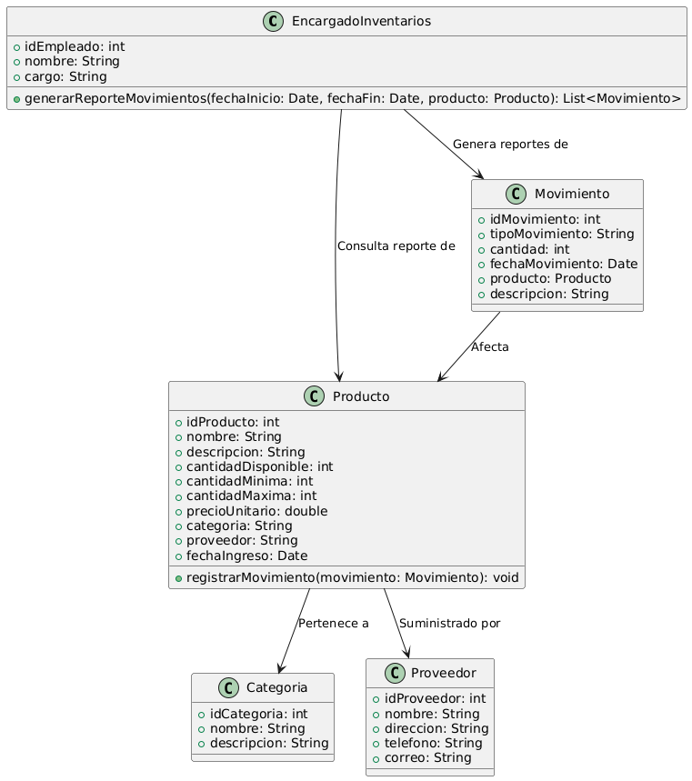

# GESTIÓN DE INVENTARIO 

------

## Caso de uso historia 
Ana, encargada de inventarios, necesita analizar la rotación de productos. Accede al sistema de gestión de inventarios y selecciona la opción para generar reportes de movimientos.Filtra los datos por rango de fechas y productos específicos. El sistema genera un reporte detallado con entradas, salidas y ajustes realizados, lo que le permite identificar tendencias y tomar decisiones sobre el manejo del inventario.

---

  <tr class="idtext principal">
    <td>ID SYN-16</td>
  </tr>
  <tr class="single text">
    <td><strong>Requerimiento</strong>:Generar reportes de movimientos por fecha o producto. ID SYN-16</td>
  </tr>
  <tr class="single gray">
    <td><strong>Historia de usuario</strong></td>
  </tr>
  <tr class="single text">
    <td>Como encargado de inventarios quiero generar reportes de movimientos de productos por fecha o producto para tener un registro detallado de los movimientos de inventario y poder analizar la rotación de productos.
</td>
  </tr>
  <tr class="duo">
    <th class="gray"><strong>Estado de la tarea</strong></th>
    <th>En desarrollo</th>
  </tr>
  <tr class="single gray">
    <td><strong>Caso de uso (Pasos)</strong></td>
  </tr>
  <tr class="single text">
    <td>
        <ol>
            <li>
             <li>El encargado de inventarios accede al sistema y selecciona la opción "Generar Reporte de Movimientos".</li>
            <li>El sistema solicita los filtros para generar el reporte: Fecha, Producto.</li>
            <li>El encargado ingresa los filtros deseados (fecha o producto) y hace clic en "Generar Reporte".</li>
            <li>El sistema consulta la base de datos y genera el reporte con la información detallada.</li>
            <li>El sistema muestra el reporte en pantalla, con opciones para exportarlo en formatos como PDF o Excel.</li>
            <li>El encargado puede revisar el reporte y, si es necesario, exportarlo para su análisis o envío.</li>
        </ol>
    </td>
  </tr>
  <tr class="single gray">
    <td><strong>Criterios de aceptación</strong></td>
  </tr>
  <tr class="single text">
    <td>
        <ol>
              <li>El sistema debe permitir generar reportes filtrados por fecha (rango de fechas).</li>
              <li>El sistema debe permitir generar reportes filtrados por producto (por nombre o código).</li>
              <li>El reporte debe incluir detalles sobre cada movimiento.</li>
              <li>El sistema debe permitir exportar el reporte a formatos PDF o Excel.</li>
              <li>El sistema debe generar el reporte en menos de 5 segundos para filtros con un rango de fechas amplio o productos con alto volumen de movimientos.</li>
              <li>Los datos del reporte deben ser exactos y basarse en los registros de movimiento actuales del inventario.</li>
              </ol>
 <tr class="duo">
    <th class="gray"><strong>Calidad</strong></th>
    <th>En desarrollo</th>
  </tr>
  <tr class="duo">
    <th class="gray"><strong>Versionamiento</strong></th>
    <th>En desarrollo</th>
  </tr>
</table>

---
## Diagrama de Caso de uso
[Creado con plantuml](https://plantuml.com/es/)

---