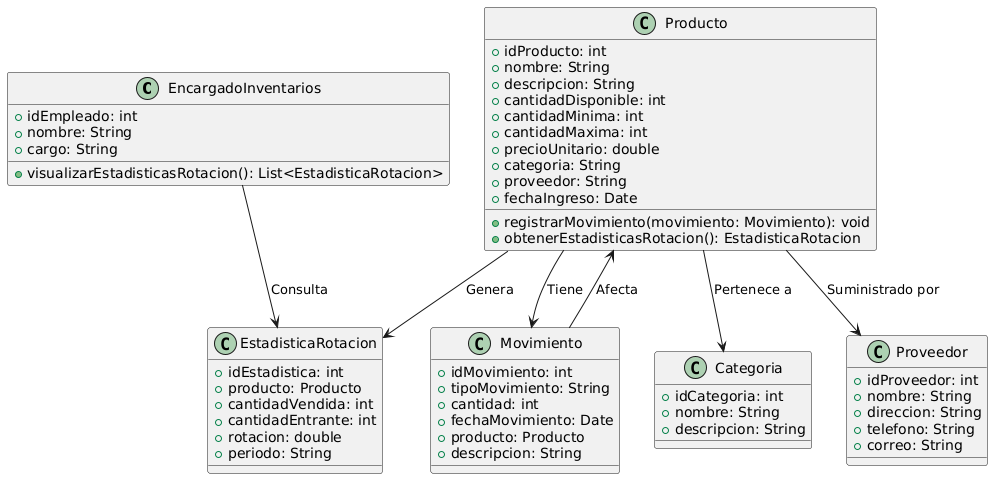

# GESTIÓN DE INVENTARIO 

------

## Caso de uso historia 
Ana, encargada de inventarios, desea analizar el desempeño de los productos. Accede al sistema de gestión de inventarios y selecciona la opción para visualizar estadísticas de rotación. El sistema presenta gráficos y datos que muestran los productos de mayor y menor rotación, junto con tendencias históricas. Con esta información, Ana identifica qué productos necesitan reabastecimiento frecuente y cuáles requieren ajustes en su manejo.

---

  <tr class="idtext principal">
    <td>ID SYN-17</td>
  </tr>
  <tr class="single text">
    <td><strong>Requerimiento</strong>:Visualizar estadísticas de rotación de productos. ID SYN-17</td>
  </tr>
  <tr class="single gray">
    <td><strong>Historia de usuario</strong></td>
  </tr>
  <tr class="single text">
    <td>Como encargado de inventarios quiero visualizar estadísticas de rotación de productos para analizar el desempeño de los productos, identificar los de mayor y menor rotación, y tomar decisiones informadas sobre compras y ventas.
</td>
  </tr>
  <tr class="duo">
    <th class="gray"><strong>Estado de la tarea</strong></th>
    <th>En desarrollo</th>
  </tr>
  <tr class="single gray">
    <td><strong>Caso de uso (Pasos)</strong></td>
  </tr>
  <tr class="single text">
    <td>
        <ol>
            <li>
             <li>El encargado de inventarios accede al sistema y selecciona la opción "Estadísticas de Rotación de Productos".</li>
            <li>El sistema solicita un filtro de tiempo, como: Fecha, Producto o categoría de producto.</li>
            <li>El encargado ingresa los filtros deseados (rango de fechas y/o productos) y confirma.</li>
            <li>El sistema genera las estadísticas de rotación, mostrando: Productos con mayor y menor rotación .Cantidad de entradas y salidas de cada producto en el periodo seleccionado.</li>
            <li>El promedio de rotación por producto.</li>
            <li>El tiempo promedio de permanencia en inventario de cada producto.</li>
            <li>El sistema presenta la información en forma de gráficos (barras, líneas, etc.) y tablas.</li>
            <li>El encargado puede exportar las estadísticas en formatos PDF o Excel para análisis adicionales.</li>
        </ol>
    </td>
  </tr>
  <tr class="single gray">
    <td><strong>Criterios de aceptación</strong></td>
  </tr>
  <tr class="single text">
    <td>
        <ol>
              <li>El sistema debe permitir visualizar las estadísticas de rotación de productos filtradas por rango de fechas (última semana, mes, etc.).</li>
              <li>El sistema debe mostrar las siguientes métricas de rotación:Productos con mayor rotación, Productos con menor rotación,Total de entradas y salidas por producto en el periodo, Promedio de rotación por producto,Tiempo promedio de permanencia en inventario por producto.</li>
              <li>Las estadísticas deben ser presentadas en formatos gráfico y tabla para facilitar el análisis.</li>
              <li>El sistema debe permitir exportar las estadísticas a formatos PDF o Excel.</li>
              <li>Las estadísticas deben estar actualizadas con los datos más recientes del sistema.</li>
            </ol>
 <tr class="duo">
    <th class="gray"><strong>Calidad</strong></th>
    <th>En desarrollo</th>
  </tr>
  <tr class="duo">
    <th class="gray"><strong>Versionamiento</strong></th>
    <th>En desarrollo</th>
  </tr>
</table>

---
## Diagrama de Caso de uso
[Creado con plantuml](https://plantuml.com/es/)

---
 