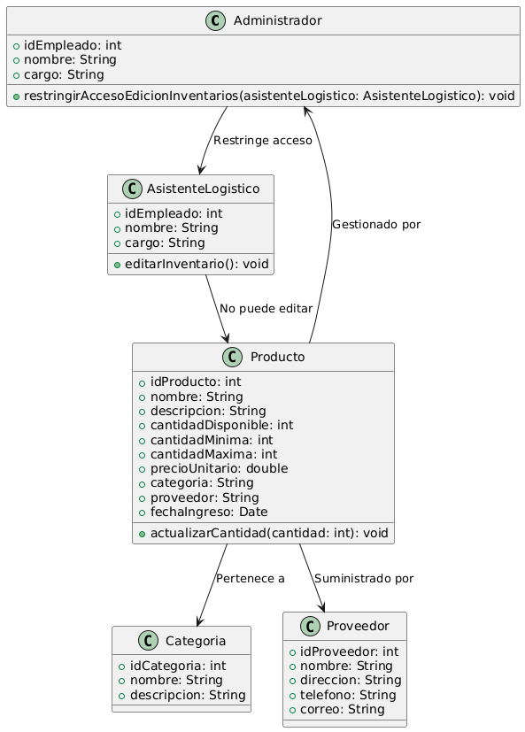

# GESTIÓN DE INVENTARIO 

------

## Caso de uso historia 
Luis, administrador del sistema, configura los permisos de usuario en el sistema de gestión de inventarios. Para garantizar que los Asistentes Logísticos no puedan realizar ajustes no autorizados, asigna roles y restringe la capacidad de editar inventarios únicamente a usuarios autorizados. Con esta configuración, el sistema bloquea la opción de edición para los Asistentes Logísticos y registra cualquier intento de acceso no permitido, asegurando un mayor control y seguridad en el manejo del inventario.

---

  <tr class="idtext principal">
    <td>ID SYN-18</td>
  </tr>
  <tr class="single text">
    <td><strong>Requerimiento</strong>:Restringir al Asistente Logístico la edición de inventarios. ID SYN-18</td>
  </tr>
  <tr class="single gray">
    <td><strong>Historia de usuario</strong></td>
  </tr>
  <tr class="single text">
    <td>Como administrador del sistema quiero restringir al Asistente Logístico la capacidad de editar los inventarios para garantizar que los ajustes de inventario solo sean realizados por usuarios autorizados y prevenir cambios no autorizados.
</td>
  </tr>
  <tr class="duo">
    <th class="gray"><strong>Estado de la tarea</strong></th>
    <th>En desarrollo</th>
  </tr>
  <tr class="single gray">
    <td><strong>Caso de uso (Pasos)</strong></td>
  </tr>
  <tr class="single text">
    <td>
        <ol>
            <li>
             <li>El administrador del sistema accede al módulo de Gestión de Roles y Permisos.</li>
              <li>Selecciona el rol de Asistente Logístico para configurar sus permisos.</li>
              <li>Modifica los permisos para restringir la edición del inventario, asegurándose de que el rol solo tenga acceso de lectura.</li>
              <li>Guarda los cambios y confirma la restricción.</li>
              <li>El sistema actualiza los permisos del rol de Asistente Logístico.</li>
              <li>A partir de ese momento, los usuarios con este rol solo pueden consultar el inventario, pero no editarlo.</li>
        </ol>
    </td>
  </tr>
  <tr class="single gray">
    <td><strong>Criterios de aceptación</strong></td>
  </tr>
  <tr class="single text">
    <td>
        <ol>
              <li>El sistema debe permitir al administrador asignar permisos específicos al rol de Asistente Logístico.</li>
              <li>Los usuarios con el rol de Asistente Logístico solo deben tener acceso de lectura al módulo de inventario.</li>
              <li>Si el Asistente Logístico intenta realizar una edición en el inventario, el sistema debe mostrar un mensaje indicando que no tiene permisos para esta acción.</li>
              <li>Los permisos deben aplicarse en tiempo real, sin necesidad de reiniciar el sistema.</li>
              <li>Los cambios en los permisos deben quedar registrados en un log de auditoria</li>
            </ol>
 <tr class="duo">
    <th class="gray"><strong>Calidad</strong></th>
    <th>En desarrollo</th>
  </tr>
  <tr class="duo">
    <th class="gray"><strong>Versionamiento</strong></th>
    <th>En desarrollo</th>
  </tr>
</table>

---
## Diagrama de Caso de uso
[Creado con plantuml](https://plantuml.com/es/)

---