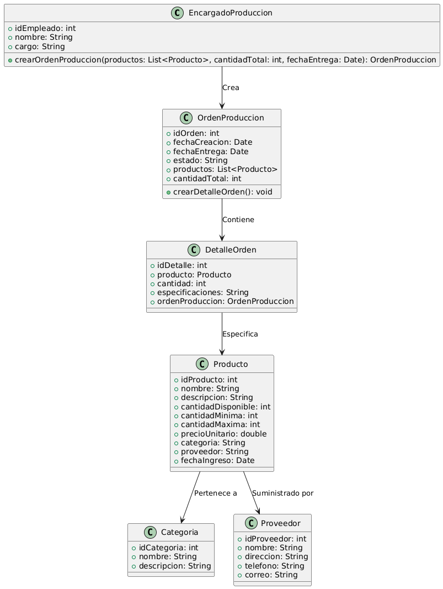

# GESTIÓN DE PRODUCCIÓN

------

## Caso de uso historia 
David, encargado de producción, recibe la demanda de fabricación de productos. Para organizar el proceso, accede al sistema de gestión de producción y crea una nueva orden de producción, ingresando los detalles de los productos a fabricar, como cantidades y especificaciones.El sistema genera la orden de producción con toda la información necesaria, permitiendo que el equipo de producción siga las instrucciones precisas. Esto asegura que los productos sean fabricados con las especificaciones correctas y en las cantidades requeridas.

---

  <tr class="idtext principal">
    <td>ID SYN-19</td>
  </tr>
  <tr class="single text">
    <td><strong>Requerimiento</strong>:Crear órdenes de producción con detalles de productos. ID SYN-19</td>
  </tr>
  <tr class="single gray">
    <td><strong>Historia de usuario</strong></td>
  </tr>
  <tr class="single text">
    <td>Como encargado de producción quiero crear órdenes de producción con detalles de los productos para organizar el proceso productivo y asegurar que se fabriquen los productos necesarios con las especificaciones correctas.
</td>
  </tr>
  <tr class="duo">
    <th class="gray"><strong>Estado de la tarea</strong></th>
    <th>En desarrollo</th>
  </tr>
  <tr class="single gray">
    <td><strong>Caso de uso (Pasos)</strong></td>
  </tr>
  <tr class="single text">
    <td>
        <ol>
            <li>
             <li>El encargado de producción accede al módulo de Órdenes de Producción.</li>
            <li>Selecciona la opción "Nueva Orden de Producción".</li>
            <li>Ingresa los detalles de la orden, incluyendo: Producto(s) a fabricar, Cantidad requerida por producto, Fecha de inicio y fecha estimada de finalización, Prioridad de la orden, observaciones.</li>
            <li>El sistema valida que los datos ingresados sean correctos y verifica la disponibilidad de materiales necesarios.</li>
            <li>Una vez validados los datos, el encargado confirma la creación de la orden.</li>
            <li>El sistema registra la orden y genera un código único de identificación para la misma.</li>
            <li>La orden queda registrada y disponible para consulta y seguimiento.</li>
        </ol>
    </td>
  </tr>
  <tr class="single gray">
    <td><strong>Criterios de aceptación</strong></td>
  </tr>
  <tr class="single text">
    <td>
        <ol>
              <li>El sistema debe permitir al encargado de producción crear una orden de producción ingresando:Producto, Cantidad requerida, Fecha de inicio y finalización, Prioridad, Observaciones.</li>
              <li>Las órdenes de producción deben tener un código único de identificación.</li>
              <li>El sistema debe validar que los datos ingresados sean correctos y notificar cualquier error.</li>
              <li>Si no hay suficientes materiales disponibles para la producción, el sistema debe notificarlo y permitir al usuario ajustar la orden.</li>
              <li>La orden creada debe ser visible en el módulo de seguimiento de órdenes de producción.</li>
            </ol>
 <tr class="duo">
    <th class="gray"><strong>Calidad</strong></th>
    <th>En desarrollo</th>
  </tr>
  <tr class="duo">
    <th class="gray"><strong>Versionamiento</strong></th>
    <th>En desarrollo</th>
  </tr>
</table>

---
## Diagrama de Caso de uso
[Creado con plantuml](https://plantuml.com/es/)

---