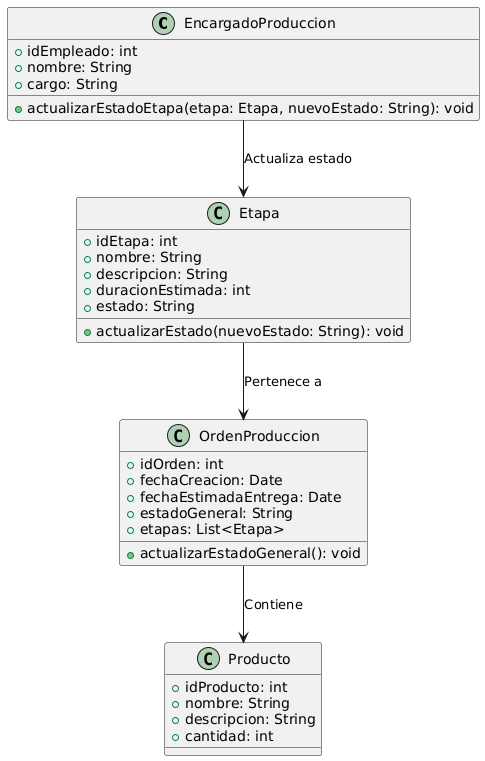

# GESTIÓN DE PRODUCCIÓN

------

## Caso de uso historia 
Carlos, encargado de producción, supervisa el avance de las órdenes de producción. A medida que una etapa del proceso se completa, accede al sistema y actualiza el estado de la etapa correspondiente para reflejar el progreso del trabajo.El sistema registra el cambio de estado y actualiza el seguimiento de la orden de producción, permitiendo a Carlos y al equipo ver el avance en tiempo real.

---

  <tr class="idtext principal">
    <td>ID SYN-21</td>
  </tr>
  <tr class="single text">
    <td><strong>Requerimiento</strong>:Actualizar el estado de una etapa de producción. ID SYN-21</td>
  </tr>
  <tr class="single gray">
    <td><strong>Historia de usuario</strong></td>
  </tr>
  <tr class="single text">
    <td>Como encargado de producción quiero actualizar el estado de una etapa del proceso de producción para reflejar el progreso del trabajo y mantener un seguimiento preciso del avance en las órdenes de producción.
</td>
  </tr>
  <tr class="duo">
    <th class="gray"><strong>Estado de la tarea</strong></th>
    <th>En desarrollo</th>
  </tr>
  <tr class="single gray">
    <td><strong>Caso de uso (Pasos)</strong></td>
  </tr>
  <tr class="single text">
    <td>
        <ol>
            <li>
             <li>El encargado de producción accede al módulo "Gestión de Producción" y selecciona una orden activa.</li>
            <li>Dentro de la orden, identifica la etapa de producción que necesita ser actualizada.</li>
            <li>Selecciona la etapa y el nuevo estado (ej., pendiente, en proceso, completada).</li>
            <li>Agrega, si es necesario, observaciones adicionales relacionadas con el cambio de estado.</li>
            <li>Confirma la actualización del estado.</li>
            <li>El sistema registra el cambio de estado y lo refleja en el resumen de la orden de producción.</li>
            <li>Se genera una notificación para los usuarios interesados en el cambio, como supervisores o responsables de etapas posteriores.</li>
        </ol>
    </td>
  </tr>
  <tr class="single gray">
    <td><strong>Criterios de aceptación</strong></td>
  </tr>
  <tr class="single text">
    <td>
        <ol>
              <li>El sistema debe permitir al encargado de producción seleccionar cualquier etapa activa de una orden.</li>
              <li>Debe haber una lista de estados predefinidos (pendiente, en proceso, completada, etc.) disponibles para selección.</li>
              <li>Si el estado de la etapa afecta a etapas posteriores (ej., bloquea o habilita su inicio), el sistema debe gestionar automáticamente estas dependencias.</li>
              <li>El sistema debe registrar un historial de cambios, indicando: Fecha y hora de la actualización, Usuario que realizó el cambio, Estado anterior y nuevo.</li>
              <li>La actualización debe reflejarse en el sistema en tiempo real.</li>
              <li>Los usuarios interesados en el progreso deben recibir una notificación automatizada.</li>
            </ol>
 <tr class="duo">
    <th class="gray"><strong>Calidad</strong></th>
    <th>En desarrollo</th>
  </tr>
  <tr class="duo">
    <th class="gray"><strong>Versionamiento</strong></th>
    <th>En desarrollo</th>
  </tr>
</table>

---
## Diagrama de Caso de uso
[Creado con plantuml](https://plantuml.com/es/)

---