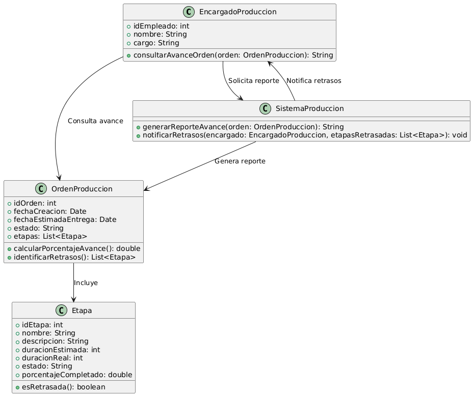

# GESTIÓN DE PRODUCCIÓN

------

## Caso de uso historia 
Carlos, encargado de producción, necesita monitorear el progreso de las órdenes en curso. Accede al sistema de gestión de producción y visualiza una vista general del avance de cada orden. El sistema muestra el estado actualizado de cada etapa de producción, incluyendo los plazos establecidos y el progreso alcanzado. Si alguna orden presenta retrasos, Carlos puede identificarla rápidamente y tomar las medidas correctivas necesarias para asegurar que se cumplan los plazos.

---

  <tr class="idtext principal">
    <td>ID SYN-25</td>
  </tr>
  <tr class="single text">
    <td><strong>Requerimiento</strong>:Visualizar el avance de órdenes de producción. ID SYN-25</td>
  </tr>
  <tr class="single gray">
    <td><strong>Historia de usuario</strong></td>
  </tr>
  <tr class="single text">
    <td>Como encargado de producción quiero visualizar el avance de las órdenes de producción para monitorear el progreso, identificar retrasos y asegurar el cumplimiento de los plazos establecidos.
</td>
  </tr>
  <tr class="duo">
    <th class="gray"><strong>Estado de la tarea</strong></th>
    <th>En desarrollo</th>
  </tr>
  <tr class="single gray">
    <td><strong>Caso de uso (Pasos)</strong></td>
  </tr>
  <tr class="single text">
    <td>
        <ol>
            <li>
             <li>El encargado accede al módulo "Seguimiento de Órdenes de Producción".</li>
              <li>Selecciona una orden de producción específica desde la lista de órdenes activas o consulta por filtros como: Número de orden, Producto fabricado, Fecha de inicio o fin.</li>
              <li>El sistema muestra un panel de seguimiento con información detallada, incluyendo:  Porcentaje de avance general, Estado de cada etapa de producción, Fechas estimadas vs reales, Recursos asignados y utilizados.</li>
              <li>Si se detectan retrasos, el sistema resalta las etapas afectadas.</li>
              <li>El encargado puede exportar el reporte de avance o programar notificaciones automáticas para futuras revisiones.</li>
        </ol>
    </td>
  </tr>
  <tr class="single gray">
    <td><strong>Criterios de aceptación</strong></td>
  </tr>
  <tr class="single text">
    <td>
        <ol>
              <li>El sistema debe permitir filtrar órdenes por criterios como número, producto, fechas o estado.</li>
              <li>El panel debe mostrar al menos: Porcentaje de avance total,Estados individuales de las etapas de producción, Fechas estimadas y reales por etapa.</li>
              <li>Las órdenes con retrasos deben resaltarse claramente para facilitar su identificación.</li>
              <li>Los usuarios deben poder exportar un reporte del avance en formato PDF o Excel.</li>
              <li>La información debe actualizarse automáticamente en tiempo real.</li>
            </ol>
 <tr class="duo">
    <th class="gray"><strong>Calidad</strong></th>
    <th>En desarrollo</th>
  </tr>
  <tr class="duo">
    <th class="gray"><strong>Versionamiento</strong></th>
    <th>En desarrollo</th>
  </tr>
</table>

---
## Diagrama de Caso de uso
[Creado con plantuml](https://plantuml.com/es/)

---

