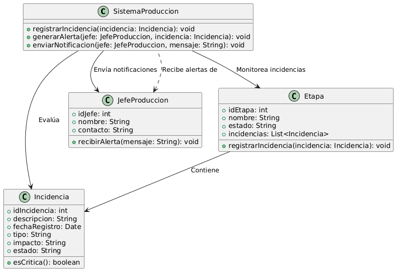

# GESTIÓN DE PRODUCCIÓN

------

## Caso de uso historia 
El sistema de gestión de producción detecta que un operario ha registrado una incidencia en una etapa crítica del proceso. Inmediatamente, genera una alerta con los detalles de la incidencia y la envía al jefe de producción. El jefe recibe la notificación en tiempo real, revisa la información y toma decisiones rápidas para corregir el problema, asegurando que los impactos en los plazos y la calidad sean mínimos.

---

  <tr class="idtext principal">
    <td>ID SYN-27</td>
  </tr>
  <tr class="single text">
    <td><strong>Requerimiento</strong>:Enviar alertas al jefe sobre incidencias. ID SYN-27</td>
  </tr>
  <tr class="single gray">
    <td><strong>Historia de usuario</strong></td>
  </tr>
  <tr class="single text">
    <td>Como sistema de gestión de producción quiero enviar alertas al jefe sobre las incidencias registradas para que pueda tomar decisiones rápidas y correctivas, minimizando los impactos en la producción.
</td>
  </tr>
  <tr class="duo">
    <th class="gray"><strong>Estado de la tarea</strong></th>
    <th>En desarrollo</th>
  </tr>
  <tr class="single gray">
    <td><strong>Caso de uso (Pasos)</strong></td>
  </tr>
  <tr class="single text">
    <td>
        <ol>
            <li>
             <li>Una incidencia es registrada por un operario o supervisor en el sistema.</li>
            <li>El sistema identifica si la incidencia tiene un nivel de prioridad medio o alto.</li>
            <li>Genera una alerta automática con los siguientes datos:Tipo de incidencia, Descripción breve, Fecha, hora y etapa afectada,Usuario que registró la incidencia.</li>
            <li>Envía la alerta al jefe de producción mediante los canales definidos (correo electrónico, notificación en el sistema, SMS).</li>
            <li>El jefe de producción recibe y revisa la alerta desde su dispositivo o sistema.</li>
        </ol>
    </td>
  </tr>
  <tr class="single gray">
    <td><strong>Criterios de aceptación</strong></td>
  </tr>
  <tr class="single text">
    <td>
        <ol>
              <li>El sistema debe enviar alertas para incidencias con prioridad media o alta.</li>
              <li>Las alertas deben contener la información esencial de la incidencia.</li>
              <li>Las alertas deben ser enviadas en tiempo real o con un retraso máximo de 1 minuto tras el registro.</li>
              <li>El sistema debe registrar el envío de la alerta para garantizar trazabilidad.</li>
              <li>El jefe debe poder acceder a la incidencia completa desde el enlace o detalle proporcionado en la alerta.</li>
            </ol>
 <tr class="duo">
    <th class="gray"><strong>Calidad</strong></th>
    <th>En desarrollo</th>
  </tr>
  <tr class="duo">
    <th class="gray"><strong>Versionamiento</strong></th>
    <th>En desarrollo</th>
  </tr>
</table>

---
## Diagrama de Caso de uso
[Creado con plantuml](https://plantuml.com/es/)

---