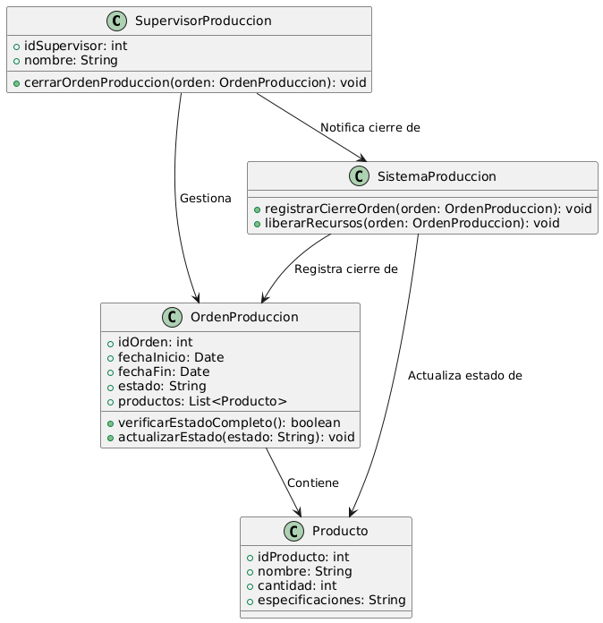

# GESTIÓN DE PRODUCCIÓN

------

## Caso de uso historia 
El sistema de gestión de producción detecta que un operario ha registrado una incidencia en una etapa crítica del proceso. Inmediatamente, genera una alerta con los detalles de la incidencia y la envía al jefe de producción. El jefe recibe la notificación en tiempo real, revisa la información y toma decisiones rápidas para corregir el problema, asegurando que los impactos en los plazos y la calidad sean mínimos.

---

  <tr class="idtext principal">
    <td>ID SYN-28</td>
  </tr>
  <tr class="single text">
    <td><strong>Requerimiento</strong>:Cerrar una orden de producción al completarla. ID SYN-28</td>
  </tr>
  <tr class="single gray">
    <td><strong>Historia de usuario</strong></td>
  </tr>
  <tr class="single text">
    <td>Como supervisor de producción quiero cerrar una orden de producción al completarla para asegurar que las órdenes terminadas se registren correctamente y se liberen recursos para nuevas producciones.
</td>
  </tr>
  <tr class="duo">
    <th class="gray"><strong>Estado de la tarea</strong></th>
    <th>En desarrollo</th>
  </tr>
  <tr class="single gray">
    <td><strong>Caso de uso (Pasos)</strong></td>
  </tr>
  <tr class="single text">
    <td>
        <ol>
             <li>El supervisor accede al sistema de gestión de producción.</li>
              <li>Selecciona la orden de producción que ha sido completada y que está lista para ser cerrada.</li>
              <li>El sistema verifica que todas las etapas de producción han sido completadas y que no hay pendientes.</li>
              <li>El supervisor confirma que la orden ha sido completada de acuerdo con los requisitos.</li>
              <li>El sistema cierra la orden, actualizando su estado a "Cerrada".</li>
              <li>El sistema genera un informe final de la orden de producción (opcional) y libera los recursos asociados para nuevas órdenes.</li>
        </ol>
    </td>
  </tr>
  <tr class="single gray">
    <td><strong>Criterios de aceptación</strong></td>
  </tr>
  <tr class="single text">
    <td>
        <ol>
              <li>El sistema debe permitir cerrar una orden solo si todas las etapas de la producción están marcadas como completadas.</li>
              <li>El sistema debe notificar al supervisor si intenta cerrar una orden con etapas pendientes.</li>
              <li>El sistema debe actualizar el estado de la orden a "Cerrada" y bloquear cualquier acción de modificación posterior.</li>
              <li>Si la orden es cerrada exitosamente, el sistema debe generar un informe final de la producción (opcional).</li>
            </ol>
 <tr class="duo">
    <th class="gray"><strong>Calidad</strong></th>
    <th>En desarrollo</th>
  </tr>
  <tr class="duo">
    <th class="gray"><strong>Versionamiento</strong></th>
    <th>En desarrollo</th>
  </tr>
</table>

---
## Diagrama de Caso de uso
[Creado con plantuml](https://plantuml.com/es/)

---