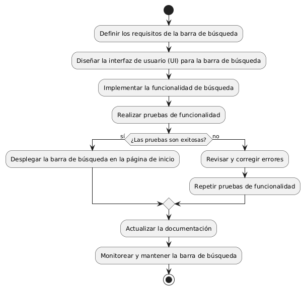
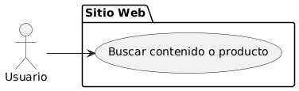

# CREAR BARRA DE BUSQUEDA EN PAGINA DE INICIO 

------
## Diagrama de Actividades
[Creado con plantuml](https://plantuml.com/es/)

{ align=center }

El diagrama de actividad describe el proceso de implementar una barra de búsqueda en una página de inicio. Incluye los pasos para mostrar la barra, recibir y validar términos de búsqueda, mostrar resultados o mensajes de error, y permitir nuevas búsquedas. Gestiona el flujo de interacción entre el usuario y el sistema.
---
###

## Caso de uso historia Crear paginas de Inicio 
El usuario que quiere comprar muebles puede entrar a un menú principal o una página de inicio , el cual tiene enlaces a otras  páginas principales como inicio, catálogos, contactos entre otros más. Dentro de la misma página cuando el usuario pase el ratón sobre las opciones del menú principal se desplegará los submenús con más opciones; la página le proporcionará enlaces rápidos para iniciar sesión o registrarse; si la persona quiere entrar a la página desde su móvil, lo podrá hacer con toda comodidad ya que el menú es responsivo para móviles. También si el usuario quiere consultar las redes sociales lo podrá hacer ya que el menú de inicio tiene enlaces  a las mismas, y no menos importante la capacidad de ver todos los productos recomendados o más vendidos de la página.

<table id="customers">
  <tr class="idtext principal">
    <td>ID MACP-10</td>
  </tr>
  <tr class="single text">
    <td><strong>Requerimiento</strong>:Implementar un enlace a redes sociales visibles ID MACP-10</td>
  </tr>
  <tr class="single gray">
    <td><strong>Historia de usuario</strong></td>
  </tr>
  <tr class="single text">
    <td>Como usuario, quiero acceder a una barra de búsqueda en la página de inicio del sitio web Para poder encontrar rápidamente el contenido o producto que estoy buscando.</td>
  </tr>
  <tr class="duo">
    <th class="gray"><strong>Estado de la tarea</strong></th>
    <th>En desarrollo</th>
  </tr>
  <tr class="single gray">
    <td><strong>Caso de uso (Pasos)</strong></td>
  </tr>
  <tr class="single text">
    <td>
        <ol>
            <li>El usuario carga la página de inicio del sitio web.</li>
            <li>El sistema muestra una barra de búsqueda visible en la página de inicio.</li>
            <li>El usuario ingresa una consulta de búsqueda en la barra de búsqueda.</li>
            <li>El usuario presiona el botón de búsqueda. </li>
            <li>El sistema procesa la consulta de búsqueda.</li>
            <li>El sistema muestra una lista de resultados relevantes basados en la consulta de búsqueda.</li>
        </ol>
    </td>
  </tr>
  <tr class="single gray">
    <td><strong>Criterios de aceptación</strong></td>
  </tr>
  <tr class="single text">
    <td>
        <ol>
                  <li>Visibilidad y Accesibilidad: La barra de búsqueda debe ser claramente visible en la página de inicio. Debe estar ubicada en un lugar prominente, como en la parte superior de la página.</li>
                  <li>Interacción: La barra de búsqueda debe permitir la entrada de texto. </li>
                  <li>Funcionalidad: El sistema debe procesar la consulta de búsqueda correctamente y devolver resultados relevantes.</li>
                  <li>Resultado de Búsqueda: Los resultados de búsqueda deben mostrarse de forma clara y ordenada. En caso de no encontrar resultados, debe aparecer un mensaje informativo con sugerencias de búsqueda.</li>
                  <li>Rendimiento:La búsqueda debe completarse en un tiempo razonable. La barra de búsqueda debe ser responsiva y adaptarse a diferentes tamaños de pantalla sin problemas.</li>
                  <li>Estética: La barra de búsqueda debe integrarse de manera coherente con el diseño general del sitio web. Debe tener un diseño atractivo y funcional.</li>
    </td>
  </tr>
 <tr class="duo">
    <th class="gray"><strong>Calidad</strong></th>
    <th>En desarrollo</th>
  </tr>
  <tr class="duo">
    <th class="gray"><strong>Versionamiento</strong></th>
    <th>En desarrollo</th>
  </tr>
</table>

---
## Diagrama de Caso de uso
[Creado con plantuml](https://plantuml.com/es/)

{ align=center }
El diagrama muestra un usuario interactuando con la barra de búsqueda en la página de inicio de un sitio web. El caso de uso "Buscar contenido o producto" permite al usuario encontrar rápidamente información o artículos deseados. Esta funcionalidad mejora la navegación y la eficiencia en la búsqueda de productos.
