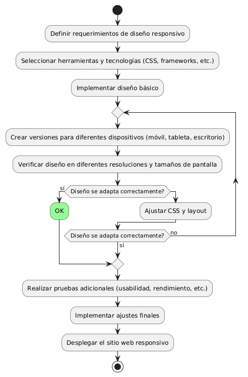

# DISEÑAR E IMPLEMENTAR UN DISEÑO RESPONSIVO 

------

## Diagrama de Actividades
[Creado con plantuml](https://plantuml.com/es/)

{ align=center }

El diagrama de actividad describe el proceso para implementar un diseño responsivo en un sitio web. Comienza con la definición de requisitos y selección de herramientas, sigue con la implementación y ajuste del diseño para varios dispositivos, y termina con pruebas y despliegue final del sitio adaptado.
---
###

## Caso de uso historia Interfaz y Experinecia del Usuario
Tenemos la responsabilidad de que La página debe verse bien en cualquier dispositivo de usuarios, parte de eso al momento de ingresar de cargar rápido, y que cada botón sea fácil de encontrar para la comodidad de pepito, es importante dado que pepito es un hombre de mediana edad y debe tener botones de ayuda al usuario por que a la gente mayor se les dificulta las compras en línea,  y como todos cometemos errores, la página va a tener acciones inmediatas y con notificación cuando tenemos una acción inadecuada.

<table id="customers">
  <tr class="idtext principal">
    <td>ID MACP-13</td>
  </tr>
  <tr class="single text">
    <td><strong>Requerimiento</strong>: Implementar un diseño responsivo ID MACP-13</td>
  </tr>
  <tr class="single gray">
    <td><strong>Historia de usuario</strong></td>
  </tr>
  <tr class="single text">
    <td>Como usuario, quiero que el sitio web se adapte a la pantalla de mi dispositivo, para que pueda navegar y acceder a la información de manera cómoda y eficiente, sin importar si estoy usando un computador, una tablet o un teléfono móvil.</td>
  </tr>
  <tr class="duo">
    <th class="gray"><strong>Estado de la tarea</strong></th>
    <th>En desarrollo</th>
  </tr>
  <tr class="single gray">
    <td><strong>Caso de uso (Pasos)</strong></td>
  </tr>
  <tr class="single text">
    <td>
        <ol>
            <li>El usuario accede al sitio web desde un dispositivo (computadora, tablet, teléfono móvil).</li>
            <li>El sistema detecta el tamaño y tipo de pantalla del dispositivo.</li>
           <li>El sitio web se adapta automáticamente al tamaño de la pantalla.</li>
           <li>El usuario navega por el sitio y accede a toda la información y funcionalidades sin problemas de usabilidad.</li>
        </ol>
    </td>
  </tr>
  <tr class="single gray">
    <td><strong>Criterios de aceptación</strong></td>
  </tr>
  <tr class="single text">
    <td>
        <ol>
                  <li>Adaptabilidad de Diseño: El sitio web debe ser visualmente consistente y funcional en dispositivos de escritorio, tabletas y teléfonos móviles. Los elementos de diseño textos, imágenes, botones deben redimensionarse y reorganizarse adecuadamente según el tamaño de la pantalla.</li>
                  <li>Pruebas de Diferentes Dispositivos: Se debe realizar una prueba en diferentes tamaños de pantalla y resoluciones para asegurar que el diseño responda de manera adecuada.</li>
                  <li>Experiencia de Usuario: La navegación debe ser fluida y sin problemas, con todos los enlaces y botones accesibles en dispositivos móviles. El contenido debe ser legible y el sitio debe evitar el uso de barras de desplazamiento horizontales innecesarias.</li>
                  <li>Desempeño: El tiempo de carga del sitio no debe verse significativamente afectado por la implementación del diseño responsivo. Las imágenes y otros recursos deben cargarse y ajustarse de manera eficiente en función del dispositivo.</li>
                  <li>Accesibilidad: El sitio debe cumplir con las pautas de accesibilidad para que todos los usuarios, incluyendo aquellos con discapacidades, puedan navegar y acceder a la información sin dificultades.</li>
                  <li>Compatibilidad con Herramientas de Desarrollo: Se debe verificar que el diseño responsivo no interfiera con el funcionamiento de herramientas de desarrollo y depuración.</li>
 <tr class="duo">
    <th class="gray"><strong>Calidad</strong></th>
    <th>En desarrollo</th>
  </tr>
  <tr class="duo">
    <th class="gray"><strong>Versionamiento</strong></th>
    <th>En desarrollo</th>
  </tr>
</table>

---
## Diagrama de Caso de uso
[Creado con plantuml](https://plantuml.com/es/)

{ align=center }

El diagrama de casos de uso muestra cómo un usuario interactúa con el sistema para encontrar productos específicos. Inicia el filtrado por categoría, ve una lista de productos filtrados, selecciona un producto y finalmente revisa sus detalles, mejorando la eficiencia en la navegación y búsqueda de productos.
