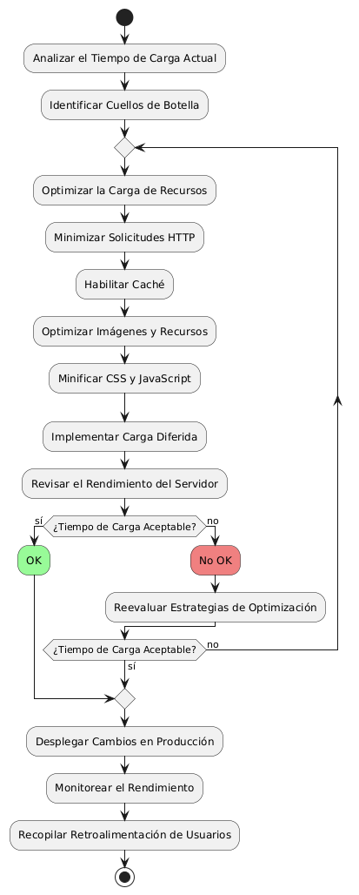

# DISEÑAR E IMPLEMENTAR CARGA RAPIDA DE PAGINA

------

## Diagrama de Actividades
[Creado con plantuml](https://plantuml.com/es/)

{ align=center }

El diagrama de actividad detalla el proceso para implementar carga rápida en una página web. Incluye pasos como analizar el tiempo de carga, identificar cuellos de botella, optimizar recursos, minimizar solicitudes HTTP, y habilitar caché. Se asegura de que las mejoras sean efectivas mediante monitoreo y retroalimentación continua.
---
###

## Caso de uso historia Interfaz y Experinecia del Usuario
Tenemos la responsabilidad de que La página debe verse bien en cualquier dispositivo de usuarios, parte de eso al momento de ingresar de cargar rápido, y que cada botón sea fácil de encontrar para la comodidad de pepito, es importante dado que pepito es un hombre de mediana edad y debe tener botones de ayuda al usuario por que a la gente mayor se les dificulta las compras en línea,  y como todos cometemos errores, la página va a tener acciones inmediatas y con notificación cuando tenemos una acción inadecuada.

<table id="customers">
  <tr class="idtext principal">
    <td>ID MACP-14</td>
  </tr>
  <tr class="single text">
    <td><strong>Requerimiento</strong>: Implementar carga rapida de pagina ID MACP-14</td>
  </tr>
  <tr class="single gray">
    <td><strong>Historia de usuario</strong></td>
  </tr>
  <tr class="single text">
    <td>Como usuario quiero que las páginas se carguen rápidamente para poder acceder rápidamente al contenido sin experimentar retrasos o tiempos de espera frustrantes.</td>
  </tr>
  <tr class="duo">
    <th class="gray"><strong>Estado de la tarea</strong></th>
    <th>En desarrollo</th>
  </tr>
  <tr class="single gray">
    <td><strong>Caso de uso (Pasos)</strong></td>
  </tr>
  <tr class="single text">
    <td>
        <ol>
            <li>El usuario navega a una página en el sitio web.</li>
           <li>El sistema procesa la solicitud de carga de la página.</li>
          <li>El sistema aplica técnicas de optimización para mejorar el tiempo de carga (e.g., minimización de recursos, compresión de imágenes, uso de caché).</li>
          <li>La página se carga y se muestra al usuario en un tiempo reducido.</li>
          <li>El usuario accede al contenido de la página sin experimentar retrasos significativos.</li>
        </ol>
    </td>
  </tr>
  <tr class="single gray">
    <td><strong>Criterios de aceptación</strong></td>
  </tr>
  <tr class="single text">
    <td>
        <ol>
                  <li>Optimización de Recursos: Todas las imágenes deben estar comprimidas adecuadamente sin pérdida significativa de calidad.</li>
                  <li>Uso de Caché: Los recursos estáticos (imágenes, CSS, JS) deben estar correctamente configurados para usar caché del navegador y del servidor.</li>
                  <li>Pruebas de Rendimiento: La página debe pasar pruebas de rendimiento utilizando herramientas como Google PageSpeed Insights, Lighthouse, o WebPageTest con una calificación mínima de 80/100 para el rendimiento.</li>
                  <li>Experiencia de Usuario: La interacción con elementos interactivos botones, enlaces debe ser fluida y sin retrasos perceptibles.</li>
                  <li>Compatibilidad: La mejora en el tiempo de carga debe ser consistente en los navegadores más comunes (Chrome, Firefox, Safari, Edge) y en dispositivos móviles y de escritorio.</li>

 <tr class="duo">
    <th class="gray"><strong>Calidad</strong></th>
    <th>En desarrollo</th>
  </tr>
  <tr class="duo">
    <th class="gray"><strong>Versionamiento</strong></th>
    <th>En desarrollo</th>
  </tr>
</table>

---
## Diagrama de Caso de uso
[Creado con plantuml](https://plantuml.com/es/)

{ align=center }

El diagrama muestra cómo optimizar la carga rápida de una página web. Incluye acciones como minimizar archivos, usar caché, optimizar imágenes y cargar contenido asíncrono. Cada uno de estos pasos contribuye a reducir los tiempos de respuesta y mejorar la experiencia del usuario al acceder al contenido rápidamente.
