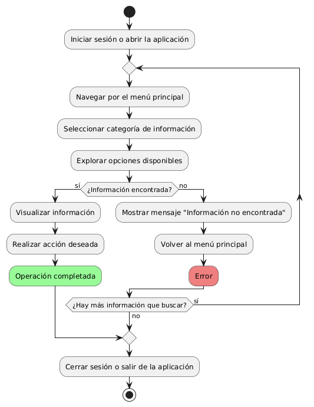

# DISEÑAR E IMPLEMENTAR UNA NAVEGACIÓN INTUITIVA

------

## Diagrama de Actividades
[Creado con plantuml](https://plantuml.com/es/)

{ align=center }

Este diagrama de actividad muestra la navegación intuitiva de un usuario en una aplicación. Comienza con el inicio de sesión y la autenticación, seguido de la búsqueda y selección de información. Si se encuentra información, se muestra y se navega, mientras que se ofrecen opciones para manejar errores y cerrar sesión.
---
###

## Caso de uso historia Interfaz y Experinecia del Usuario
Tenemos la responsabilidad de que La página debe verse bien en cualquier dispositivo de usuarios, parte de eso al momento de ingresar de cargar rápido, y que cada botón sea fácil de encontrar para la comodidad de pepito, es importante dado que pepito es un hombre de mediana edad y debe tener botones de ayuda al usuario por que a la gente mayor se les dificulta las compras en línea,  y como todos cometemos errores, la página va a tener acciones inmediatas y con notificación cuando tenemos una acción inadecuada.

<table id="customers">
  <tr class="idtext principal">
    <td>ID MACP-15</td>
  </tr>
  <tr class="single text">
    <td><strong>Requerimiento</strong>: Implementar una navegación intuitiva ID MACP-15</td>
  </tr>
  <tr class="single gray">
    <td><strong>Historia de usuario</strong></td>
  </tr>
  <tr class="single text">
    <td>Como usuario quiero una navegación intuitiva para poder encontrar fácilmente la información que necesito y moverme sin problemas por el sitio web o la aplicación.</td>
  </tr>
  <tr class="duo">
    <th class="gray"><strong>Estado de la tarea</strong></th>
    <th>En desarrollo</th>
  </tr>
  <tr class="single gray">
    <td><strong>Caso de uso (Pasos)</strong></td>
  </tr>
  <tr class="single text">
    <td>
        <ol>
            <li>Acceso a la Página de Inicio: El usuario llega a la página de inicio del sitio web o aplicación.</li>
            <li>Navegación entre Secciones: El usuario utiliza los menús de navegación (como menús superiores, laterales o desplegables) para moverse entre diferentes secciones del sitio o aplicación.</li>
            <li>Búsqueda de Información: El usuario utiliza funciones de búsqueda o filtros para encontrar información específica.</li>
            <li>Interacción con Elementos: El usuario interactúa con enlaces, botones y otros elementos de navegación para acceder a contenido adicional o realizar acciones.</li>
            <li>Retroalimentación del Usuario: El sistema proporciona retroalimentación clara y visible sobre la ubicación actual del usuario y las opciones disponibles para avanzar.</li>
        </ol>
    </td>
  </tr>
  <tr class="single gray">
    <td><strong>Criterios de aceptación</strong></td>
  </tr>
  <tr class="single text">
    <td>
        <ol>
                  <li>Menús Claros y Accesibles: Los menús de navegación deben estar claramente etiquetados y ser accesibles desde todas las páginas principales del sitio o aplicación. Los menús deben estar bien organizados, con categorías lógicas y subcategorías si es necesario.</li>
                  <li>Funcionalidad de Búsqueda:La función de búsqueda debe ser fácilmente visible y accesible. Los resultados de búsqueda deben ser relevantes y deben presentarse de manera ordenada.</li>
                  <li>Retroalimentación Visual: El sistema debe proporcionar retroalimentación visual clara cuando el usuario interactúa con elementos de navegación, como cambios en los botones al pasar el cursor sobre ellos o al hacer clic.</li>
                  <li>Consistencia en la Navegación: La navegación debe ser consistente en todas las páginas y secciones del sitio o aplicación. Los estilos y comportamientos de los elementos de navegación deben ser uniformes para evitar confusión.</li>
                  <li>Accesibilidad: La navegación debe ser accesible para usuarios con discapacidades, cumpliendo con las pautas de accesibilidad web. Los elementos de navegación deben ser utilizables con teclado y lectores de pantalla.</li>
                  <li>Desempeño: La navegación no debe afectar negativamente el tiempo de carga de las páginas. Las transiciones entre secciones deben ser suaves y sin demoras.</li>
                  <li>Mensajes de Error: Los mensajes de error deben ser claros y útiles, proporcionando al usuario opciones para solucionar el problema o regresar a una sección anterior.</li>
 <tr class="duo">
    <th class="gray"><strong>Calidad</strong></th>
    <th>En desarrollo</th>
  </tr>
  <tr class="duo">
    <th class="gray"><strong>Versionamiento</strong></th>
    <th>En desarrollo</th>
  </tr>
</table>

---
## Diagrama de Caso de uso
[Creado con plantuml](https://plantuml.com/es/)

{ align=center }

Este diagrama de casos de uso muestra cómo un usuario interactúa con un sistema web o aplicación. Destaca la importancia de una carga rápida de página y una navegación intuitiva para que el usuario pueda encontrar fácilmente la información y moverse sin problemas, mejorando así la experiencia general.
 