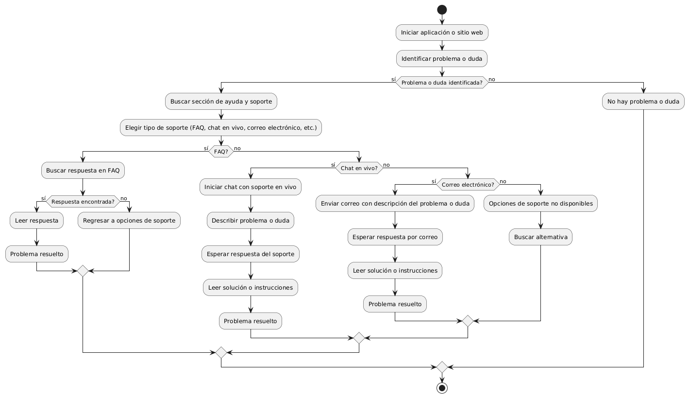

# DISEÑAR E IMPLEMENTAR AYUDA Y SOPORTE ACCESIBLE

------

## Diagrama de Actividades
[Creado con plantuml](https://plantuml.com/es/)

{ align=center }

El diagrama de actividad muestra cómo un usuario puede acceder a ayuda y soporte en un sitio web o aplicación. Incluye pasos para identificar problemas, buscar y elegir entre opciones de soporte como FAQ, chat en vivo o correo electrónico, y seguir hasta resolver el problema o duda.
---
###

## Caso de uso historia Interfaz y Experinecia del Usuario
Tenemos la responsabilidad de que La página debe verse bien en cualquier dispositivo de usuarios, parte de eso al momento de ingresar de cargar rápido, y que cada botón sea fácil de encontrar para la comodidad de pepito, es importante dado que pepito es un hombre de mediana edad y debe tener botones de ayuda al usuario por que a la gente mayor se les dificulta las compras en línea,  y como todos cometemos errores, la página va a tener acciones inmediatas y con notificación cuando tenemos una acción inadecuada.

<table id="customers">
  <tr class="idtext principal">
    <td>ID MACP-16</td>
  </tr>
  <tr class="single text">
    <td><strong>Requerimiento</strong>:Implementar ayuda y soporte accesible
 ID MACP-16</td>
  </tr>
  <tr class="single gray">
    <td><strong>Historia de usuario</strong></td>
  </tr>
  <tr class="single text">
    <td>Como usuario quiero tener acceso fácil a ayuda y soporte para poder resolver rápidamente cualquier problema o duda que pueda surgir durante mi experiencia en el sitio web o la aplicación.</td>
  </tr>
  <tr class="duo">
    <th class="gray"><strong>Estado de la tarea</strong></th>
    <th>En desarrollo</th>
  </tr>
  <tr class="single gray">
    <td><strong>Caso de uso (Pasos)</strong></td>
  </tr>
  <tr class="single text">
    <td>
        <ol>
             <li> Acceso al soporte: El usuario busca una opción de ayuda o soporte dentro del sitio web o la aplicación.</li>
             <li>Visualización de opciones: El usuario encuentra y selecciona una opción de ayuda, como un botón, enlace o ícono accesible.</li>
            <li>Interacción con el soporte: El usuario accede a las diferentes opciones de soporte ofrecidas, que pueden incluir: FAQ (Preguntas frecuentes): Acceso a una lista de preguntas comunes y sus respuestas. Chat en vivo: Interacción con un agente de soporte en tiempo real. Formulario de contacto: Envío de una consulta o solicitud de soporte a través de un formulario. Número de teléfono: Información para contactar soporte por teléfono.</li>
            <li>Resolución de problemas: El usuario recibe la asistencia necesaria y resuelve el problema o responde a la duda que tenía.</li>
        </ol>
    </td>
  </tr>
  <tr class="single gray">
    <td><strong>Criterios de aceptación</strong></td>
  </tr>
  <tr class="single text">
    <td>
        <ol>
                  <li>Accesibilidad: El botón o enlace para acceder a ayuda y soporte es visible y accesible en todas las páginas o pantallas principales del sitio web o la aplicación.</li>
                  <li>Disponibilidad de Opciones: El sistema ofrece al menos tres de las siguientes opciones de soporte: FAQ, guías/tutoriales, chat en vivo, formulario de contacto, y número de teléfono. Cada opción de soporte es funcional y lleva al usuario a la información o a la herramienta adecuada para obtener ayuda.</li>
                  <li>Facilidad de Uso: Las opciones de ayuda y soporte están claramente etiquetadas y son intuitivas para el usuario. El chat en vivo y el formulario de contacto deben funcionar correctamente y ser fáciles de usar.</li>
                  <li>Consistencia: Las opciones de ayuda y soporte son consistentes en todas las páginas del sitio web o en todas las pantallas de la aplicación. El diseño y la ubicación de los elementos de soporte deben ser coherentes con el resto de la interfaz.</li>
                  <li>Mensajes de Error: Si hay algún problema para acceder a las opciones de ayuda y soporte, se deben mostrar mensajes de error claros y útiles que ofrezcan alternativas para contactar al soporte.</li>
                  <li>Tiempo de Respuesta: Si se utiliza chat en vivo o formulario de contacto, el tiempo de respuesta debe cumplir con los estándares establecidos (por ejemplo, respuesta en 24 horas para formularios de contacto).</li>
                  <li>Documentación y Contenido: Las FAQ, guías y tutoriales deben estar actualizados y ser relevantes para las preguntas o problemas comunes que enfrentan los usuarios.</li>
 <tr class="duo">
    <th class="gray"><strong>Calidad</strong></th>
    <th>En desarrollo</th>
  </tr>
  <tr class="duo">
    <th class="gray"><strong>Versionamiento</strong></th>
    <th>En desarrollo</th>
  </tr>
</table>

---
## Diagrama de Caso de uso
[Creado con plantuml](https://plantuml.com/es/)

{ align=center }

Este diagrama de casos de uso ilustra cómo un usuario puede acceder al sistema de soporte de un sitio web o aplicación. Incluye opciones para acceder al centro de ayuda, contactar al equipo de soporte, ver preguntas frecuentes, enviar tickets y chatear en vivo con soporte, facilitando la resolución de problemas.
 