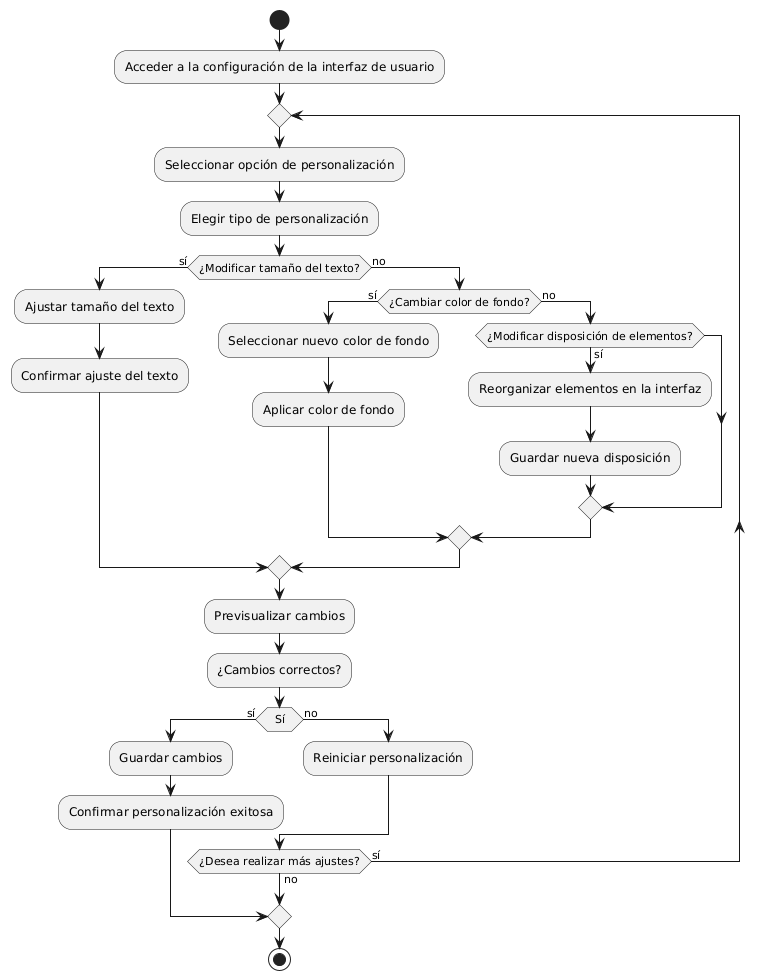

# DISEÑAR E IMPLEMENTAR PERSONALIZACIÓN DE LA INTERFAZ DE USUARIO 

------

## Diagrama de Actividades
[Creado con plantuml](https://plantuml.com/es/)

{ align=center }

Este diagrama de actividad muestra el proceso de personalización de una interfaz de usuario. Incluye pasos para ajustar el tamaño del texto, cambiar el color de fondo y reorganizar elementos. El usuario puede previsualizar y confirmar los cambios, y realizar ajustes adicionales si es necesario.
---
###

## Caso de uso historia Interfaz y Experinecia del Usuario
Tenemos la responsabilidad de que La página debe verse bien en cualquier dispositivo de usuarios, parte de eso al momento de ingresar de cargar rápido, y que cada botón sea fácil de encontrar para la comodidad de pepito, es importante dado que pepito es un hombre de mediana edad y debe tener botones de ayuda al usuario por que a la gente mayor se les dificulta las compras en línea,  y como todos cometemos errores, la página va a tener acciones inmediatas y con notificación cuando tenemos una acción inadecuada.

<table id="customers">
  <tr class="idtext principal">
    <td>ID MACP-18</td>
  </tr>
  <tr class="single text">
    <td><strong>Requerimiento</strong>:Implementar personalización de la interfaz de usuario ID MACP-18</td>
  </tr>
  <tr class="single gray">
    <td><strong>Historia de usuario</strong></td>
  </tr>
  <tr class="single text">
    <td>Como usuario quiero poder personalizar la interfaz de usuario para adaptarla a mis preferencias individuales, como el tamaño del texto, el color de fondo y la disposición de los elementos, para una experiencia de uso más cómoda y personalizada.</td>
  </tr>
  <tr class="duo">
    <th class="gray"><strong>Estado de la tarea</strong></th>
    <th>En desarrollo</th>
  </tr>
  <tr class="single gray">
    <td><strong>Caso de uso (Pasos)</strong></td>
  </tr>
  <tr class="single text">
    <td>
        <ol>
            <li>
             <li>Acceso a Opciones de Personalización: El usuario accede a la sección de personalización a través de un menú de configuración en la interfaz de usuario.</li>
            <li>Ajuste del Tamaño del Texto: El usuario selecciona el tamaño del texto deseado a través de una opción de ajuste en un control deslizante o menú desplegable.</li>
            <li>Selección del Color de Fondo: El usuario elige un color de fondo mediante un selector de color o una paleta predefinida.</li>
           <li>Modificación de la Disposición de los Elementos: El usuario reconfigura la disposición de los elementos arrastrando y soltando componentes en la interfaz.</li>
          <li>Aplicación de Cambios: El usuario guarda los cambios realizados y la interfaz de usuario se actualiza para reflejar las nuevas preferencias.</li>
          <li>Confirmación: El usuario recibe una notificación de que los cambios se han aplicado correctamente.</li>
        </ol>
    </td>
  </tr>
  <tr class="single gray">
    <td><strong>Criterios de aceptación</strong></td>
  </tr>
  <tr class="single text">
    <td>
        <ol>
                  <li>Acceso a Personalización: El usuario puede acceder a las opciones de personalización desde el menú de configuración de la interfaz de usuario sin problemas.</li>
                  <li>Ajuste del Tamaño del Texto: El usuario puede cambiar el tamaño del texto utilizando un control deslizante o menú desplegable y los cambios se reflejan en toda la interfaz de usuario inmediatamente.</li>
                  <li>Selección del Color de Fondo: El usuario puede seleccionar un color de fondo mediante un selector de color o una paleta predefinida, y el nuevo color de fondo se aplica a la interfaz de usuario correctamente.</li>
                  <li>Modificación de la Disposición de los Elementos: El usuario puede arrastrar y soltar los elementos en la interfaz de usuario para reconfigurarlos, y la nueva disposición se guarda y refleja en la interfaz de usuario.</li>
                  <li>Aplicación y Confirmación de Cambios: El usuario puede guardar los cambios y recibir una confirmación visual o notificación de que los cambios se han aplicado correctamente.</li>
                  <li>Cancelación y Reversión: El usuario puede cancelar los cambios antes de guardarlos y/o revertir a la configuración predeterminada de la interfaz si lo desea.</li>
                  <li>Persistencia de Configuración: Las preferencias de personalización se mantienen y aplican en futuras sesiones del usuario.</li>
                  <li>Compatibilidad y Accesibilidad: Las opciones de personalización deben ser accesibles y funcionales en todos los dispositivos y navegadores compatibles con el sistema.</li>
 <tr class="duo">
    <th class="gray"><strong>Calidad</strong></th>
    <th>En desarrollo</th>
  </tr>
  <tr class="duo">
    <th class="gray"><strong>Versionamiento</strong></th>
    <th>En desarrollo</th>
  </tr>
</table>

---
## Diagrama de Caso de uso
[Creado con plantuml](https://plantuml.com/es/)

{ align=center }

Como usuario, quiero personalizar la interfaz de usuario para ajustar el tamaño del texto, el color de fondo y la disposición de los elementos según mis preferencias. Esto me permitirá tener una experiencia más cómoda y adaptada a mis necesidades, mejorando la usabilidad y satisfacción general.
 