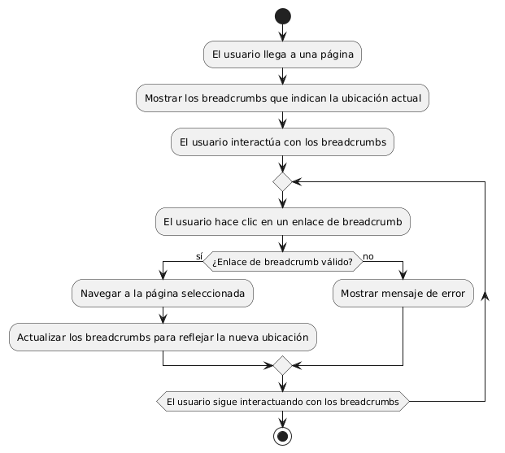

# DISEÑAR E IMPLEMENTAR BREADCRUMBS PARA FACIL NAVEGACIÓN 

------

## Diagrama de Actividades
[Creado con plantuml](https://plantuml.com/es/)

{ align=center }

El diagrama de actividad muestra cómo un usuario navega por un sitio web utilizando breadcrumbs para mantener la orientación. Desde la página principal, el usuario avanza a diferentes niveles y retrocede a páginas anteriores, con los breadcrumbs actualizándose para reflejar la ubicación actual y facilitar la navegación sin perder contexto.
---
###

## Caso de uso historia Interfaz y Experinecia del Usuario
Tenemos la responsabilidad de que La página debe verse bien en cualquier dispositivo de usuarios, parte de eso al momento de ingresar de cargar rápido, y que cada botón sea fácil de encontrar para la comodidad de pepito, es importante dado que pepito es un hombre de mediana edad y debe tener botones de ayuda al usuario por que a la gente mayor se les dificulta las compras en línea,  y como todos cometemos errores, la página va a tener acciones inmediatas y con notificación cuando tenemos una acción inadecuada.

<table id="customers">
  <tr class="idtext principal">
    <td>ID MACP-19</td>
  </tr>
  <tr class="single text">
    <td><strong>Requerimiento</strong>:Implementar breadcrumbs para fácil navegación ID MACP-19</td>
  </tr>
  <tr class="single gray">
    <td><strong>Historia de usuario</strong></td>
  </tr>
  <tr class="single text">
    <td>Como usuario quiero tener breadcrumbs para una fácil navegación para poder ubicarme rápidamente dentro del sitio web y retroceder a páginas anteriores sin perder el contexto de mi ubicación actual.</td>
  </tr>
  <tr class="duo">
    <th class="gray"><strong>Estado de la tarea</strong></th>
    <th>En desarrollo</th>
  </tr>
  <tr class="single gray">
    <td><strong>Caso de uso (Pasos)</strong></td>
  </tr>
  <tr class="single text">
    <td>
        <ol>
            <li>
             <li>Visualización de la Página: El usuario accede a una página dentro del sitio web.</li>
             <li>Generación de Breadcrumbs: El sistema genera el conjunto adecuado de breadcrumbs basado en la estructura de navegación del sitio web.</li>
            <li>Presentación en Interfaz: El sistema muestra los breadcrumbs en la interfaz de usuario en una ubicación visible y accesible, típicamente en la parte superior de la página.</li>
             <li>Interacción del Usuario: El usuario puede hacer clic en cualquiera de los enlaces dentro de los breadcrumbs para retroceder a una página anterior en la jerarquía.</li>
        </ol>
    </td>
  </tr>
  <tr class="single gray">
    <td><strong>Criterios de aceptación</strong></td>
  </tr>
  <tr class="single text">
    <td>
        <ol>
                  <li>Visibilidad: Los breadcrumbs deben ser visibles en todas las páginas del sitio web en una ubicación consistente, típicamente en la parte superior de la página o justo debajo del encabezado.</li>
                  <li>Formato y Diseño: Los breadcrumbs deben estar diseñados de manera clara y legible, utilizando un formato de "Inicio > Sección > Subsección > Página Actual".</li>
                  <li>Funcionalidad: Los enlaces dentro de los breadcrumbs deben ser clicables y llevar al usuario a la página correspondiente en la jerarquía.</li>
                  <li>Actualización Dinámica: Los breadcrumbs deben actualizarse automáticamente para reflejar la estructura de navegación actual del sitio web. En caso de cambios en la estructura del sitio, los breadcrumbs deben reflejar estos cambios sin necesidad de actualización manual por parte del usuario.</li>
                  <li>Accesibilidad: Los breadcrumbs deben ser accesibles para usuarios con discapacidades, incluyendo compatibilidad con lectores de pantalla.</li>
                  <li>Pruebas: Se deben realizar pruebas en diferentes navegadores y dispositivos para asegurar que los breadcrumbs se muestran y funcionan correctamente en todos ellos. Debe verificarse que los breadcrumbs funcionen correctamente con la navegación interna del sitio y no interfieran con otros elementos de la interfaz de usuario.</li>
 <tr class="duo">
    <th class="gray"><strong>Calidad</strong></th>
    <th>En desarrollo</th>
  </tr>
  <tr class="duo">
    <th class="gray"><strong>Versionamiento</strong></th>
    <th>En desarrollo</th>
  </tr>
</table>

---
## Diagrama de Caso de uso
[Creado con plantuml](https://plantuml.com/es/)

{ align=center }

El diagrama de casos de uso ilustra cómo un usuario interactúa con los breadcrumbs en un sitio web. Permite ver la página actual, retroceder a la página anterior, navegar a la página principal y a la página de inicio, mejorando así la navegación y la orientación dentro del sitio.
 