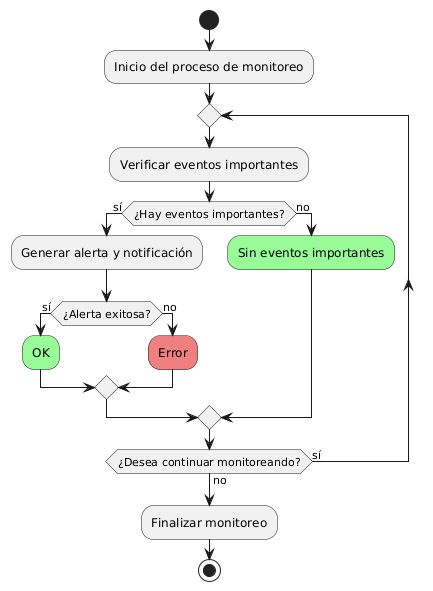

# DISEÑAR E IMPLEMENTAR ALERTAS Y NOTIFICACIONES EN TIEMPO REAL 

------

## Diagrama de Actividades
[Creado con plantuml](https://plantuml.com/es/)

{ align=center }

El diagrama de actividad describe un proceso de monitoreo que verifica eventos importantes, genera alertas y notificaciones en tiempo real, y maneja errores. Si hay eventos, se envían alertas y se verifica su éxito. El proceso se repite hasta que se decide finalizar el monitoreo.
---
###

## Caso de uso historia Interfaz y Experinecia del Usuario
Tenemos la responsabilidad de que La página debe verse bien en cualquier dispositivo de usuarios, parte de eso al momento de ingresar de cargar rápido, y que cada botón sea fácil de encontrar para la comodidad de pepito, es importante dado que pepito es un hombre de mediana edad y debe tener botones de ayuda al usuario por que a la gente mayor se les dificulta las compras en línea,  y como todos cometemos errores, la página va a tener acciones inmediatas y con notificación cuando tenemos una acción inadecuada.

<table id="customers">
  <tr class="idtext principal">
    <td>ID MACP-20</td>
  </tr>
  <tr class="single text">
    <td><strong>Requerimiento</strong>:Implementar alertas y notificaciones en tiempo real ID MACP-20</td>
  </tr>
  <tr class="single gray">
    <td><strong>Historia de usuario</strong></td>
  </tr>
  <tr class="single text">
    <td>Como usuario, quiero recibir alertas y notificaciones en tiempo real sobre eventos importantes para que pueda estar informado y tomar las medidas necesarias.</td>
  </tr>
  <tr class="duo">
    <th class="gray"><strong>Estado de la tarea</strong></th>
    <th>En desarrollo</th>
  </tr>
  <tr class="single gray">
    <td><strong>Caso de uso (Pasos)</strong></td>
  </tr>
  <tr class="single text">
    <td>
        <ol>
             <li>El sistema detecta un evento importante: El sistema identifica un evento relevante que requiere que el usuario sea informado de inmediato (por ejemplo, una actualización crítica, una alerta de seguridad, un recordatorio de vencimiento, etc.).</li>
            <li>El sistema envía una notificación: El sistema genera y envía una notificación en tiempo real al usuario a través de sus canales de comunicación preferidos (por ejemplo, correo electrónico, mensaje de texto, notificación push, etc.).</li>
           <li>El usuario recibe la notificación: El usuario recibe la notificación de manera oportuna en el dispositivo o canal que ha seleccionado en sus preferencias.</li>
           <li>El usuario toma acción: El usuario lee la notificación y toma las medidas necesarias en respuesta al evento.</li>
        </ol>
    </td>
  </tr>
  <tr class="single gray">
    <td><strong>Criterios de aceptación</strong></td>
  </tr>
  <tr class="single text">
    <td>
        <ol>
               <li>
                  <li>Envío en Tiempo Real: La notificación debe ser enviada y recibida por el usuario en tiempo real o con una latencia mínima, acorde a las necesidades del evento. </li>
•  <li>Canales de Notificación: La notificación debe enviarse a través de los canales seleccionados por el usuario (por ejemplo, correo electrónico, mensaje de texto, notificación push).</li>
•  <li>Formato de Notificación: La notificación debe ser clara y proporcionar suficiente información sobre el evento para que el usuario pueda comprender rápidamente la situación y actuar en consecuencia.</li>
•  <li>Configuración de Preferencias: El sistema debe permitir a los usuarios configurar y actualizar sus preferencias de notificación (por ejemplo, tipos de eventos, frecuencia, canales de comunicación).</li>
•  <li>Confirmación de Recepción: Si el canal de notificación lo permite, el sistema debe proporcionar una confirmación de recepción de la notificación (por ejemplo, un acuse de recibo para notificaciones push o un informe de entrega para correos electrónicos).</li>
•  <li>Registro de Intentos Fallidos: El sistema debe registrar los intentos fallidos de envío de notificaciones para su posterior análisis y resolución de problemas.</li>
•  <li>Accesibilidad: Las notificaciones deben ser accesibles en diferentes dispositivos y plataformas según las configuraciones del usuario (por ejemplo, móviles, tabletas, computadoras de escritorio).</li>
•  <li>Seguridad: Las notificaciones deben cumplir con los estándares de seguridad y privacidad para proteger la información del usuario y garantizar que solo el usuario destinatario reciba la notificación.</li>
•  <li>Pruebas y Validación: Se deben realizar pruebas exhaustivas para garantizar que las notificaciones se envíen y reciban correctamente en todos los escenarios previstos.</li>
 <tr class="duo">
    <th class="gray"><strong>Calidad</strong></th>
    <th>En desarrollo</th>
  </tr>
  <tr class="duo">
    <th class="gray"><strong>Versionamiento</strong></th>
    <th>En desarrollo</th>
  </tr>
</table>

---
## Diagrama de Caso de uso
[Creado con plantuml](https://plantuml.com/es/)

{ align=center }

El diagrama de casos de uso muestra cómo un usuario interactúa con el sistema de alertas y notificaciones en tiempo real. Incluye casos de uso para recibir, configurar y visualizar el historial de alertas y notificaciones. Esto permite al usuario estar informado y gestionar sus preferencias de manera efectiva.