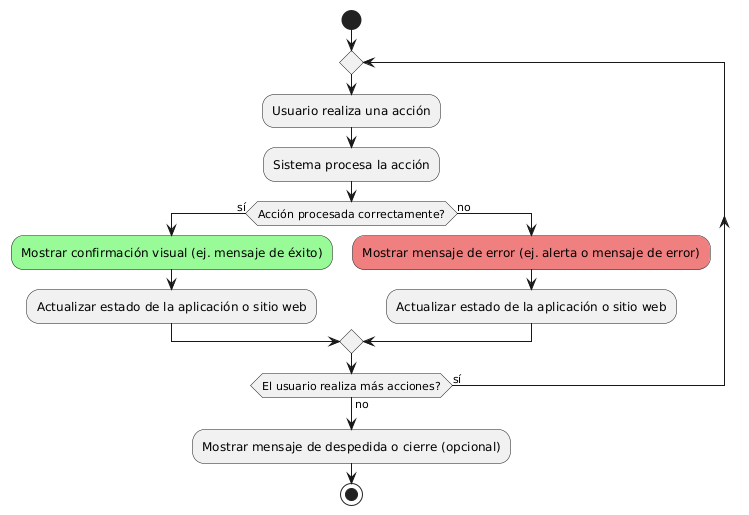

# DISEÑAR E IMPLEMENTAR FEEDBACK VISUAL TRAS INTERACCIÓN

------

## Diagrama de Actividades
[Creado con plantuml](https://plantuml.com/es/)

{ align=center }

Este diagrama de actividad muestra cómo un sistema proporciona feedback visual tras cada acción del usuario. El proceso incluye la verificación de si la acción fue exitosa o fallida, mostrando mensajes de confirmación o error, y actualizando el estado de la aplicación. El ciclo se repite hasta que el usuario termina.
---
###

## Caso de uso historia Interfaz y Experinecia del Usuario
Tenemos la responsabilidad de que La página debe verse bien en cualquier dispositivo de usuarios, parte de eso al momento de ingresar de cargar rápido, y que cada botón sea fácil de encontrar para la comodidad de pepito, es importante dado que pepito es un hombre de mediana edad y debe tener botones de ayuda al usuario por que a la gente mayor se les dificulta las compras en línea,  y como todos cometemos errores, la página va a tener acciones inmediatas y con notificación cuando tenemos una acción inadecuada.

<table id="customers">
  <tr class="idtext principal">
    <td>ID MACP-21</td>
  </tr>
  <tr class="single text">
    <td><strong>Requerimiento</strong>:Implementar feedback visual tras interacción ID MACP-21</td>
  </tr>
  <tr class="single gray">
    <td><strong>Historia de usuario</strong></td>
  </tr>
  <tr class="single text">
    <td>Como usuario quiero recibir feedback visual tras cada interacción para tener una confirmación clara de que mi acción ha sido procesada correctamente y entender el estado de la aplicación o sitio web en todo momento.</td>
  </tr>
  <tr class="duo">
    <th class="gray"><strong>Estado de la tarea</strong></th>
    <th>En desarrollo</th>
  </tr>
  <tr class="single gray">
    <td><strong>Caso de uso (Pasos)</strong></td>
  </tr>
  <tr class="single text">
    <td>
        <ol>
             <li>Interacción del Usuario: El usuario realiza una acción en la aplicación o sitio web por ejemplo, enviar un formulario, hacer clic en un botón, etc.</li>
             <li>Procesamiento de la Acción: El sistema procesa la acción del usuario.</li>
             <li>Feedback Visual: El sistema proporciona una respuesta visual inmediata que confirma la acción y su estado. Esto puede incluir cambios en el diseño, mensajes emergentes, iconos de carga, etc.</li>
             <li>Confirmación de la Acción: El usuario ve el feedback visual y entiende que su acción ha sido procesada correctamente o recibe una indicación clara del estado actual (por ejemplo, éxito, error, carga en progreso).</li>
        </ol>
    </td>
  </tr>
  <tr class="single gray">
    <td><strong>Criterios de aceptación</strong></td>
  </tr>
  <tr class="single text">
    <td>
        <ol>
               <li>
                  <li>Feedback de Éxito: Tras una acción exitosa, el sistema debe mostrar un feedback visual que indique claramente que la acción se completó con éxito por ejemplo, un mensaje de confirmación verde o una animación de éxito.</li>
                  <li>Feedback de Error: En caso de error, el sistema debe proporcionar un feedback visual que explique el problema y sugiera acciones para resolverlo por ejemplo, un mensaje de error rojo con detalles sobre lo que salió mal.</li>
                  <li>Feedback de Progreso: Mientras se está procesando una acción que toma tiempo, el sistema debe mostrar un feedback visual de carga que informe al usuario que la acción está en curso por ejemplo, un spinner o una barra de progreso.</li>
                  <li>Consistencia: El feedback visual debe ser consistente en todo el sistema. Los mismos tipos de acciones deben tener el mismo tipo de feedback visual en todas las partes de la aplicación o sitio web.</li>
                  <li>Claridad y Visibilidad: El feedback visual debe ser claro y fácilmente visible para el usuario. Los mensajes y los iconos deben ser lo suficientemente grandes y contrastantes para ser notados sin dificultad.</li>
                  <li>Desaparecer Automáticamente: El feedback visual de éxito o error debe desaparecer automáticamente después de un tiempo razonable o después de que el usuario interactúe con la aplicación (por ejemplo, al hacer clic en un botón de "Aceptar" o cerrar un mensaje de notificación).</li>
                  <li>Accesibilidad: El feedback visual debe ser accesible para todos los usuarios, incluyendo aquellos con discapacidades. Esto puede incluir la implementación de lectores de pantalla o descripciones alternativas para los elementos visuales.</li>
 <tr class="duo">
    <th class="gray"><strong>Calidad</strong></th>
    <th>En desarrollo</th>
  </tr>
  <tr class="duo">
    <th class="gray"><strong>Versionamiento</strong></th>
    <th>En desarrollo</th>
  </tr>
</table>

---
## Diagrama de Caso de uso
[Creado con plantuml](https://plantuml.com/es/)

{ align=center }

El diagrama muestra cómo un usuario interactúa con un sistema, generando feedback visual para confirmar la acción. Este feedback actualiza el estado de la interfaz y del sistema, asegurando que el usuario reciba una confirmación clara y comprensible de que su acción ha sido procesada correctamente.