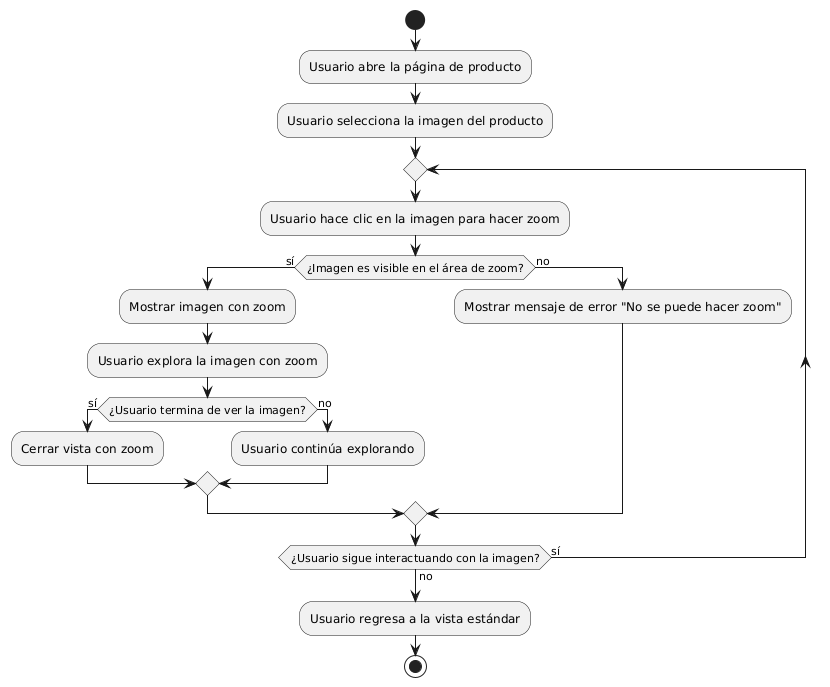

# DISEÑAR E IMPLEMENTAR FUNCIONALIDAD DE ZOOM EN IMAGENES DE PRODUCTO 

------

## Diagrama de Actividades
[Creado con plantuml](https://plantuml.com/es/)

{ align=center }

Este diagrama de actividad muestra cómo implementar la funcionalidad de zoom en imágenes de productos. Incluye pasos para que el usuario seleccione una imagen, haga zoom, explore detalles, y regrese a la vista estándar. También gestiona errores, como la imposibilidad de realizar el zoom, y permite una navegación fluida.
---
###

## Caso de uso historia Interfaz y Experinecia del Usuario
Tenemos la responsabilidad de que La página debe verse bien en cualquier dispositivo de usuarios, parte de eso al momento de ingresar de cargar rápido, y que cada botón sea fácil de encontrar para la comodidad de pepito, es importante dado que pepito es un hombre de mediana edad y debe tener botones de ayuda al usuario por que a la gente mayor se les dificulta las compras en línea,  y como todos cometemos errores, la página va a tener acciones inmediatas y con notificación cuando tenemos una acción inadecuada.

<table id="customers">
  <tr class="idtext principal">
    <td>ID MACP-22</td>
  </tr>
  <tr class="single text">
    <td><strong>Requerimiento</strong>:Implementar funcionalidad de zoom en imágenes de productos ID MACP-22</td>
  </tr>
  <tr class="single gray">
    <td><strong>Historia de usuario</strong></td>
  </tr>
  <tr class="single text">
    <td>Como usuario quiero tener la funcionalidad de hacer zoom en las imágenes de los productos para poder ver detalles más precisos y hacer una evaluación más completa antes de tomar una decisión de compra.</td>
  </tr>
  <tr class="duo">
    <th class="gray"><strong>Estado de la tarea</strong></th>
    <th>En desarrollo</th>
  </tr>
  <tr class="single gray">
    <td><strong>Caso de uso (Pasos)</strong></td>
  </tr>
  <tr class="single text">
    <td>
        <ol>
            <li>
             <li>El usuario navega a una página de producto y observa la imagen del producto.</li>
            <li>El usuario realiza una acción para activar el zoom (por ejemplo, pasar el cursor sobre la imagen o hacer clic en un botón de zoom).</li>
           <li>La imagen se amplía para mostrar un área más detallada, permitiendo al usuario ver detalles más finos.</li>
           <li>El usuario puede mover el área de zoom para examinar diferentes partes de la imagen.</li>
           <li>El usuario puede desactivar el zoom para volver a la vista normal de la imagen.</li>
        </ol>
    </td>
  </tr>
  <tr class="single gray">
    <td><strong>Criterios de aceptación</strong></td>
  </tr>
  <tr class="single text">
    <td>
        <ol>
                  <li>Activación del Zoom: El usuario puede activar la funcionalidad de zoom de manera intuitiva (por ejemplo, al pasar el cursor sobre la imagen o al hacer clic en un botón específico).</li>
                  <li>Calidad de la Imagen: La imagen ampliada debe mantener una calidad aceptable para que los detalles sean visibles y claros.</li>
                  <li>Interactividad: El usuario puede mover el área de zoom para ver diferentes partes de la imagen. El zoom se puede desactivar de manera simple por ejemplo, al hacer clic fuera del área de zoom o presionar un botón de cierre.</li>
                  <li>Rendimiento: La funcionalidad de zoom debe funcionar sin causar retrasos significativos o problemas de rendimiento en la página.</li>
                  <li>Compatibilidad: La funcionalidad de zoom debe ser compatible con los principales navegadores web (Chrome, Firefox, Safari, Edge) y dispositivos (desktops y móviles).</li>
                  <li>Mensajes de Error: En caso de que la imagen no tenga suficiente resolución para el zoom, debe mostrarse un mensaje claro al usuario explicando la limitación.</li>
                 <li>Accesibilidad: La funcionalidad de zoom debe ser accesible para usuarios con discapacidades, incluyendo compatibilidad con tecnologías de asistencia como lectores de pantalla.</li>
                 <li>Responsividad:La funcionalidad de zoom debe ser responsiva y ajustarse correctamente en diferentes tamaños de pantalla, incluyendo dispositivos móviles y tablets.</li>
 <tr class="duo">
    <th class="gray"><strong>Calidad</strong></th>
    <th>En desarrollo</th>
  </tr>
  <tr class="duo">
    <th class="gray"><strong>Versionamiento</strong></th>
    <th>En desarrollo</th>
  </tr>
</table>

---
## Diagrama de Caso de uso
[Creado con plantuml](https://plantuml.com/es/)

{ align=center }

El sistema permite a los usuarios visualizar imágenes de productos con funcionalidades de zoom. Los usuarios pueden ampliar o reducir la imagen, moverla para explorar diferentes áreas y restablecer el zoom a su configuración original, facilitando una evaluación detallada del producto antes de realizar una compra.