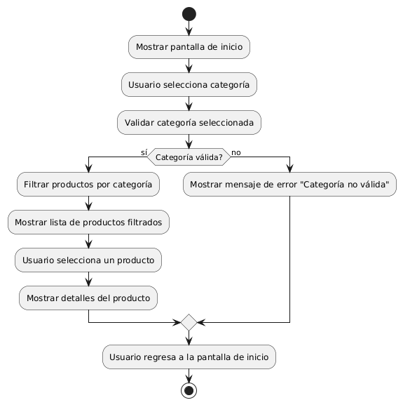

# DISEÑAR UN FILTRADO DE PRODUCTOS POR CATEGORIA 

------
## Diagrama de Actividades
[Creado con plantuml](https://plantuml.com/es/)

{ align=center }

Este diagrama de actividad ilustra el proceso de filtrado de productos por categoría. Muestra cómo el usuario selecciona una categoría, valida su elección, filtra los productos, y luego visualiza los detalles del producto seleccionado. Si la categoría no es válida, se muestra un mensaje de error y se regresa a la pantalla principal.
---
###

## Caso de uso historia MACP-24
Si un pepito perez desea ver nuestro catálogo de productos, verá que  cada producto tendrá información detallada, como precio, color, tamaño, etc. también puede  seleccionar las  categorías para filtrar los productos u ordenar productos por precio, popularidad, etc. y como sabemos que para crecer como empresa debemos valorar la opinión de usuarios, por ende:  pepito perez podra dejar comentarios y estrellas de valoración.

<table id="customers">
  <tr class="idtext principal">
    <td>ID MACP-24</td>
  </tr>
  <tr class="single text">
    <td><strong>Requerimiento</strong>: Diseñar un filtrado de productos por categoría ID MACP-24</td>
  </tr>
  <tr class="single gray">
    <td><strong>Historia de usuario</strong></td>
  </tr>
  <tr class="single text">
    <td>Como usuario, quiero encontrar productos específicos dentro de una categoría determinada para poder navegar de manera más eficiente y encontrar rápidamente los productos que me interesan.</td>
  </tr>
  <tr class="duo">
    <th class="gray"><strong>Estado de la tarea</strong></th>
    <th>En desarrollo</th>
  </tr>
  <tr class="single gray">
    <td><strong>Caso de uso (Pasos)</strong></td>
  </tr>
  <tr class="single text">
    <td>
        <ol>
            <li>El usuario accede a la página de productos.</li>
               <li>El sistema muestra una lista de categorías disponibles en un panel de filtrado o en un menú lateral.</li>
              <li>El usuario selecciona una categoría de interés.</li>
               <li>El sistema filtra y muestra productos solo de la categoría seleccionada.</li>
               <li>El usuario puede ver y seleccionar productos dentro de la categoría filtrada.</li>
        </ol>
    </td>
  </tr>
  <tr class="single gray">
    <td><strong>Criterios de aceptación</strong></td>
  </tr>
  <tr class="single text">
    <td>
        <ol>
                  <li>Visualización de Categorías: El sistema debe mostrar claramente una lista de categorías disponibles en un lugar accesible en la interfaz de usuario.</li>
                  <li>Selección de Categoría: Al seleccionar una categoría, el sistema debe filtrar y mostrar solo los productos que pertenecen a la categoría seleccionada.</li>
                  <li>Mensaje de Categoría Vacía: Si no hay productos en la categoría seleccionada, el sistema debe mostrar un mensaje claro indicando que no hay productos disponibles en esa categoría.</li>
                  <li>Interactividad y Usabilidad: La lista de categorías y el filtrado deben ser fácilmente accesibles y utilizables, con un diseño que facilite la navegación.</li>
                  <li>Compatibilidad y Rendimiento: El sistema debe funcionar correctamente en diferentes dispositivos y navegadores, La funcionalidad de filtrado debe ser eficiente y no afectar negativamente el rendimiento del sistema.</li>
    </td>
  </tr>
 <tr class="duo">
    <th class="gray"><strong>Calidad</strong></th>
    <th>En desarrollo</th>
  </tr>
  <tr class="duo">
    <th class="gray"><strong>Versionamiento</strong></th>
    <th>En desarrollo</th>
  </tr>
</table>

---
## Diagrama de Caso de uso
[Creado con plantuml](https://plantuml.com/es/)

{ align=center }
El diagrama de casos de uso muestra cómo un usuario interactúa con el sistema para encontrar productos específicos. Inicia el filtrado por categoría, ve una lista de productos filtrados, selecciona un producto y finalmente revisa sus detalles, mejorando la eficiencia en la navegación y búsqueda de productos.
