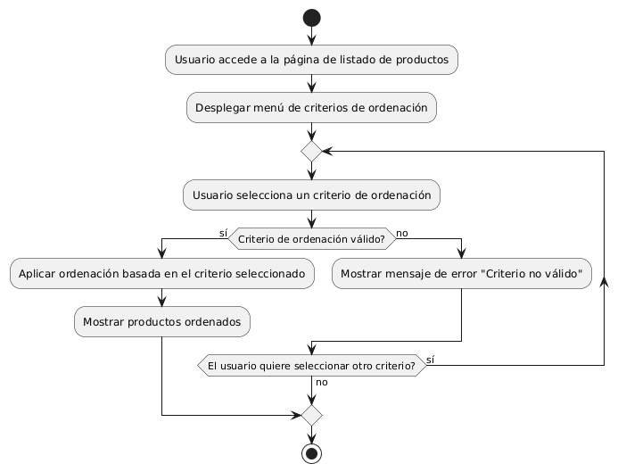

# DISEÑAR MENUS DESPLEGABLES 

------
## Diagrama de Actividades
[Creado con plantuml](https://plantuml.com/es/)

{ align=center }

Este diagrama de actividad muestra cómo un usuario selecciona un criterio de ordenación en una página de productos. Comienza mostrando el menú desplegable, permite al usuario elegir un criterio, valida la selección, aplica la ordenación y muestra los productos ordenados, repitiendo el proceso si es necesario.
---
###

## Caso de uso historia Epica Catalogo de Productos
Si un pepito perez desea ver nuestro catálogo de productos, verá que  cada producto tendrá información detallada, como precio, color, tamaño, etc. también puede  seleccionar las  categorías para filtrar los productos u ordenar productos por precio, popularidad, etc. y como sabemos que para crecer como empresa debemos valorar la opinión de usuarios, por ende:  pepito perez podra dejar comentarios y estrellas de valoración.

<table id="customers">
  <tr class="idtext principal">
    <td>ID MACP-25</td>
  </tr>
  <tr class="single text">
    <td><strong>Requerimiento</strong>: Diseñar menús desplegable ID MACP-25</td>
  </tr>
  <tr class="single gray">
    <td><strong>Historia de usuario</strong></td>
  </tr>
  <tr class="single text">
    <td>Como usuario, quiero seleccionar el criterio de ordenación de los productos en una página de listado Para organizar los productos de la manera que me sea más conveniente.</td>
  </tr>
  <tr class="duo">
    <th class="gray"><strong>Estado de la tarea</strong></th>
    <th>En desarrollo</th>
  </tr>
  <tr class="single gray">
    <td><strong>Caso de uso (Pasos)</strong></td>
  </tr>
  <tr class="single text">
    <td>
        <ol>
            <li>El usuario accede a la página de listado de productos.</li>
              <li>  El sistema muestra el menú desplegable de criterios de ordenación.</li>
               <li> El usuario selecciona un criterio de ordenación.</li>
               <li> El sistema actualiza la lista de productos según el criterio seleccionado.</li>
        </ol>
    </td>
  </tr>
  <tr class="single gray">
    <td><strong>Criterios de aceptación</strong></td>
  </tr>
  <tr class="single text">
    <td>
        <ol>
                  <li>Disponibilidad del Menú Desplegable: El menú desplegable para la selección del criterio de ordenación debe ser visible y accesible en la parte superior de la lista de productos. El menú debe estar disponible en todas las vistas de la página de listado de productos.</li>
                  <li>Opciones de Ordenación: El menú desplegable debe mostrar al menos tres criterios de ordenación válidos, Las opciones deben ser relevantes y útiles para la organización de los productos.</li>
                    <li>Actualización de la Lista: Al seleccionar un criterio de ordenación, la lista de productos debe actualizarse automáticamente para reflejar el orden especificado por el criterio seleccionado.</li>
                    <li>Persistencia de la Selección: El criterio de ordenación seleccionado debe ser recordado durante la sesión del usuario y aplicado correctamente si el usuario navega hacia adelante o hacia atrás dentro de la página de listado.</li>
                     <li>Accesibilidad y Usabilidad: El menú desplegable debe ser accesible y fácil de usar en diferentes dispositivos y tamaños de pantalla.</li>
    </td>
  </tr>
 <tr class="duo">
    <th class="gray"><strong>Calidad</strong></th>
    <th>En desarrollo</th>
  </tr>
  <tr class="duo">
    <th class="gray"><strong>Versionamiento</strong></th>
    <th>En desarrollo</th>
  </tr>
</table>

---
## Diagrama de Caso de uso
[Creado con plantuml](https://plantuml.com/es/)

{ align=center }
El diagrama de casos de uso muestra cómo un usuario interactúa con el sistema para encontrar productos específicos. Inicia el filtrado por categoría, ve una lista de productos filtrados, selecciona un producto y finalmente revisa sus detalles, mejorando la eficiencia en la navegación y búsqueda de productos.
