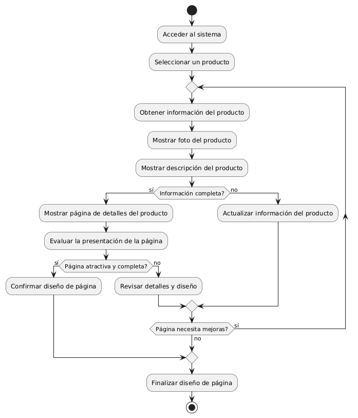

# DISEÑAR PAGINAS DE DETALLES DE PRODUCTOS CON FOTO Y DESCRIPCIÓN

------
## Diagrama de Actividades
[Creado con plantuml](https://plantuml.com/es/)

{ align=center }

El diagrama de actividad ilustra el proceso de diseño de páginas de detalles de productos. Comienza con la selección del producto y la recopilación de información, seguido de la inclusión de fotos y descripciones. Luego, evalúa la presentación y hace ajustes hasta que la página sea completa y atractiva.
---
###

## Caso de uso historia Epica Catalogo de Productos
Si un pepito perez desea ver nuestro catálogo de productos, verá que  cada producto tendrá información detallada, como precio, color, tamaño, etc. también puede  seleccionar las  categorías para filtrar los productos u ordenar productos por precio, popularidad, etc. y como sabemos que para crecer como empresa debemos valorar la opinión de usuarios, por ende:  pepito perez podra dejar comentarios y estrellas de valoración.

<table id="customers">
  <tr class="idtext principal">
    <td>ID MACP-26</td>
  </tr>
  <tr class="single text">
    <td><strong>Requerimiento</strong>: diseñar páginas de detalles de productos con fotos y descripciones ID MACP-26</td>
  </tr>
  <tr class="single gray">
    <td><strong>Historia de usuario</strong></td>
  </tr>
  <tr class="single text">
    <td>Como usuario, quiero acceder a páginas de detalles de productos que me presenten información completa y atractiva sobre los productos que me interesan Para poder tomar decisiones informadas sobre mi compra.</td>
  </tr>
  <tr class="duo">
    <th class="gray"><strong>Estado de la tarea</strong></th>
    <th>En desarrollo</th>
  </tr>
  <tr class="single gray">
    <td><strong>Caso de uso (Pasos)</strong></td>
  </tr>
  <tr class="single text">
    <td>
        <ol>
            <li>El usuario navega por el sitio web o realiza una búsqueda de productos.</li>
           <li>El usuario selecciona un producto de interés de la lista de resultados o de una categoría.</li>
            <li>El sistema muestra la página de detalles del producto.</li>
             <li>La página presenta: Una imagen principal del producto, Nombre del producto, Descripción completa del producto, Especificaciones o características del producto, Precio, Información de disponibilidad (en stock o fuera de stock), Opciones para seleccionar cantidad o variaciones, Botón para agregar al carrito, Opciones para compartir el producto en redes sociales o enviar por correo electrónico.</li>
             <li>El usuario revisa la información y decide si desea agregar el producto al carrito o continuar explorando.</li>

    </td>
  </tr>
  <tr class="single gray">
    <td><strong>Criterios de aceptación</strong></td>
  </tr>
  <tr class="single text">
    <td>
        <ol>
                  <li>Imágenes del Producto: La página debe mostrar una imagen principal del producto de alta calidad. Debe haber una galería de fotos adicionales que el usuario pueda explorar.</li>
                  <li>Descripción del Producto: La descripción del producto debe ser clara, precisa y completa, proporcionando toda la información relevante. Debe haber un resumen breve y destacado al inicio de la descripción.</li>
                  <li>Especificaciones y Características: Las especificaciones técnicas o características del producto deben estar listadas de manera clara y organizada. Deben incluirse detalles relevantes como dimensiones, materiales, capacidades, etc.</li>
                    <li>Precio: El precio del producto debe estar claramente visible y actualizado. Debe indicar si el precio está en oferta o incluye algún tipo de descuento.</li>
                   <li>Disponibilidad: La página debe mostrar la disponibilidad del producto. Debe indicar el tiempo estimado de envío si el producto está disponible.</li>
                   <li>Opciones de Compra: Debe haber opciones para seleccionar cantidad y variaciones del producto como talla, color, tela, etc. El botón de Agregar al carrito debe estar claramente visible y funcional.</li>
                     <li>Interactividad y Usabilidad: La página debe ser fácil de navegar y estéticamente atractiva. Debe ser compatible con dispositivos móviles y de escritorio.</li>
                    <li>Funcionalidades Adicionales: Deben estar presentes opciones para compartir el producto en redes sociales y enviar por correo electrónico. La página debe permitir al usuario dejar comentarios o valoraciones si se requiere.</li>

  </tr>
 <tr class="duo">
    <th class="gray"><strong>Calidad</strong></th>
    <th>En desarrollo</th>
  </tr>
  <tr class="duo">
    <th class="gray"><strong>Versionamiento</strong></th>
    <th>En desarrollo</th>
  </tr>
</table>

---
## Diagrama de Caso de uso
[Creado con plantuml](https://plantuml.com/es/)

{ align=center }

Las páginas de detalles de productos presentan información completa y visualmente atractiva para facilitar la toma de decisiones de compra. Incluyen fotos de alta calidad y descripciones detalladas del producto, permitiendo a los usuarios comparar opciones y obtener una visión clara de las características y beneficios antes de realizar una compra.