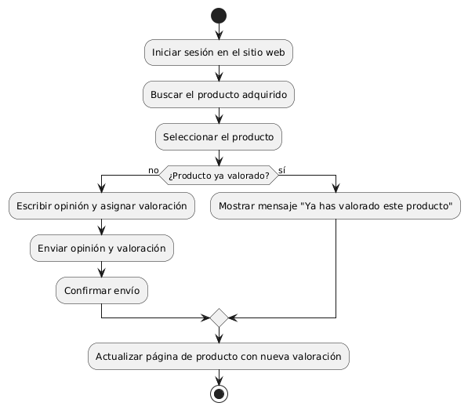

# DISEÑAR OPIBIÓN DE COMENTARIOS Y VALORACIÓN DE PRODUCTO

------
## Diagrama de Actividades
[Creado con plantuml](https://plantuml.com/es/)

{ align=center }

El diagrama de actividad ilustra el proceso de que un usuario opine y valore productos en un sitio web. El usuario selecciona un producto, escribe un comentario, da una valoración, y envía la información. El sistema valida, guarda los datos, actualiza la puntuación y muestra una confirmación, repitiendo si es necesario.
---
###

## Caso de uso historia Epica Catalogo de Productos
Si un pepito perez desea ver nuestro catálogo de productos, verá que  cada producto tendrá información detallada, como precio, color, tamaño, etc. también puede  seleccionar las  categorías para filtrar los productos u ordenar productos por precio, popularidad, etc. y como sabemos que para crecer como empresa debemos valorar la opinión de usuarios, por ende:  pepito perez podra dejar comentarios y estrellas de valoración.

<table id="customers">
  <tr class="idtext principal">
    <td>ID MACP-27</td>
  </tr>
  <tr class="single text">
    <td><strong>Requerimiento</strong>: diseñar opinión de comentarios y valoración de productos por parte de los usuarios ID MACP-27</td>
  </tr>
  <tr class="single gray">
    <td><strong>Historia de usuario</strong></td>
  </tr>
  <tr class="single text">
    <td>Como usuario, quiero expresar mi opinión y valoración sobre los productos que he adquirido en el sitio web Para compartir mi experiencia con otros usuarios y ayudarlos a tomar decisiones de compra informadas.</td>
  </tr>
  <tr class="duo">
    <th class="gray"><strong>Estado de la tarea</strong></th>
    <th>En desarrollo</th>
  </tr>
  <tr class="single gray">
    <td><strong>Caso de uso (Pasos)</strong></td>
  </tr>
  <tr class="single text">
    <td>
        <ol>
            <li>Iniciar sesión: El usuario inicia sesión en su cuenta en el sitio web.</li>
            <li>Acceder al producto: El usuario navega a la página del producto que ha adquirido y desea valorar.</li>
            <li>Seleccionar opción de valoración: El usuario hace clic en el botón o enlace para dejar una valoración y comentario.</li>
            <li>Ingresar valoración: El usuario selecciona una calificación (por ejemplo, de 1 a 5 estrellas).</li>
            <li>Escribir comentario: El usuario escribe un comentario sobre su experiencia con el producto.</li>
            <li>Enviar valoración: El usuario hace clic en el botón para enviar la valoración y comentario.</li>
            <li>Confirmación: El sistema muestra un mensaje de confirmación indicando que la valoración y comentario se han enviado correctamente.</li>
            <li>Visualización: La nueva valoración y comentario se muestran en la página del producto para que otros usuarios puedan verlo.</li>
    </td>
  </tr>
  <tr class="single gray">
    <td><strong>Criterios de aceptación</strong></td>
  </tr>
  <tr class="single text">
    <td>
        <ol>
                  <li>Acceso al producto: El usuario puede acceder a la página del producto adquirido desde su historial de compras o desde una búsqueda en el sitio.</li>
                  <li>Opción de valoración: El sitio muestra claramente un botón o enlace para dejar una valoración y comentario en la página del producto.</li>
                  <li>Ingreso de valoración: El usuario puede seleccionar una calificación de 1 a 5 , El sistema permite una única valoración por usuario por producto.</li>
                   <li>Ingreso de comentario: El campo para el comentario tiene un tamaño adecuado para permitir una descripción detallada.</li>
                   <li>Validación del comentario: El sistema valida que el comentario no contenga lenguaje ofensivo o inapropiado, y muestra mensajes claros para correcciones si es necesario.</li>
                  <li>Envío y confirmación: Tras enviar la valoración y el comentario, el usuario recibe una confirmación de que la acción se realizó con éxito. La valoración y el comentario se muestran en la página del producto inmediatamente después de ser enviados.</li>
                  <li>Visualización: Las valoraciones y comentarios son visibles para otros usuarios y están ordenados de manera clara.</li>
                  <li>Cumplimiento de políticas: La funcionalidad cumple con las políticas de privacidad y términos de uso del sitio web en cuanto a la recolección y manejo de opiniones y valoraciones.</li>
  </tr>
 <tr class="duo">
    <th class="gray"><strong>Calidad</strong></th>
    <th>En desarrollo</th>
  </tr>
  <tr class="duo">
    <th class="gray"><strong>Versionamiento</strong></th>
    <th>En desarrollo</th>
  </tr>
</table>

---
## Diagrama de Caso de uso
[Creado con plantuml](https://plantuml.com/es/)

{ align=center }

El sistema permite a los usuarios escribir opiniones y valorar productos, así como leer opiniones y valoraciones de otros usuarios. Esta funcionalidad ayuda a los compradores a compartir experiencias y tomar decisiones informadas al adquirir productos, promoviendo una comunidad más transparente y colaborativa en el sitio web.