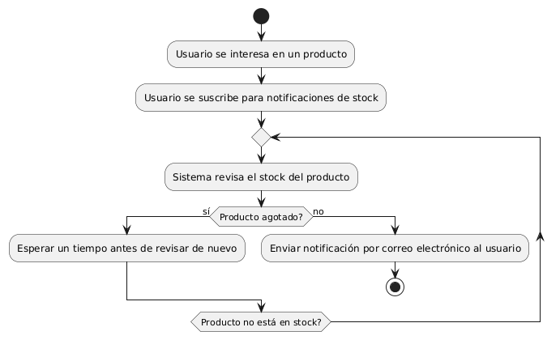

# DISEÑAR NOTIFICACIONES DE STOCK PARA PRODUCTOS AGOTADOS

------
## Diagrama de Actividades
[Creado con plantuml](https://plantuml.com/es/)

{ align=center }

El diagrama de actividad muestra el proceso para notificar a un usuario cuando un producto agotado vuelve a estar en stock. El usuario se suscribe a notificaciones, y el sistema revisa periódicamente el stock. Cuando el producto está disponible, se envía una notificación por correo electrónico al usuario.
---
###

## Caso de uso historia Epica Catalogo de Productos
Si un pepito perez desea ver nuestro catálogo de productos, verá que  cada producto tendrá información detallada, como precio, color, tamaño, etc. también puede  seleccionar las  categorías para filtrar los productos u ordenar productos por precio, popularidad, etc. y como sabemos que para crecer como empresa debemos valorar la opinión de usuarios, por ende:  pepito perez podra dejar comentarios y estrellas de valoración.

<table id="customers">
  <tr class="idtext principal">
    <td>ID MACP-28</td>
  </tr>
  <tr class="single text">
    <td><strong>Requerimiento</strong>: Diseñar notificaciones de stock para productos agotados ID MACP-28</td>
  </tr>
  <tr class="single gray">
    <td><strong>Historia de usuario</strong></td>
  </tr>
  <tr class="single text">
    <td>Como usuario, quiero recibir una notificación por correo electrónico cuando un producto que me interesa se encuentre agotado Para poder estar al tanto de la disponibilidad del producto y realizar mi compra cuando vuelva a estar en stock.</td>
  </tr>
  <tr class="duo">
    <th class="gray"><strong>Estado de la tarea</strong></th>
    <th>En desarrollo</th>
  </tr>
  <tr class="single gray">
    <td><strong>Caso de uso (Pasos)</strong></td>
  </tr>
  <tr class="single text">
    <td>
        <ol>
            <li>El usuario agrega un producto a su lista de seguimiento: El usuario selecciona un producto y opta por recibir notificaciones cuando el producto esté disponible.</li>
            <li>El producto se agota: El sistema detecta que el producto ha sido marcado como agotado.</li>
            <li>El sistema envía una notificación: Cuando el producto vuelva a estar en stock, el sistema envía un correo electrónico a todos los usuarios que han optado por recibir notificaciones para ese producto.</li>
           <li>El usuario recibe la notificación: El usuario recibe un correo electrónico informándole que el producto está nuevamente disponible para la compra.</li>
    </td>
  </tr>
  <tr class="single gray">
    <td><strong>Criterios de aceptación</strong></td>
  </tr>
  <tr class="single text">
    <td>
        <ol>
                  <li>Registro de Interés: El usuario puede agregar productos a una lista de seguimiento para recibir notificaciones. El sistema confirma la adición del producto a la lista de seguimiento mediante una notificación visual en la interfaz de usuario.</li>
                  <li>Detección de Agotamiento: El sistema detecta correctamente cuando un producto se agota y actualiza el estado del producto en el sistema.</li>
                  <li>Envío de Notificaciones: El sistema envía un correo electrónico a los usuarios registrados cuando el producto vuelva a estar en stock. El correo electrónico contiene la información necesaria para que el usuario pueda proceder a comprar el producto.</li>
                 <li>Dirección de Correo Electrónico Válida: El sistema verifica la validez de la dirección de correo electrónico y notifica al usuario en caso de que la dirección proporcionada sea inválida o incorrecta.</li>
                <li>Preferencias del Usuario: El usuario puede optar por darse de baja de las notificaciones para productos específicos o para todos los productos. </li>

  </tr>
 <tr class="duo">
    <th class="gray"><strong>Calidad</strong></th>
    <th>En desarrollo</th>
  </tr>
  <tr class="duo">
    <th class="gray"><strong>Versionamiento</strong></th>
    <th>En desarrollo</th>
  </tr>
</table>

---
## Diagrama de Caso de uso
[Creado con plantuml](https://plantuml.com/es/)

{ align=center }

El diagrama de casos de uso muestra cómo un usuario recibe notificaciones por correo electrónico sobre productos agotados. Incluye tres funcionalidades clave: monitorear la disponibilidad del producto, enviar notificaciones de stock y recibir actualizaciones. El sistema asegura que los usuarios estén informados y puedan realizar compras cuando el producto vuelva a estar disponible.