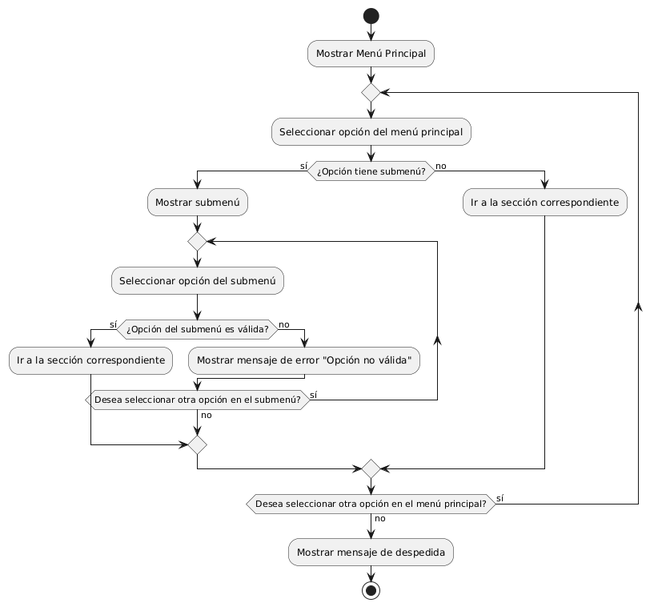

# CREAR SEBMENU DESPLEGABLE

------
## Diagrama de Actividades
[Creado con plantuml](https://plantuml.com/es/)

{ align=center }

Este diagrama de actividades ilustra el flujo de interacción de un usuario con un menú principal de un sitio web, incluyendo opciones con submenús desplegables. Muestra cómo el usuario navega, selecciona opciones y maneja mensajes de error, facilitando una experiencia organizada y eficiente en la navegación del sitio.
---
###

## Caso de uso historia Crear paginas de Inicio 
El usuario que quiere comprar muebles puede entrar a un menú principal o una página de inicio , el cual tiene enlaces a otras  páginas principales como inicio, catálogos, contactos entre otros más. Dentro de la misma página cuando el usuario pase el ratón sobre las opciones del menú principal se desplegará los submenús con más opciones; la página le proporcionará enlaces rápidos para iniciar sesión o registrarse; si la persona quiere entrar a la página desde su móvil, lo podrá hacer con toda comodidad ya que el menú es responsivo para móviles. También si el usuario quiere consultar las redes sociales lo podrá hacer ya que el menú de inicio tiene enlaces  a las mismas, y no menos importante la capacidad de ver todos los productos recomendados o más vendidos de la página.

<table id="customers">
  <tr class="idtext principal">
    <td>ID MACP-3</td>
  </tr>
  <tr class="single text">
    <td><strong>Requerimiento</strong>: Se debe crear un menú principal visible en todas las páginas ID MACP-3</td>
  </tr>
  <tr class="single gray">
    <td><strong>Historia de usuario</strong></td>
  </tr>
  <tr class="single text">
    <td>Como usuario, quiero que el menú principal del sitio web contenga submenús desplegables Para organizar las opciones de manera más eficiente y acceder rápidamente a las secciones específicas que me interesan.</td>
  </tr>
  <tr class="duo">
    <th class="gray"><strong>Estado de la tarea</strong></th>
    <th>En desarrollo</th>
  </tr>
  <tr class="single gray">
    <td><strong>Caso de uso (Pasos)</strong></td>
  </tr>
  <tr class="single text">
    <td>
        <ol>
            <li>El usuario accede a cualquier página del sitio web.</li>
            <li>El usuario pasa el cursor sobre una opción del menú que tiene submenús disponibles (o hace clic en ella, dependiendo del diseño).</li>
            <li>El submenú se despliega mostrando las opciones adicionales disponibles.</li>
            <li>El usuario puede hacer clic en una opción del submenú para navegar a la sección deseada.</li>
            <li>El submenú se colapsa (opcionalmente) cuando el usuario hace clic en una opción o mueve el cursor fuera del área del menú.</li>
        </ol>
    </td>
  </tr>
  <tr class="single gray">
    <td><strong>Criterios de aceptación</strong></td>
  </tr>
  <tr class="single text">
    <td>
        <ol>
               <li>Visualización de Submenús:  Los submenús deben desplegarse correctamente al pasar el cursor o hacer clic en el elemento del menú principal, dependiendo del diseño especificado.mostrando todas las opciones relacionadas de manera clara y legible.</li>
              <li>Accesibilidad y Usabilidad:  Los submenús deben ser accesibles tanto con el teclado (navegación con tabulador) como con el ratón. En dispositivos móviles, los submenús deben ser fácilmente accesibles mediante táctiles y deben responder adecuadamente a los toques.</li>
              <li>Diseño y Estilo:Los submenús deben coincidir con el diseño visual del menú principal y seguir las directrices de estilo del sitio web.</li>
              <li>Rendimiento: Los submenús deben desplegarse de manera rápida y sin retrasos perceptibles.</li>
              <li>Compatibilidad: Los submenús deben funcionar correctamente en todos los navegadores web modernos y en las versiones más recientes de los sistemas operativos móviles.</li>
              <li>Responsividad:El diseño del submenú debe adaptarse adecuadamente a diferentes tamaños de pantalla y resoluciones.</li>
              <li>Interacción:  El submenú debe colapsarse cuando se hace clic en una opción dentro del submenú o cuando el usuario mueve el cursor fuera del área del menú (si aplica).</li>
              <li>Errores y Mensajes: En caso de errores de despliegue, debe haber una solución de respaldo o un mensaje claro que informe al usuario sobre el problema.</li>

        </ol>
    </td>
  </tr>
 <tr class="duo">
    <th class="gray"><strong>Calidad</strong></th>
    <th>En desarrollo</th>
  </tr>
  <tr class="duo">
    <th class="gray"><strong>Versionamiento</strong></th>
    <th>En desarrollo</th>
  </tr>
</table>

---
## Diagrama de Caso de uso
[Creado con plantuml](https://plantuml.com/es/)

{ align=center }

Este diagrama muestra un menú principal con submenús desplegables para un sitio web. El usuario puede ver las opciones del menú, abrir submenús y seleccionar opciones específicas. Esta estructura organiza las opciones eficientemente, facilitando el acceso rápido a las secciones deseadas y mejorando la navegación en el sitio.
---
