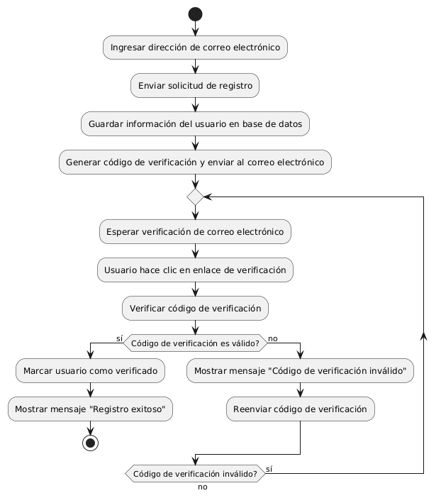

# DISEÑAR REGISTRO DE USUARIO CON VERIFICACIÓN DE EMAIL

------
## Diagrama de Actividades
[Creado con plantuml](https://plantuml.com/es/)

{ align=center }

El diagrama de actividad ilustra el proceso de registro de usuarios con verificación de correo electrónico. Incluye pasos para ingresar datos, enviar información al servidor, validar datos, enviar un correo de verificación, y confirmar el correo. Dependiendo de la validación, el usuario recibe un mensaje de éxito o error.
---
###

## Caso de uso historia Epica Gestión de Usuario 
Continuando con el ejemplo de pepito perez el podra : tener acceso al formulario de registro que requiere confirmación por correo electrónico, adicionalmente podrá gestionar su contraseña por si la pierde o se le olvida en algún momento; creado el usuario la página le dará la opción de guardar sus historiales de compras, también cuenta con configuración de usuario para cambiar o editar algo de su perfil. Y para darle confianza a pepito pérez tiene la opción de cerrar la sesión de manera segura.

<table id="customers">
  <tr class="idtext principal">
    <td>ID MACP-30</td>
  </tr>
  <tr class="single text">
    <td><strong>Requerimiento</strong>: Crear registro de usuarios con verificación de email ID MACP-30</td>
  </tr>
  <tr class="single gray">
    <td><strong>Historia de usuario</strong></td>
  </tr>
  <tr class="single text">
    <td>Como usuario, quiero poder registrarme en el sitio web con una dirección de correo electrónico válida para acceder a todas las funciones y servicios ofrecidos.</td>
  </tr>
  <tr class="duo">
    <th class="gray"><strong>Estado de la tarea</strong></th>
    <th>En desarrollo</th>
  </tr>
  <tr class="single gray">
    <td><strong>Caso de uso (Pasos)</strong></td>
  </tr>
  <tr class="single text">
    <td>
        <ol>
            <li>Iniciación del Registro: El usuario accede a la página de registro del sitio web. El sistema muestra el formulario de registro.</li>
           <li>Ingreso de Datos: El usuario ingresa su dirección de correo electrónico, así como cualquier otro dato requerido como nombre, contraseña, etc. El usuario envía el formulario de registro.</li>
           <li>Validación del Correo Electrónico: El sistema valida el formato de la dirección de correo electrónico. El sistema verifica que la dirección de correo electrónico no esté ya registrada.</li>
           <li>Envío de Correo de Verificación: El sistema envía un correo electrónico al usuario con un enlace de verificación. El correo electrónico contiene un enlace único que permite la activación de la cuenta.</li>
           <li>Confirmación de la Verificación: El usuario recibe el correo electrónico y hace clic en el enlace de verificación. El sistema verifica el enlace y activa la cuenta del usuario.</li>
           <li>Acceso Completo: Una vez verificado, el usuario puede iniciar sesión y acceder a todas las funciones y servicios ofrecidos.</li>
    </td>
  </tr>
  <tr class="single gray">
    <td><strong>Criterios de aceptación</strong></td>
  </tr>
  <tr class="single text">
    <td>
        <ol>
                  <li>Formulario de Registro: El formulario de registro debe solicitar al menos la dirección de correo electrónico, nombre, y una contraseña. El sistema debe validar el formato de la dirección de correo electrónico.</li>
                  <li>Verificación de Duplicados: El sistema debe verificar que la dirección de correo electrónico no esté ya en uso antes de enviar el correo de verificación.</li>
                  <li>Envío de Correo: El sistema debe enviar un correo electrónico de verificación al usuario con un enlace único. El correo electrónico debe llegar a la dirección proporcionada y contener instrucciones claras sobre cómo verificar la cuenta.</li>
                  <li>Verificación del Enlace: El enlace de verificación debe ser único y tener un período de validez. Al hacer clic en el enlace, el sistema debe verificar su validez y activar la cuenta del usuario.</li>
                  <li>Activación de la Cuenta: Una vez el usuario hace clic en el enlace de verificación, la cuenta debe ser activada y el usuario debe ser redirigido a una página de confirmación.</li>
                  <li>Acceso a Funciones: Solo después de verificar el correo electrónico, el usuario debe poder iniciar sesión y acceder a todas las funciones del sitio web.</li>
  </tr>
 <tr class="duo">
    <th class="gray"><strong>Calidad</strong></th>
    <th>En desarrollo</th>
  </tr>
  <tr class="duo">
    <th class="gray"><strong>Versionamiento</strong></th>
    <th>En desarrollo</th>
  </tr>
</table>

---
## Diagrama de Caso de uso
[Creado con plantuml](https://plantuml.com/es/)

{ align=center }

El diagrama muestra el proceso de registro de usuarios en un sitio web. El Invitado se registra creando una cuenta, mientras que el Sistema de Correo Electrónico envía un mensaje para verificar el correo proporcionado. La verificación se activa tras el registro, asegurando la validez del correo electrónico.