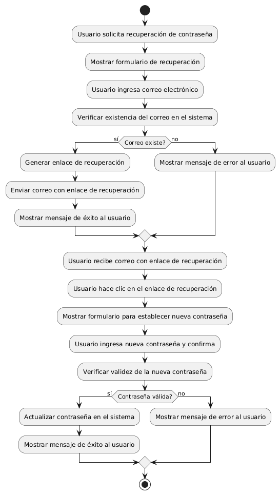

# DISEÑAR CONFIGURACIÓN CON OPCIÓN DE RECUPERAR CONTRASEÑA 

------
## Diagrama de Actividades
[Creado con plantuml](https://plantuml.com/es/)

{ align=center }

Este diagrama de actividad describe el proceso de recuperación de contraseña olvidada. Incluye la solicitud del usuario, verificación del correo electrónico, envío de un enlace de recuperación, establecimiento de una nueva contraseña, y validación. Finaliza con mensajes de éxito o error según el resultado de cada paso.
---
###

## Caso de uso historia Epica Gestión de Usuario 
Continuando con el ejemplo de pepito perez el podra : tener acceso al formulario de registro que requiere confirmación por correo electrónico, adicionalmente podrá gestionar su contraseña por si la pierde o se le olvida en algún momento; creado el usuario la página le dará la opción de guardar sus historiales de compras, también cuenta con configuración de usuario para cambiar o editar algo de su perfil. Y para darle confianza a pepito pérez tiene la opción de cerrar la sesión de manera segura.

<table id="customers">
  <tr class="idtext principal">
    <td>ID MACP-31</td>
  </tr>
  <tr class="single text">
    <td><strong>Requerimiento</strong>: crear configuración con opción de recuperar contraseña olvidada
 ID MACP-31</td>
  </tr>
  <tr class="single gray">
    <td><strong>Historia de usuario</strong></td>
  </tr>
  <tr class="single text">
    <td>Como usuario, quiero tener la opción de recuperar mi contraseña olvidada para poder volver a acceder a mi cuenta de manera segura y sin inconvenientes.</td>
  </tr>
  <tr class="duo">
    <th class="gray"><strong>Estado de la tarea</strong></th>
    <th>En desarrollo</th>
  </tr>
  <tr class="single gray">
    <td><strong>Caso de uso (Pasos)</strong></td>
  </tr>
  <tr class="single text">
    <td>
        <ol>
            <li>El usuario accede a la página de inicio de sesión.</li>
            <li>El usuario hace clic en el enlace "¿Olvidaste tu contraseña?" o una opción similar.</li>
           <li>El sistema solicita al usuario que ingrese su dirección de correo electrónico o número de teléfono asociado a la cuenta.</li>
           <li>El usuario proporciona la información solicitada y envía la solicitud.</li>
           <li>El sistema verifica que la dirección de correo electrónico o número de teléfono coincide con una cuenta registrada.</li>
           <li>El sistema envía un enlace para restablecer la contraseña a la dirección de correo electrónico o número de teléfono proporcionado.</li>
          <li>El usuario recibe el mensaje con el enlace de restablecimiento y hace clic en él.</li>
            <li>El usuario es redirigido a una página de restablecimiento de contraseña.</li>
          <li>El usuario ingresa una nueva contraseña y la confirma.</li>
          <li>El sistema valida la nueva contraseña (cumple con los requisitos de seguridad) y actualiza la contraseña en la base de datos.</li>
         <li>El sistema confirma que la contraseña ha sido restablecida exitosamente.</li>
         <li>El usuario puede ahora iniciar sesión con la nueva contraseña.</li>
    </td>
  </tr>
  <tr class="single gray">
    <td><strong>Criterios de aceptación</strong></td>
  </tr>
  <tr class="single text">
    <td>
        <ol>
                  <li>Interfaz de Usuario: La opción de recuperar contraseña olvidada está claramente visible y accesible desde la pantalla de inicio de sesión. El formulario para ingresar el correo electrónico o número de teléfono es fácil de usar y tiene instrucciones claras.</li>
                  <li>Validación de Datos: El sistema debe verificar la validez del correo electrónico o número de teléfono proporcionado antes de enviar el enlace de restablecimiento. el sistema debe manejar casos en los que el correo electrónico o número de teléfono no está registrado en la base de datos.</li>
                  <li>Enlace de Restablecimiento: El enlace de restablecimiento enviado al correo electrónico o número de teléfono debe ser único y de un solo uso.</li>
                  <li>Proceso de Restablecimiento: La página de restablecimiento de contraseña debe solicitar y confirmar la nueva contraseña. La nueva contraseña debe cumplir con los requisitos de seguridad definidos longitud mínima, complejidad, etc. El sistema debe confirmar al usuario que la contraseña se ha restablecido exitosamente.</li>
                  <li>Seguridad: Los datos de recuperación correo electrónico, número de teléfono deben ser manejados de forma segura y no deben exponerse a terceros. El sistema debe registrar los intentos de recuperación de contraseña para prevenir abusos.</li>
                  <li>Notificaciones:  El usuario debe recibir una notificación (correo electrónico o mensaje de texto) confirmando que se ha solicitado el restablecimiento de la contraseña. El usuario debe recibir una confirmación correo electrónico o mensaje de texto una vez que la contraseña ha sido restablecida exitosamente.</li>
  </tr>
 <tr class="duo">
    <th class="gray"><strong>Calidad</strong></th>
    <th>En desarrollo</th>
  </tr>
  <tr class="duo">
    <th class="gray"><strong>Versionamiento</strong></th>
    <th>En desarrollo</th>
  </tr>
</table>

---
## Diagrama de Caso de uso
[Creado con plantuml](https://plantuml.com/es/)

{ align=center }

EEl diagrama ilustra el proceso de recuperación de contraseña olvidada. El Usuario solicita la recuperación, lo que desencadena el envío de un enlace de recuperación por correo. Posteriormente, el usuario usa este enlace para restablecer su contraseña, garantizando el acceso seguro a su cuenta.