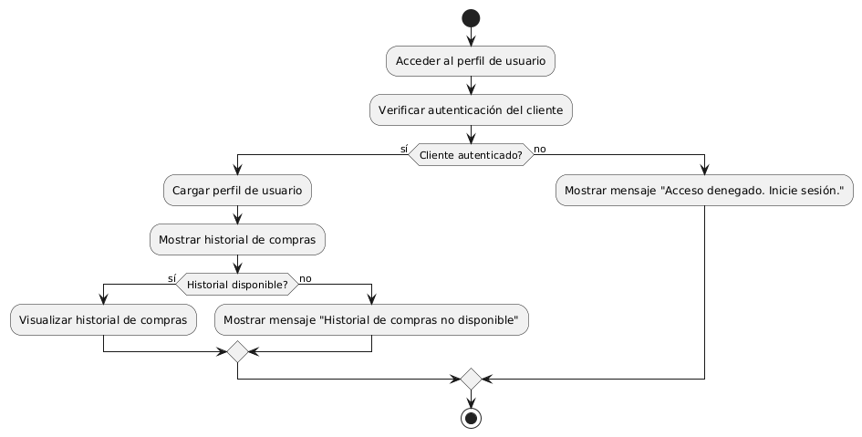

# DISEÑAR PERFIL DE USUARIO CON HISTORIAL DE COMPRAS

------
## Diagrama de Actividades
[Creado con plantuml](https://plantuml.com/es/)

{ align=center }

El diagrama de actividad muestra el proceso de acceso al perfil de usuario y la visualización del historial de compras. Primero, se verifica la autenticación del cliente. Si está autenticado, se carga el perfil y se muestra el historial; si no, se muestra un mensaje solicitando iniciar sesión.
---
###

## Caso de uso historia Epica Gestión de Usuario 
Continuando con el ejemplo de pepito perez el podra : tener acceso al formulario de registro que requiere confirmación por correo electrónico, adicionalmente podrá gestionar su contraseña por si la pierde o se le olvida en algún momento; creado el usuario la página le dará la opción de guardar sus historiales de compras, también cuenta con configuración de usuario para cambiar o editar algo de su perfil. Y para darle confianza a pepito pérez tiene la opción de cerrar la sesión de manera segura.

<table id="customers">
  <tr class="idtext principal">
    <td>ID MACP-32</td>
  </tr>
  <tr class="single text">
    <td><strong>Requerimiento</strong>: Crear perfil de usuario con historial de compras ID MACP-32</td>
  </tr>
  <tr class="single gray">
    <td><strong>Historia de usuario</strong></td>
  </tr>
  <tr class="single text">
    <td>Como cliente, quiero acceder a mi perfil de usuario para visualizar mi historial de compras para tener una mejor comprensión de mis hábitos de compra y tomar decisiones informadas sobre futuras compras.</td>
  </tr>
  <tr class="duo">
    <th class="gray"><strong>Estado de la tarea</strong></th>
    <th>En desarrollo</th>
  </tr>
  <tr class="single gray">
    <td><strong>Caso de uso (Pasos)</strong></td>
  </tr>
  <tr class="single text">
    <td>
        <ol>
            <li>El cliente inicia sesión en su cuenta.</li>
            <li>El cliente accede a su perfil de usuario.</li>
            <li>El sistema muestra una sección de "Historial de Compras" dentro del perfil del cliente.</li>
            <li>El cliente selecciona la opción para ver el historial de compras.</li>
            <li>El sistema muestra una lista detallada de compras realizadas por el cliente, incluyendo detalles como fecha de compra, productos comprados, cantidades, y precios.</li>
            <li>El cliente puede filtrar el historial por fechas específicas, categorías de productos, o tipos de transacciones.</li>
             <li>El cliente puede hacer clic en cualquier transacción para ver detalles más específicos.</li>
  </tr>
  <tr class="single gray">
    <td><strong>Criterios de aceptación</strong></td>
  </tr>
  <tr class="single text">
    <td>
        <ol>
                  <li>Autenticación y Acceso: El cliente debe poder iniciar sesión con sus credenciales válidas. El cliente debe poder acceder a su perfil de usuario después de iniciar sesión.</li>
                  <li>Visualización del Historial de Compras: El perfil del usuario debe tener una sección visible y accesible para el historial de compras. La lista de historial de compras debe mostrar la fecha de cada compra, los productos adquiridos, las cantidades y los precios. El cliente debe poder seleccionar una compra específica para ver detalles adicionales.</li>
                  <li>Manejo de Datos Vacíos: Si el cliente no tiene compras en el historial, el sistema debe mostrar un mensaje informativo adecuado indicando que no hay datos disponibles.</li>
                  <li>Interfaz de Usuario: La interfaz debe ser clara y fácil de usar, con un diseño que permita a los clientes navegar fácilmente a través de su historial de compras. Los detalles de cada compra deben estar presentados de forma legible y organizada.</li>
                  <li>Seguridad y Privacidad: El acceso al perfil de usuario y al historial de compras debe ser seguro, asegurando que solo el cliente autenticado pueda visualizar su propia información. Los datos de las compras deben manejarse de manera que cumpla con las políticas de privacidad y protección de datos.</li>
  </tr>
 <tr class="duo">
    <th class="gray"><strong>Calidad</strong></th>
    <th>En desarrollo</th>
  </tr>
  <tr class="duo">
    <th class="gray"><strong>Versionamiento</strong></th>
    <th>En desarrollo</th>
  </tr>
</table>

---
## Diagrama de Caso de uso
[Creado con plantuml](https://plantuml.com/es/)

{ align=center }

El diagrama de casos de uso muestra cómo un cliente interactúa con el sistema de compras. Primero, accede a su perfil de usuario, y luego puede visualizar su historial de compras. Esta funcionalidad permite al cliente comprender mejor sus hábitos de compra y tomar decisiones informadas para futuras adquisiciones.
