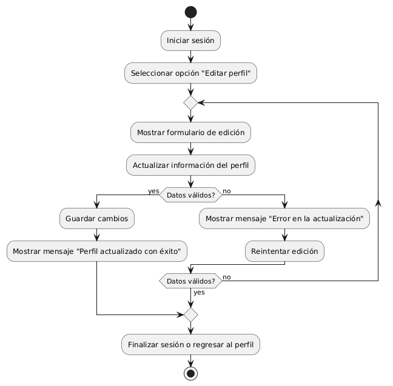

# DISEÑAR OPCIONES PARA EDITAR DATOS DEL PERFIL DEL USUARIO 

------
## Diagrama de Actividades
[Creado con plantuml](https://plantuml.com/es/)

{ align=center }

El diagrama de actividad muestra el proceso para editar datos del perfil del usuario. Incluye pasos para iniciar sesión, seleccionar la opción de editar perfil, actualizar la información, y validar los datos. Si los datos son correctos, se guardan los cambios; si no, se notifica un error y se permite reintentar.
---
###

## Caso de uso historia Epica Gestión de Usuario 
Continuando con el ejemplo de pepito perez el podra : tener acceso al formulario de registro que requiere confirmación por correo electrónico, adicionalmente podrá gestionar su contraseña por si la pierde o se le olvida en algún momento; creado el usuario la página le dará la opción de guardar sus historiales de compras, también cuenta con configuración de usuario para cambiar o editar algo de su perfil. Y para darle confianza a pepito pérez tiene la opción de cerrar la sesión de manera segura.

<table id="customers">
  <tr class="idtext principal">
    <td>ID MACP-33</td>
  </tr>
  <tr class="single text">
    <td><strong>Requerimiento</strong>:Crear opciónes para editar datos del perfil del usuario ID MACP-33</td>
  </tr>
  <tr class="single gray">
    <td><strong>Historia de usuario</strong></td>
  </tr>
  <tr class="single text">
    <td>Como usuario registrado, quiero editar mi información de perfil para mantener mis datos actualizados y precisos.</td>
  </tr>
  <tr class="duo">
    <th class="gray"><strong>Estado de la tarea</strong></th>
    <th>En desarrollo</th>
  </tr>
  <tr class="single gray">
    <td><strong>Caso de uso (Pasos)</strong></td>
  </tr>
  <tr class="single text">
    <td>
        <ol>
            <li>El usuario inicia sesión en el sistema.</li>
            <li>El usuario accede a la sección de perfil desde el menú principal.</li>
            <li>l usuario selecciona la opción "Editar perfil".</li>
            <li>El sistema muestra un formulario con los campos actuales del perfil del usuario.</li>
            <li>El usuario modifica los datos deseados en el formulario.</li>
            <li>El usuario envía el formulario para guardar los cambios.</li>
            <li>El sistema valida la información proporcionada.Si los datos son válidos, el sistema actualiza la información en la base de datos.</li>
            <li>El sistema muestra un mensaje de confirmación indicando que la información ha sido actualizada con éxito.</li>
            <li>El usuario puede ver la información actualizada en su perfil.</li>
  
  <tr class="single gray">
    <td><strong>Criterios de aceptación</strong></td>
  </tr>
  <tr class="single text">
    <td>
        <ol>
                  <li>Acceso a la Edición del Perfil: El usuario puede acceder a la opción "Editar perfil" desde la sección de perfil de su cuenta.</li>
                  <li>Formulario de Edición: El formulario de edición muestra los datos actuales del perfil del usuario. Los campos del formulario permiten editar la siguiente información: Nombre completo, Correo electrónico, Número de teléfono, Dirección, Foto de perfil.</li>
                  <li>Validación de Datos: El sistema valida que el correo electrónico tenga un formato correcto. El sistema verifica que el número de teléfono tenga el formato adecuado. El sistema asegura que los campos obligatorios no estén vacíos.</li>
                  <li>Mensajes de Error: Si hay errores en la información proporcionada, el sistema muestra mensajes de error claros y específicos al usuario.</li>
                  <li>Confirmación de Actualización: El sistema muestra un mensaje de confirmación una vez que los datos se han actualizado correctamente.</li>
                  <li>Visualización de Información Actualizada: Después de actualizar el perfil, los cambios se reflejan inmediatamente en la vista del perfil del usuario.</li>
                  <li>Acciones en Caso de Fallo: Si el sistema no puede actualizar los datos (por ejemplo, debido a un error en el servidor), el usuario recibe un mensaje de error y la información del perfil no se actualiza.</li>
                  <li>Seguridad: Los datos del perfil deben ser actualizados de manera segura, garantizando que solo el usuario autenticado pueda modificar su propia información.</li>
  </tr>
 <tr class="duo">
    <th class="gray"><strong>Calidad</strong></th>
    <th>En desarrollo</th>
  </tr>
  <tr class="duo">
    <th class="gray"><strong>Versionamiento</strong></th>
    <th>En desarrollo</th>
  </tr>
</table>

</tr>

---
## Diagrama de Caso de uso
[Creado con plantuml](https://plantuml.com/es/)

{ align=center }

El diagrama de casos de uso muestra cómo un Usuario Registrado interactúa con el Sistema de Perfil de Usuario. El usuario puede Editar Datos del Perfil y Ver Perfil. La edición del perfil incluye la Actualización de Información. Esto asegura que el usuario pueda mantener su perfil actualizado y preciso.