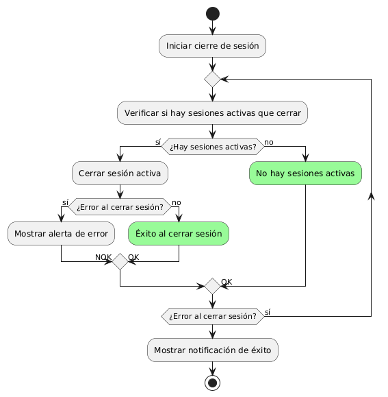

# DISEÑAR CERRAR SESIÓN DE FORMA SEGURA

------
## Diagrama de Actividades
[Creado con plantuml](https://plantuml.com/es/)

{ align=center }

Este diagrama de actividad muestra el proceso de cierre de sesión seguro. Inicia la acción, verifica si hay sesiones activas, y maneja errores potenciales. Si el cierre es exitoso, muestra una notificación de éxito; de lo contrario, alerta de errores y repite el proceso según sea necesario.
---
###

## Caso de uso historia Epica Gestión de Usuario 
Continuando con el ejemplo de pepito perez el podra : tener acceso al formulario de registro que requiere confirmación por correo electrónico, adicionalmente podrá gestionar su contraseña por si la pierde o se le olvida en algún momento; creado el usuario la página le dará la opción de guardar sus historiales de compras, también cuenta con configuración de usuario para cambiar o editar algo de su perfil. Y para darle confianza a pepito pérez tiene la opción de cerrar la sesión de manera segura.

<table id="customers">
  <tr class="idtext principal">
    <td>ID MACP-34</td>
  </tr>
  <tr class="single text">
    <td><strong>Requerimiento</strong>:Crear cerrar sesión de forma segura ID MACP-34</td>
  </tr>
  <tr class="single gray">
    <td><strong>Historia de usuario</strong></td>
  </tr>
  <tr class="single text">
    <td>Como usuario, quiero cerrar sesión de mi cuenta de forma segura para proteger mi información personal y evitar accesos no autorizados.</td>
  </tr>
  <tr class="duo">
    <th class="gray"><strong>Estado de la tarea</strong></th>
    <th>En desarrollo</th>
  </tr>
  <tr class="single gray">
    <td><strong>Caso de uso (Pasos)</strong></td>
  </tr>
  <tr class="single text">
    <td>
        <ol>
            <li>El usuario hace clic en el botón o enlace de "Cerrar sesión" en la interfaz de usuario.</li>
           <li>El sistema solicita una confirmación para cerrar sesión (si aplica).</li>
           <li>El usuario confirma la acción de cerrar sesión.</li>
           <li>El sistema invalida la sesión del usuario y borra cualquier token de autenticación o credencial asociada.</li>
          <li>El sistema redirige al usuario a una página segura.</li>
          <li>El sistema muestra un mensaje de confirmación que indica que la sesión ha sido cerrada exitosamente.</li>
    </tr>
  <tr class="single gray">
    <td><strong>Criterios de aceptación</strong></td>
  </tr>
  <tr class="single text">
    <td>
        <ol>
                  <li>Interfaz de Usuario: El botón o enlace de "Cerrar sesión" debe estar claramente visible en la interfaz del usuario. La confirmación para cerrar sesión (si se solicita) debe ser clara y fácil de entender.</li>
                  <li>Seguridad: La sesión del usuario debe ser completamente invalidada en el servidor y en el cliente. Cualquier intento de acceso a la cuenta después de cerrar sesión debe redirigir al usuario a la página de inicio de sesión o a una página segura.</li>
                  <li>Redirección: Después de cerrar sesión, el usuario debe ser redirigido automáticamente a una página segura. La página a la que se redirige al usuario debe ser accesible sin necesidad de autenticación.</li>
                  <li>Mensajes de Confirmación: Si se muestra un mensaje de confirmación de cierre de sesión, debe ser informativo y confirmar que la sesión ha sido cerrada exitosamente.</li>
                  <li>Pruebas de Seguridad: Se debe realizar una prueba para asegurarse de que no se pueda acceder a recursos protegidos después de cerrar sesión. Validar que todos los tokens de autenticación y cookies asociadas a la sesión se eliminen adecuadamente.</li>
  </tr>
 <tr class="duo">
    <th class="gray"><strong>Calidad</strong></th>
    <th>En desarrollo</th>
  </tr>
  <tr class="duo">
    <th class="gray"><strong>Versionamiento</strong></th>
    <th>En desarrollo</th>
  </tr>
</table>

---
## Diagrama de Caso de uso
[Creado con plantuml](https://plantuml.com/es/)

{ align=center }

El diagrama de casos de uso muestra cómo un Usuario puede cerrar sesión de forma segura en el Sistema de Gestión de Cuenta. El proceso incluye verificar si la sesión está activa antes de cerrarla, garantizando así la protección de la información personal y evitando accesos no autorizados.