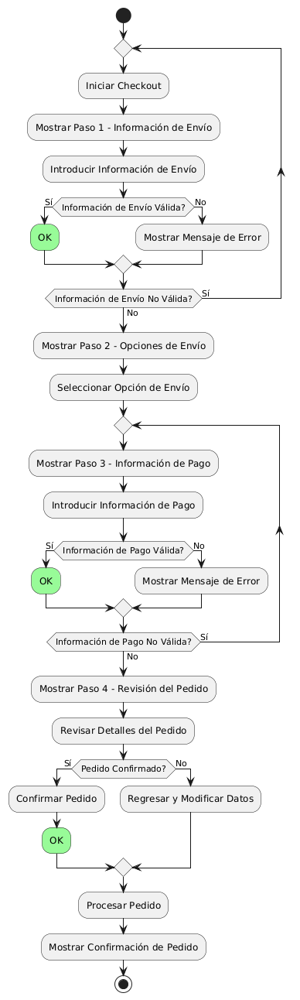
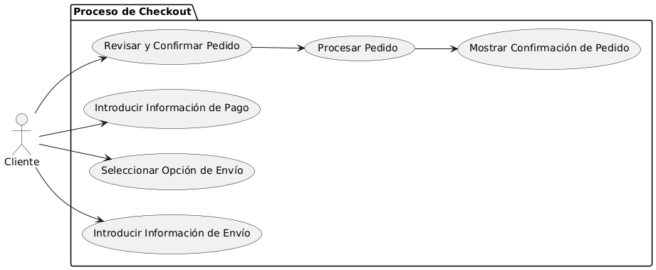

# Epica de Análisis

------
## Diagrama de Actividades
[Creado con plantuml](https://plantuml.com/es/)

{ align=center }
---
Este diagrama de actividades en PlantUML ilustra un proceso de checkout en línea dividido en pasos definidos: información de envío, opciones de envío, pago y revisión del pedido. Incluye validaciones y repeticiones en caso de errores, asegurando que cada etapa se complete correctamente antes de confirmar y procesar la compra.
---

###
###

## Escenario MACP-35
Después de clickear el botón de compras pasará al checkout donde encontrará las etapas bien marcadas del proceso como por ejemplo: apis para sugerir direcciones por medio de geolocalizador , datos de entrega, verificación de datos antes del pago que le permite a pepito perez gestionar su pago por diferentes alternativas, y si lo desea puede guardar los datos de pago, luego recibirá su factura a su  correo electrónico.

<table id="customers">
  <tr class="idtext principal">
    <td>ID MACP-36</td>
  </tr>
  <tr class="single text">
    <td><strong>Requerimiento</strong>: crear proceso de checkout en pasos claramente definidos ID MACP-36</td>
  </tr>
  <tr class="single gray">
    <td><strong>Historia de usuario</strong></td>
  </tr>
  <tr class="single text">
    <td>Como cliente quiero que el proceso de checkout esté dividido en pasos claramente definidos para facilitar la navegación y comprensión de cada etapa al momento de realizar una compra en línea.</td>
  </tr>
  <tr class="duo">
    <th class="gray"><strong>Estado de la tarea</strong></th>
    <th>En desarrollo</th>
  </tr>
  <tr class="single gray">
    <td><strong>Caso de uso (Pasos)</strong></td>
  </tr>
  <tr class="single text">
    <td>
        <ol>
            <li>iniciar Checkout</li>
            <li>Información de Envío</li>
            <li>Opciones de Envío</li>
            <li>Información de Pago</li>
            <li>Revisión del Pedido</li>
            <li>Confirmación del Pedido</li>
        </ol>
    </td>
  </tr>
  <tr class="single gray">
    <td><strong>Criterios de aceptación</strong></td>
  </tr>
  <tr class="single text">
    <td>
        <ol>
            <li>Iniciar Checkout Exitosamente: El sistema debe mostrar el primer paso del checkout al iniciar el proceso.</li>
            <li>Validación de Información de Envío: El sistema debe permitir avanzar o mostrar un error según la validez de la dirección de envío.</li>
            <li>Selección de Opción de Envío: El sistema debe permitir avanzar al paso de pago tras seleccionar una opción de envío válida.</li>
            <li>Validación de Información de Pago: El sistema debe permitir avanzar o solicitar correcciones según la validez de la información de pago.</li>
            <li>Revisión y Confirmación del Pedido: El sistema debe procesar y confirmar el pedido, además de enviar un correo con los detalles.</li>
            <li>Confirmación del Pedido Procesada Correctamente: El sistema debe generar la confirmación del pedido y finalizar el checkout exitosamente.</li>
        </ol>
    </td>
  </tr>
 <tr class="duo">
    <th class="gray"><strong>Calidad</strong></th>
    <th>En desarrollo</th>
  </tr>
  <tr class="duo">
    <th class="gray"><strong>Versionamiento</strong></th>
    <th>En desarrollo</th>
  </tr>
</table>

---
## Diagrama de Caso de uso
[Creado con plantuml](https://plantuml.com/es/)

{ align=center }
El diagrama de casos de uso en PlantUML muestra un proceso de checkout dividido en pasos claros. Incluye actores, como el cliente, y casos de uso relacionados con la introducción de información de envío, selección de opciones de envío, introducción de pago, revisión, confirmación, y procesamiento del pedido, asegurando un flujo ordenado.
---
