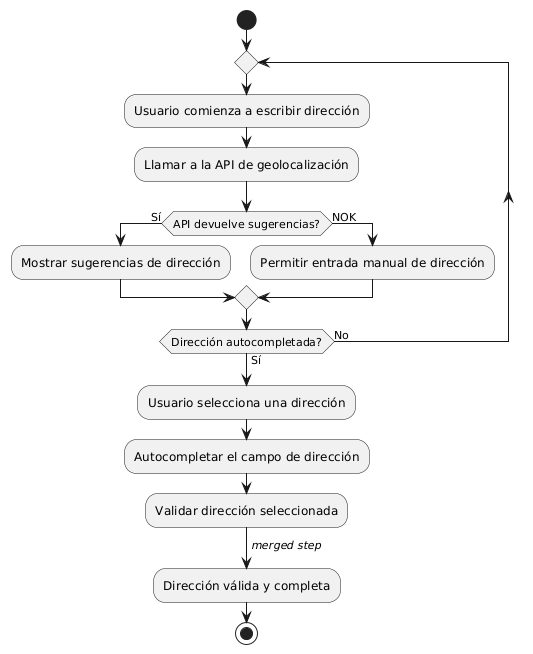
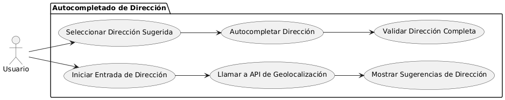

# Epica de Análisis

------
## Diagrama de Actividades
[Creado con plantuml](https://plantuml.com/es/)

{ align=center }
---
Este diagrama de actividades en PlantUML muestra el proceso de autocompletado de dirección utilizando una API de geolocalización. Incluye pasos como la llamada a la API, la visualización de sugerencias de dirección, la selección por parte del usuario y la validación final de la dirección, garantizando precisión y eficiencia en la entrada de datos.
---

###
###

## Escenario MACP-35
Después de clickear el botón de compras pasará al checkout donde encontrará las etapas bien marcadas del proceso como por ejemplo: apis para sugerir direcciones por medio de geolocalizador , datos de entrega, verificación de datos antes del pago que le permite a pepito perez gestionar su pago por diferentes alternativas, y si lo desea puede guardar los datos de pago, luego recibirá su factura a su  correo electrónico.

<table id="customers">
  <tr class="idtext principal">
    <td>ID MACP-37</td>
  </tr>
  <tr class="single text">
    <td><strong>Requerimiento</strong>: implementar autocompletado de dirección con API de geolocalización ID MACP-37</td>
  </tr>
  <tr class="single gray">
    <td><strong>Historia de usuario</strong></td>
  </tr>
  <tr class="single text">
    <td>Como usuario quiero que el sistema auto complete mi dirección utilizando una API de geolocalización para ahorrar tiempo y asegurarme de que la información de envío sea precisa y completa.</td>
  </tr>
  <tr class="duo">
    <th class="gray"><strong>Estado de la tarea</strong></th>
    <th>En desarrollo</th>
  </tr>
  <tr class="single gray">
    <td><strong>Caso de uso (Pasos)</strong></td>
  </tr>
  <tr class="single text">
    <td>
        <ol>
            <li>Iniciar la Entrada de Dirección</li>
            <li>Llamar a la API de Geolocalización</li>
            <li>Mostrar Sugerencias de Dirección</li>
            <li>Seleccionar Dirección</li>
            <li>Completar el Campo de Dirección:</li>
            <li>Validación y Confirmación</li>
        </ol>
    </td>
  </tr>
  <tr class="single gray">
    <td><strong>Criterios de aceptación</strong></td>
  </tr>
  <tr class="single text">
    <td>
        <ol>
            <li>Activación del Autocompletado: El sistema debe llamar a la API de geolocalización tras ingresar 3 caracteres en la dirección</li>
            <li>Mostrar Sugerencias de Dirección: El sistema debe mostrar al menos 3 sugerencias relevantes al escribir la dirección.</li>
            <li>Selección de Dirección: El sistema debe autocompletar el campo de dirección tras seleccionar una sugerencia.</li>
            <li>Validación de la Dirección: El sistema debe validar que la dirección autocompletada esté completa y lista para envío.</li>
            <li>Manejo de Errores de API: El sistema debe notificar errores de la API y permitir la entrada manual de la dirección.</li>
        </ol>
    </td>
  </tr>
 <tr class="duo">
    <th class="gray"><strong>Calidad</strong></th>
    <th>En desarrollo</th>
  </tr>
  <tr class="duo">
    <th class="gray"><strong>Versionamiento</strong></th>
    <th>En desarrollo</th>
  </tr>
</table>

---
## Diagrama de Caso de uso
[Creado con plantuml](https://plantuml.com/es/)

{ align=center }
El diagrama de casos de uso en PlantUML muestra cómo un usuario interactúa con el sistema para autocompletar direcciones utilizando una API de geolocalización. Los casos de uso incluyen iniciar la entrada de dirección, llamar a la API, mostrar sugerencias, seleccionar una dirección, autocompletar y validar la dirección completa para asegurar precisión.
---
