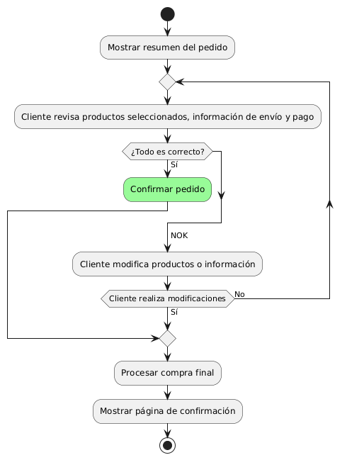
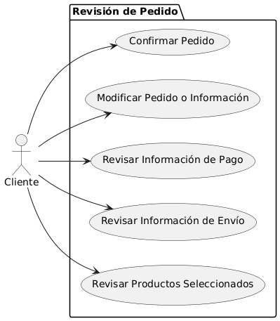

# Epica de Análisis

------
## Diagrama de Actividades
[Creado con plantuml](https://plantuml.com/es/)

{ align=center }
---
Este diagrama de actividades en PlantUML muestra el proceso de revisión de pedido antes de la compra final. Incluye pasos donde el cliente revisa productos, información de envío y pago. Si hay errores, el cliente puede modificar los detalles. Finalmente, el sistema procesa la compra y muestra una página de confirmación.
---

###
###

## Escenario MACP-35
Después de clickear el botón de compras pasará al checkout donde encontrará las etapas bien marcadas del proceso como por ejemplo: apis para sugerir direcciones por medio de geolocalizador , datos de entrega, verificación de datos antes del pago que le permite a pepito perez gestionar su pago por diferentes alternativas, y si lo desea puede guardar los datos de pago, luego recibirá su factura a su  correo electrónico.

<table id="customers">
  <tr class="idtext principal">
    <td>ID MACP-38</td>
  </tr>
  <tr class="single text">
    <td><strong>Requerimiento</strong>: implementar revisión de pedido antes de la compra final ID MACP-38</td>
  </tr>
  <tr class="single gray">
    <td><strong>Historia de usuario</strong></td>
  </tr>
  <tr class="single text">
    <td>Como cliente quiero poder revisar mi pedido antes de realizar la compra final para asegurarme de que todos los productos seleccionados sean los correctos y que la información de envío y pago sea precisa.</td>
  </tr>
  <tr class="duo">
    <th class="gray"><strong>Estado de la tarea</strong></th>
    <th>En desarrollo</th>
  </tr>
  <tr class="single gray">
    <td><strong>Caso de uso (Pasos)</strong></td>
  </tr>
  <tr class="single text">
    <td>
        <ol>
            <li>Acceder a la Revisión de Pedido</li>
            <li>Mostrar Resumen del Pedido</li>
            <li>Revisar Información de Envío y Pago</li>
            <li>Confirmar o Modificar Pedido</li>
            <li>Proceder a la Compra Final</li>            
        </ol>
    </td>
  </tr>
  <tr class="single gray">
    <td><strong>Criterios de aceptación</strong></td>
  </tr>
  <tr class="single text">
    <td>
        <ol>
            <li>Acceso a la Revisión de Pedido: El cliente debe ver un resumen detallado del pedido antes de confirmar la compra.</li>
            <li>Visualización del Resumen de Pedido: El resumen del pedido debe incluir productos, cantidades, precios, impuestos, envío, y pago.</li>
            <li>Capacidad de Modificación: El cliente debe poder modificar el pedido y la información antes de confirmar.</li>
            <li>Confirmación del Pedido: El sistema debe procesar el pedido y mostrar una confirmación tras la revisión.</li>
            <li>Manejo de Cancelación: El sistema debe permitir la cancelación del pedido y opciones para regresar o salir.</li>
        </ol>
    </td>
  </tr>
 <tr class="duo">
    <th class="gray"><strong>Calidad</strong></th>
    <th>En desarrollo</th>
  </tr>
  <tr class="duo">
    <th class="gray"><strong>Versionamiento</strong></th>
    <th>En desarrollo</th>
  </tr>
</table>

---
## Diagrama de Caso de uso
[Creado con plantuml](https://plantuml.com/es/)

{ align=center }
---
Este diagrama de casos de uso en PlantUML ilustra cómo un cliente revisa su pedido antes de la compra final. Incluye casos de uso para revisar productos seleccionados, información de envío y pago, así como la opción de modificar datos si es necesario, y finalmente confirmar el pedido para proceder con la compra.
---
