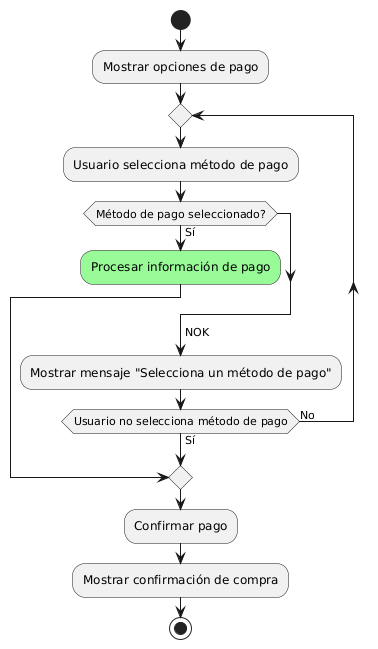
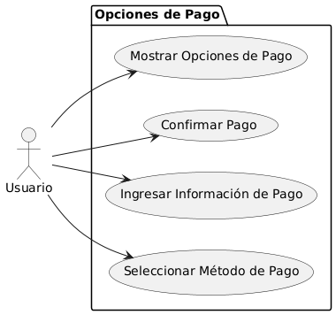

# Epica de Análisis

------
## Diagrama de Actividades
[Creado con plantuml](https://plantuml.com/es/)

{ align=center }
---
Este diagrama de actividades en PlantUML ilustra el proceso para ofrecer múltiples opciones de pago. El usuario selecciona un método de pago, el sistema procesa la información y confirma la compra. Si no se selecciona un método, se solicita al usuario que elija uno antes de continuar.
---

###
###

## Escenario MACP-35
Después de clickear el botón de compras pasará al checkout donde encontrará las etapas bien marcadas del proceso como por ejemplo: apis para sugerir direcciones por medio de geolocalizador , datos de entrega, verificación de datos antes del pago que le permite a pepito perez gestionar su pago por diferentes alternativas, y si lo desea puede guardar los datos de pago, luego recibirá su factura a su  correo electrónico.

<table id="customers">
  <tr class="idtext principal">
    <td>ID MACP-39</td>
  </tr>
  <tr class="single text">
    <td><strong>Requerimiento</strong>: crear opciones múltiples de pago ID MACP-39</td>
  </tr>
  <tr class="single gray">
    <td><strong>Historia de usuario</strong></td>
  </tr>
  <tr class="single text">
    <td>Como usuario quiero tener opciones múltiples de pago para poder elegir el método que mejor se adapte a mis necesidades y preferencias al realizar una compra.</td>
  </tr>
  <tr class="duo">
    <th class="gray"><strong>Estado de la tarea</strong></th>
    <th>En desarrollo</th>
  </tr>
  <tr class="single gray">
    <td><strong>Caso de uso (Pasos)</strong></td>
  </tr>
  <tr class="single text">
    <td>
        <ol>
            <li>Acceso a la Etapa de Pago</li>
            <li>Visualización de Opciones de Pago</li>
            <li>Selección de la Opción de Pago</li>
            <li>Ingreso de Información de Pago</li>
            <li>Confirmación y Procesamiento del Pago</li>
            <li>Finalización de la Compra</li>            
        </ol>
    </td>
  </tr>
  <tr class="single gray">
    <td><strong>Criterios de aceptación</strong></td>
  </tr>
  <tr class="single text">
    <td>
        <ol>
            <li>Visualización de Opciones de Pago: El sistema debe mostrar al menos tres métodos de pago al llegar a la etapa de pago.</li>
            <li>Selección de la Opción de Pago: El sistema debe permitir ingresar la información necesaria al seleccionar una opción de pago.</li>
            <li>Procesamiento de Pago Exitoso: El sistema debe procesar el pago y confirmar la compra exitosa.</li>
            <li>Manejo de Pagos Fallidos: El sistema debe notificar pagos rechazados y ofrecer opciones para reintentar o corregir la información.</li>
            <li>Cancelación del Proceso de Pago: El sistema debe permitir la cancelación del pago sin procesar el pedido, ofreciendo regresar al carrito o salir.</li>
        </ol>
    </td>
  </tr>
 <tr class="duo">
    <th class="gray"><strong>Calidad</strong></th>
    <th>En desarrollo</th>
  </tr>
  <tr class="duo">
    <th class="gray"><strong>Versionamiento</strong></th>
    <th>En desarrollo</th>
  </tr>
</table>

---
## Diagrama de Caso de uso
[Creado con plantuml](https://plantuml.com/es/)

{ align=center }
---
Este diagrama de casos de uso en PlantUML muestra cómo un cliente revisa su pedido antes de finalizar la compra. Incluye casos de uso para revisar productos seleccionados, información de envío y pago, modificar el pedido si es necesario, y confirmar la compra para asegurar precisión y satisfacción.
---
