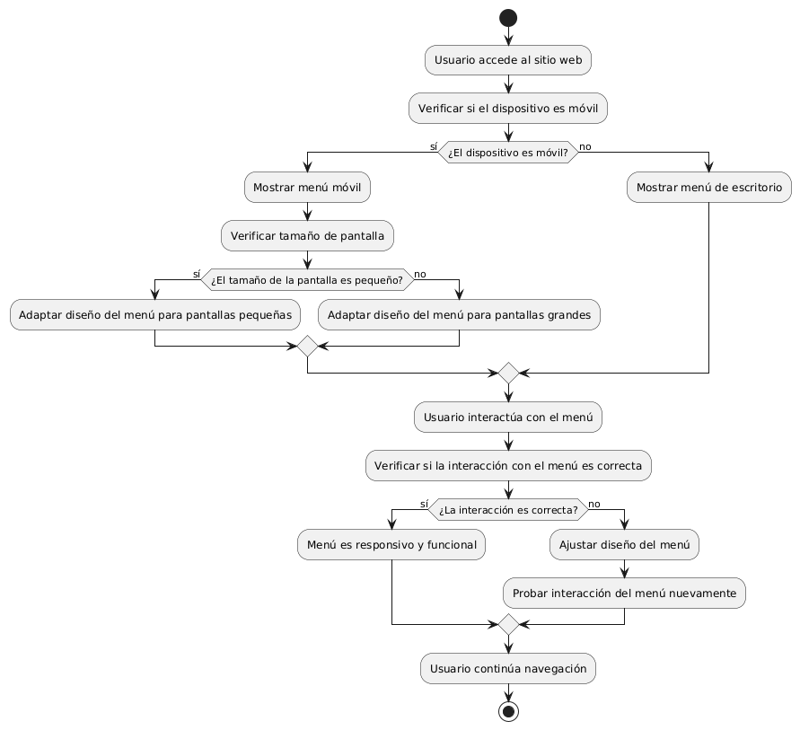

# CREAR MENU RESPONSIVO

------
## Diagrama de Actividades
[Creado con plantuml](https://plantuml.com/es/)

{ align=center }

Este diagrama de actividades ilustra el flujo de interacción de un usuario con un menú principal de un sitio web, incluyendo opciones con submenús desplegables. Muestra cómo el usuario navega, selecciona opciones y maneja mensajes de error, facilitando una experiencia organizada y eficiente en la navegación del sitio.
---
###

## Caso de uso historia Crear paginas de Inicio 
El usuario que quiere comprar muebles puede entrar a un menú principal o una página de inicio , el cual tiene enlaces a otras  páginas principales como inicio, catálogos, contactos entre otros más. Dentro de la misma página cuando el usuario pase el ratón sobre las opciones del menú principal se desplegará los submenús con más opciones; la página le proporcionará enlaces rápidos para iniciar sesión o registrarse; si la persona quiere entrar a la página desde su móvil, lo podrá hacer con toda comodidad ya que el menú es responsivo para móviles. También si el usuario quiere consultar las redes sociales lo podrá hacer ya que el menú de inicio tiene enlaces  a las mismas, y no menos importante la capacidad de ver todos los productos recomendados o más vendidos de la página.

<table id="customers">
  <tr class="idtext principal">
    <td>ID MACP-4</td>
  </tr>
  <tr class="single text">
    <td><strong>Requerimiento</strong>: Se debe crear un menú responsivo para móviles ID MACP-4</td>
  </tr>
  <tr class="single gray">
    <td><strong>Historia de usuario</strong></td>
  </tr>
  <tr class="single text">
    <td>Como usuario, quiero que el menú principal del sitio web se adapte automáticamente al tamaño de mi pantalla cuando navego desde un dispositivo móvil Para poder acceder a las diferentes opciones de navegación de manera fácil y cómoda, sin importar el tamaño del dispositivo que esté utilizando.</td>
  </tr>
  <tr class="duo">
    <th class="gray"><strong>Estado de la tarea</strong></th>
    <th>En desarrollo</th>
  </tr>
  <tr class="single gray">
    <td><strong>Caso de uso (Pasos)</strong></td>
  </tr>
  <tr class="single text">
    <td>
        <ol>
            <li>Acceso al Sitio Web: El usuario abre el sitio web en un dispositivo móvil.</li>
           <li>Visualización del Menú: El menú principal del sitio web se muestra en una vista optimizada para dispositivos móviles.</li>
           <li>Interacción con el Menú: El usuario puede tocar o hacer clic en el menú para desplegar las opciones de navegación.</li>
           <li>Acceso a Opciones: El usuario selecciona una opción del menú y es dirigido a la sección correspondiente del sitio web.</li>
           <li>Cierre del Menú: El usuario puede cerrar el menú si lo desea</li>
        </ol>
    </td>
  </tr>
  <tr class="single gray">
    <td><strong>Criterios de aceptación</strong></td>
  </tr>
  <tr class="single text">
    <td>
        <ol>
               <li>Adaptabilidad del Diseño: El menú principal debe adaptarse automáticamente al tamaño de la pantalla del dispositivo móvil sin necesidad de desplazamiento horizontal.</li>
              <li>Legibilidad y Usabilidad: Las opciones del menú deben ser claramente legibles y debe mantener una estructura clara y lógica, facilitando la navegación por el sitio.</li>
              <li>Interacción: Los elementos del menú deben responder adecuadamente al toque por ejemplo, abrir submenús, cambiar de página, etc</li>
              <li> Consistencia: El diseño del menú debe ser consistente con el diseño general del sitio web, manteniendo la coherencia en colores, fuentes y estilo.</li>
              <li>Rendimiento: El menú debe cargarse y ser funcional sin causar retrasos o tiempos de carga prolongados en dispositivos móviles.</li>
              <li>Compatibilidad: El menú debe ser compatible con los principales navegadores móviles y debe poder funcionar en diferentes tamaños de pantalla y resoluciones.</li>
              <li>Pruebas de Usuario: El menú debe ser probado en varios dispositivos móviles para asegurar su funcionalidad y adaptabilidad.</li>

        </ol>
    </td>
  </tr>
 <tr class="duo">
    <th class="gray"><strong>Calidad</strong></th>
    <th>En desarrollo</th>
  </tr>
  <tr class="duo">
    <th class="gray"><strong>Versionamiento</strong></th>
    <th>En desarrollo</th>
  </tr>
</table>

---
## Diagrama de Caso de uso
[Creado con plantuml](https://plantuml.com/es/)

{ align=center }

Un menú responsivo para móviles permite a los usuarios acceder a las opciones del sitio web cómodamente en cualquier dispositivo. Se adapta automáticamente al tamaño de la pantalla, facilitando la navegación entre secciones, la búsqueda y el acceso al perfil, garantizando una experiencia fluida y accesible.
---
