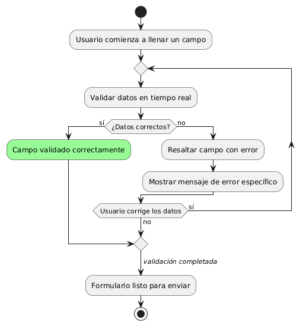
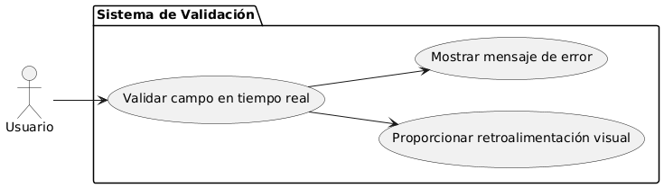

# Epica de Análisis

------
## Diagrama de Actividades
[Creado con plantuml](https://plantuml.com/es/)

{ align=center }
---
El diagrama de actividades muestra el proceso de validación en tiempo real de un formulario. Representa cómo el sistema verifica continuamente los datos ingresados, proporcionando retroalimentación inmediata si hay errores, hasta que todos los campos sean correctos y el formulario esté listo para ser enviado.
---

###
###

## Escenario MACP-35
Después de clickear el botón de compras pasará al checkout donde encontrará las etapas bien marcadas del proceso como por ejemplo: apis para sugerir direcciones por medio de geolocalizador , datos de entrega, verificación de datos antes del pago que le permite a pepito perez gestionar su pago por diferentes alternativas, y si lo desea puede guardar los datos de pago, luego recibirá su factura a su  correo electrónico.

<table id="customers">
  <tr class="idtext principal">
    <td>ID MACP-40</td>
  </tr>
  <tr class="single text">
    <td><strong>Requerimiento</strong>: crear validación en tiempo real ID MACP-40</td>
  </tr>
  <tr class="single gray">
    <td><strong>Historia de usuario</strong></td>
  </tr>
  <tr class="single text">
    <td>Como usuario quiero que la forma sea validada en tiempo real para recibir retroalimentación inmediata sobre los datos que ingreso, asegurando que complete correctamente el formulario sin errores.</td>
  </tr>
  <tr class="duo">
    <th class="gray"><strong>Estado de la tarea</strong></th>
    <th>En desarrollo</th>
  </tr>
  <tr class="single gray">
    <td><strong>Caso de uso (Pasos)</strong></td>
  </tr>
  <tr class="single text">
    <td>
        <ol>
            <li>llenar un campo del formulario.</li>
            <li>Validar automáticamente la información ingresada en tiempo real.</li>
            <li>Si los datos son correctos, el sistema confirma.</li>
            <li>Si los datos son incorrectos o faltan campos obligatorios, el sistema muestra un mensaje de error.</li>
            <li>Corrige los datos en base a la retroalimentación proporcionada.</li>
            <li>El proceso se repite hasta que todos los campos estén validados correctamente.</li>            
        </ol>
    </td>
  </tr>
  <tr class="single gray">
    <td><strong>Criterios de aceptación</strong></td>
  </tr>
  <tr class="single text">
    <td>
        <ol>
            <li>Validación en Tiempo Real: El sistema debe validar los datos inmediatamente después de que el usuario interactúa con un campo.</li>
            <li>Mensajes de Error Claros: Los mensajes de error deben ser específicos y explicar cómo corregir los datos ingresados.</li>
            <li>Indicadores Visuales: El sistema debe mostrar indicadores visuales junto a los campos con errores.</li>
            <li>Corrección de Errores: Los errores corregidos deben desaparecer y el campo debe marcarse como válido.</li>
            <li>Sin Impacto en el Rendimiento: La validación en tiempo real no debe afectar el rendimiento de la página.</li>
            <li>Experiencia de Usuario Intuitiva: La validación debe ser intuitiva y permitir completar el formulario eficientemente.</li>
        </ol>
    </td>
  </tr>
 <tr class="duo">
    <th class="gray"><strong>Calidad</strong></th>
    <th>En desarrollo</th>
  </tr>
  <tr class="duo">
    <th class="gray"><strong>Versionamiento</strong></th>
    <th>En desarrollo</th>
  </tr>
</table>

---
## Diagrama de Caso de uso
[Creado con plantuml](https://plantuml.com/es/)

{ align=center }
---
El diagrama de casos de uso muestra cómo un usuario interactúa con el sistema de validación en tiempo real. Incluye los casos de uso para validar datos ingresados, proporcionar retroalimentación visual y mostrar mensajes de error, asegurando que el formulario se complete correctamente sin errores.
---
