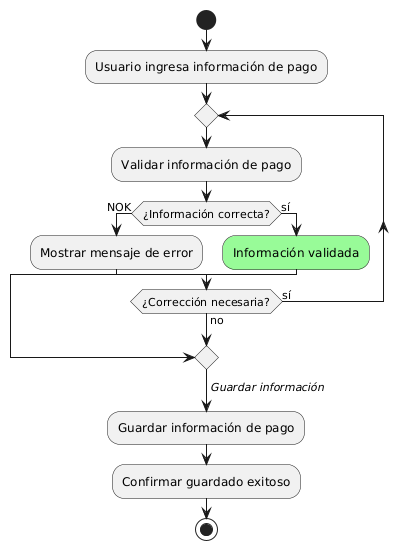
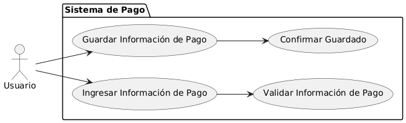

# Epica de Análisis

------
## Diagrama de Actividades
[Creado con plantuml](https://plantuml.com/es/)

{ align=center }
---
El diagrama de actividades muestra el proceso para guardar información de pago para futuras compras. Representa cómo el usuario ingresa y valida los datos, recibe retroalimentación en caso de errores, y tras la validación correcta, el sistema guarda la información, confirmando el éxito de la operación.
---

###
###

## Escenario MACP-35
Después de clickear el botón de compras pasará al checkout donde encontrará las etapas bien marcadas del proceso como por ejemplo: apis para sugerir direcciones por medio de geolocalizador , datos de entrega, verificación de datos antes del pago que le permite a pepito perez gestionar su pago por diferentes alternativas, y si lo desea puede guardar los datos de pago, luego recibirá su factura a su  correo electrónico.

<table id="customers">
  <tr class="idtext principal">
    <td>ID MACP-41</td>
  </tr>
  <tr class="single text">
    <td><strong>Requerimiento</strong>: implementar guardar información de pago para futuras compras ID MACP-41</td>
  </tr>
  <tr class="single gray">
    <td><strong>Historia de usuario</strong></td>
  </tr>
  <tr class="single text">
    <td>Como usuario quiero poder guardar mi información de pago para futuras compras para agilizar el proceso de compra y evitar tener que ingresar los detalles de pago cada vez que realice una transacción.</td>
  </tr>
  <tr class="duo">
    <th class="gray"><strong>Estado de la tarea</strong></th>
    <th>En desarrollo</th>
  </tr>
  <tr class="single gray">
    <td><strong>Caso de uso (Pasos)</strong></td>
  </tr>
  <tr class="single text">
    <td>
        <ol>
            <li>Agrega productos a su carrito y procede al checkout.</li>
            <li>Ingresa información de pago.</li>
            <li>Opción para guardar la información de pago.</li>
            <li>Selecciona la opción de guardar la información de pago.</li>
            <li>El sistema guarda la información de pago.</li>
            <li>El sistema confirma que la información de pago se ha guardado correctamente.</li>
            <li>En futuras compras usar la información de pago guardada.</li>
        </ol>
    </td>
  </tr>
  <tr class="single gray">
    <td><strong>Criterios de aceptación</strong></td>
  </tr>
  <tr class="single text">
    <td>
        <ol>
            <li>Opción de Guardar Información de Pago: El sistema debe ofrecer guardar la información de pago en la etapa de pago.</li>
            <li>Confirmación del Guardado: El sistema debe confirmar que la información de pago se guardó correctamente.</li>
            <li>Uso de Información de Pago Guardada: El sistema debe permitir usar la información de pago guardada en futuras compras.</li>
            <li>Seguridad en el Guardado: El sistema debe asegurar que la información de pago se guarde de manera segura.</li>
            <li>Opciones de Administración de Información de Pago: El sistema debe permitir gestionar la información de pago guardada en la cuenta del usuario.</li>
        </ol>
    </td>
  </tr>
 <tr class="duo">
    <th class="gray"><strong>Calidad</strong></th>
    <th>En desarrollo</th>
  </tr>
  <tr class="duo">
    <th class="gray"><strong>Versionamiento</strong></th>
    <th>En desarrollo</th>
  </tr>
</table>

---
## Diagrama de Caso de uso
[Creado con plantuml](https://plantuml.com/es/)

{ align=center }
---
El diagrama de casos de uso ilustra cómo un usuario interactúa con el sistema de pago para guardar su información de pago para futuras compras. Los casos de uso incluyen ingresar y validar la información de pago, guardar los datos, y recibir una confirmación del guardado exitoso.
---
