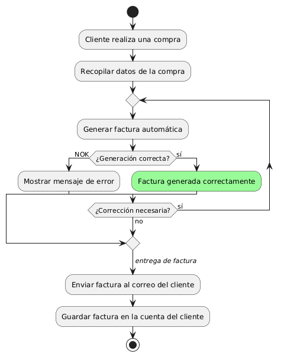
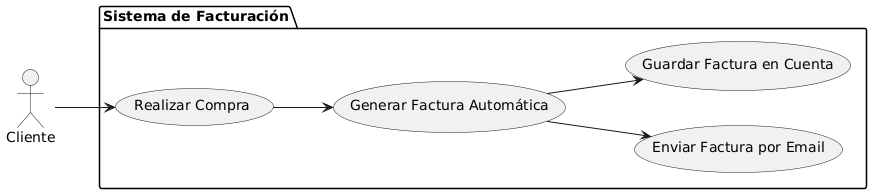

# Epica de Análisis

------
## Diagrama de Actividades
[Creado con plantuml](https://plantuml.com/es/)

{ align=center }
---
El diagrama de actividades muestra el proceso de generación automática de facturas tras una compra. Incluye la recopilación de datos, generación de la factura, manejo de posibles errores, y el envío de la factura al correo del cliente, así como su almacenamiento en la cuenta del cliente.
---

###
###

## Escenario MACP-35
Después de clickear el botón de compras pasará al checkout donde encontrará las etapas bien marcadas del proceso como por ejemplo: apis para sugerir direcciones por medio de geolocalizador , datos de entrega, verificación de datos antes del pago que le permite a pepito perez gestionar su pago por diferentes alternativas, y si lo desea puede guardar los datos de pago, luego recibirá su factura a su  correo electrónico.

<table id="customers">
  <tr class="idtext principal">
    <td>ID MACP-42</td>
  </tr>
  <tr class="single text">
    <td><strong>Requerimiento</strong>: diseñar generación de factura automática ID MACP-42</td>
  </tr>
  <tr class="single gray">
    <td><strong>Historia de usuario</strong></td>
  </tr>
  <tr class="single text">
    <td>Como cliente quiero que se genere una factura automáticamente para tener un registro detallado y preciso de mis compras sin tener que solicitarla manualmente.</td>
  </tr>
  <tr class="duo">
    <th class="gray"><strong>Estado de la tarea</strong></th>
    <th>En desarrollo</th>
  </tr>
  <tr class="single gray">
    <td><strong>Caso de uso (Pasos)</strong></td>
  </tr>
  <tr class="single text">
    <td>
        <ol>
            <li>Realizar compra en la plataforma.</li>
            <li>El sistema recopila todos los datos necesarios para la factura.</li>
            <li>El sistema genera la factura automáticamente en formato electrónico.</li>
            <li>La factura es enviada automáticamente al correo electrónico.</li>
            <li>El sistema almacena una copia de la factura.</li>
        </ol>
    </td>
  </tr>
  <tr class="single gray">
    <td><strong>Criterios de aceptación</strong></td>
  </tr>
  <tr class="single text">
    <td>
        <ol>
            <li>Generación Automática: El sistema debe generar una factura automáticamente después de cada compra.</li>
            <li>Precisión de la Factura: La factura debe incluir todos los detalles relevantes de la compra.</li>
            <li>Formato de la Factura: La factura debe ser generada en un formato estándar como PDF y cumplir con las normativas fiscales.</li>
            <li>Entrega de la Factura: La factura debe ser enviada al correo electrónico del cliente inmediatamente después de la compra.</li>
            <li>Almacenamiento de Facturas: El sistema debe almacenar una copia de cada factura en la cuenta del cliente para su acceso y descarga.</li>
            <li>Notificación de Facturación: El cliente debe recibir una notificación cuando la factura sea generada y enviada.</li>
            <li>Accesibilidad: Los clientes deben poder acceder a sus facturas anteriores a través de su cuenta en la plataforma.</li>
        </ol>
    </td>
  </tr>
 <tr class="duo">
    <th class="gray"><strong>Calidad</strong></th>
    <th>En desarrollo</th>
  </tr>
  <tr class="duo">
    <th class="gray"><strong>Versionamiento</strong></th>
    <th>En desarrollo</th>
  </tr>
</table>

---
## Diagrama de Caso de uso
[Creado con plantuml](https://plantuml.com/es/)

{ align=center }
---
El diagrama de casos de uso ilustra cómo un cliente interactúa con el sistema de facturación para generar automáticamente una factura tras una compra. Incluye la generación de la factura, su envío por email, y su almacenamiento en la cuenta del cliente, facilitando el registro detallado de compras.
---
