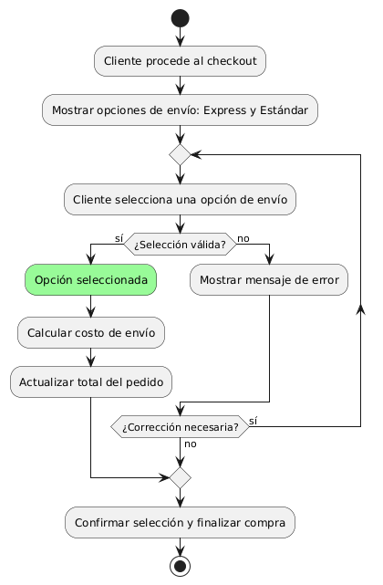
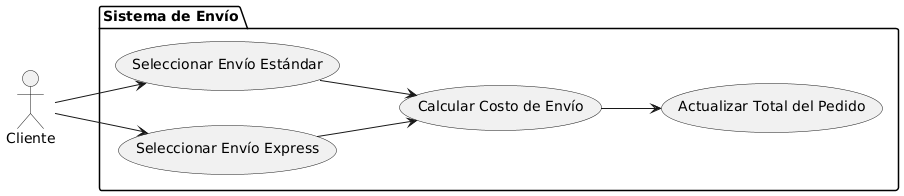

# Epica de Análisis

------
## Diagrama de Actividades
[Creado con plantuml](https://plantuml.com/es/)

{ align=center }
---
El diagrama de actividades ilustra el proceso para seleccionar entre opciones de envío express o estándar durante el checkout. Incluye la visualización de opciones, selección por parte del cliente, cálculo del costo de envío, y actualización del total del pedido antes de la confirmación final.
---

###
###

## Escenario MACP-35
Después de clickear el botón de compras pasará al checkout donde encontrará las etapas bien marcadas del proceso como por ejemplo: apis para sugerir direcciones por medio de geolocalizador , datos de entrega, verificación de datos antes del pago que le permite a pepito perez gestionar su pago por diferentes alternativas, y si lo desea puede guardar los datos de pago, luego recibirá su factura a su  correo electrónico.

<table id="customers">
  <tr class="idtext principal">
    <td>ID MACP-43</td>
  </tr>
  <tr class="single text">
    <td><strong>Requerimiento</strong>: implementar opción de envío express o estándar ID MACP-43</td>
  </tr>
  <tr class="single gray">
    <td><strong>Historia de usuario</strong></td>
  </tr>
  <tr class="single text">
    <td>Como cliente quiero tener la opción de elegir entre envío express o estándar para poder recibir mi pedido de acuerdo a mis necesidades de tiempo y presupuesto.</td>
  </tr>
  <tr class="duo">
    <th class="gray"><strong>Estado de la tarea</strong></th>
    <th>En desarrollo</th>
  </tr>
  <tr class="single gray">
    <td><strong>Caso de uso (Pasos)</strong></td>
  </tr>
  <tr class="single text">
    <td>
        <ol>
            <li>El cliente procede al checkout después de agregar productos al carrito.</li>
            <li>El sistema muestra las opciones de envío disponibles: express y estándar.</li>
            <li>El cliente selecciona una de las opciones de envío.</li>
            <li>El sistema calcula y muestra el costo de envío basado en la opción seleccionada.</li>
            <li>El cliente confirma la selección del método de envío.</li>
            <li>El sistema guarda la opción de envío seleccionada junto con el pedido.</li>
        </ol>
    </td>
  </tr>
  <tr class="single gray">
    <td><strong>Criterios de aceptación</strong></td>
  </tr>
  <tr class="single text">
    <td>
        <ol>
            <li>Opciones de Envío Disponibles: El sistema debe mostrar opciones de envío express y estándar durante el checkout.</li>
            <li>Costo de Envío: El sistema debe mostrar el costo de cada opción de envío antes de confirmar el pedido.</li>
            <li>Confirmación de Selección: El cliente debe confirmar su opción de envío antes de finalizar la compra.</li>
            <li>Actualización de Pedido: La opción de envío seleccionada debe aparecer en los detalles y confirmación del pedido.</li>
            <li>Accesibilidad: La selección de envío debe funcionar en todos los dispositivos y navegadores soportados.</li>
            <li>Información del Envío: El sistema debe registrar y almacenar la opción de envío seleccionada junto con el pedido.</li>            
        </ol>
    </td>
  </tr>
 <tr class="duo">
    <th class="gray"><strong>Calidad</strong></th>
    <th>En desarrollo</th>
  </tr>
  <tr class="duo">
    <th class="gray"><strong>Versionamiento</strong></th>
    <th>En desarrollo</th>
  </tr>
</table>

---
## Diagrama de Caso de uso
[Creado con plantuml](https://plantuml.com/es/)

{ align=center }
---
El diagrama de casos de uso muestra cómo el cliente interactúa con el sistema de envío para elegir entre opciones de envío express o estándar. Incluye casos de uso para seleccionar un método de envío, calcular el costo asociado, y actualizar el total del pedido en consecuencia.
---
