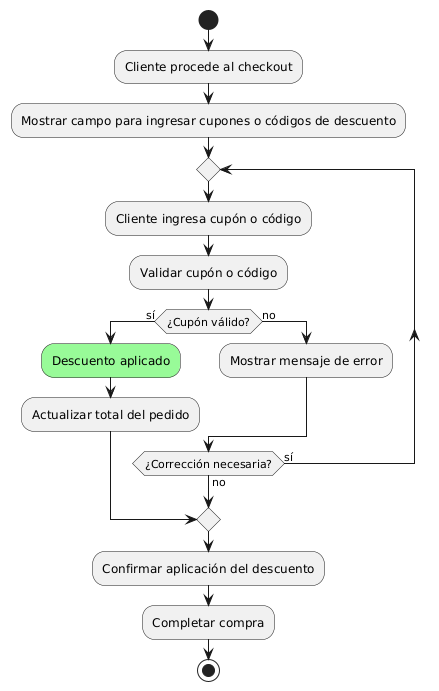
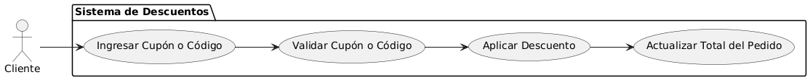

# Epica de Análisis

------
## Diagrama de Actividades
[Creado con plantuml](https://plantuml.com/es/)

{ align=center }
---
El diagrama de actividades ilustra el proceso de aplicación de cupones y códigos de descuento durante el checkout. Incluye la entrada del código por el cliente, validación del cupón, aplicación del descuento, y actualización del total del pedido antes de completar la compra. Muestra el manejo de errores y confirmación final.
---

###
###

## Escenario MACP-35
Después de clickear el botón de compras pasará al checkout donde encontrará las etapas bien marcadas del proceso como por ejemplo: apis para sugerir direcciones por medio de geolocalizador , datos de entrega, verificación de datos antes del pago que le permite a pepito perez gestionar su pago por diferentes alternativas, y si lo desea puede guardar los datos de pago, luego recibirá su factura a su  correo electrónico.

<table id="customers">
  <tr class="idtext principal">
    <td>ID MACP-44</td>
  </tr>
  <tr class="single text">
    <td><strong>Requerimiento</strong>: implementar cupones y códigos de descuento ID MACP-44</td>
  </tr>
  <tr class="single gray">
    <td><strong>Historia de usuario</strong></td>
  </tr>
  <tr class="single text">
    <td>Como cliente quiero tener la opción de aplicar cupones y códigos de descuento durante el proceso de compra para obtener precios reducidos y disfrutar de ofertas especiales en mis productos favoritos.</td>
  </tr>
  <tr class="duo">
    <th class="gray"><strong>Estado de la tarea</strong></th>
    <th>En desarrollo</th>
  </tr>
  <tr class="single gray">
    <td><strong>Caso de uso (Pasos)</strong></td>
  </tr>
  <tr class="single text">
    <td>
        <ol>
            <li>El cliente procede al checkout después de agregar productos al carrito.</li>
            <li>El sistema presenta un campo para ingresar el cupón o código de descuento.</li>
            <li>El cliente ingresa el cupón o código de descuento en el campo correspondiente.</li>
            <li>El sistema valida el cupón o código ingresado.</li>
            <li>Si el cupón o código es válido, el sistema aplica el descuento correspondiente al total del pedido.</li>
            <li>El sistema muestra el total actualizado con el descuento aplicado..</li>
            <li>El cliente confirma la aplicación del descuento y completa la compra.</li>
        </ol>
    </td>
  </tr>
  <tr class="single gray">
    <td><strong>Criterios de aceptación</strong></td>
  </tr>
  <tr class="single text">
    <td>
        <ol>
            <li>Opciones de Envío Disponibles: El sistema debe mostrar opciones de envío express y estándar durante el checkout.</li>
            <li>Costo de Envío: El sistema debe mostrar el costo de cada opción de envío antes de confirmar el pedido.</li>
            <li>Confirmación de Selección: El cliente debe confirmar su opción de envío antes de finalizar la compra.</li>
            <li>Actualización de Pedido: La opción de envío seleccionada debe aparecer en los detalles y confirmación del pedido.</li>
            <li>Accesibilidad: La selección de envío debe funcionar en todos los dispositivos y navegadores soportados.</li>
            <li>Información del Envío: El sistema debe registrar y almacenar la opción de envío seleccionada junto con el pedido.</li>            
        </ol>
    </td>
  </tr>
 <tr class="duo">
    <th class="gray"><strong>Calidad</strong></th>
    <th>En desarrollo</th>
  </tr>
  <tr class="duo">
    <th class="gray"><strong>Versionamiento</strong></th>
    <th>En desarrollo</th>
  </tr>
</table>

---
## Diagrama de Caso de uso
[Creado con plantuml](https://plantuml.com/es/)

{ align=center }
---
El diagrama de casos de uso muestra cómo el cliente interactúa con el sistema para aplicar cupones y códigos de descuento. Incluye ingresar el cupón, validarlo, aplicar el descuento al pedido y actualizar el total. Facilita la aplicación de descuentos durante el proceso de compra.
---
