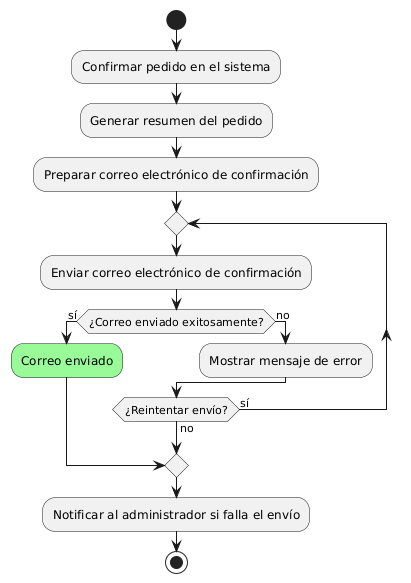
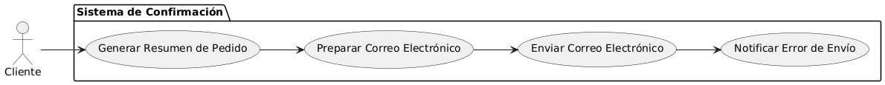

# Epica de Análisis

------
## Diagrama de Actividades
[Creado con plantuml](https://plantuml.com/es/)

{ align=center }
---
El diagrama de actividades describe el proceso de enviar una confirmación de pedido por correo electrónico. Incluye la confirmación del pedido, generación del resumen, preparación del correo, y el intento de envío. Maneja errores y reintentos, y notifica al administrador en caso de fallos en el envío del correo.
---

###
###

## Escenario MACP-35
Después de clickear el botón de compras pasará al checkout donde encontrará las etapas bien marcadas del proceso como por ejemplo: apis para sugerir direcciones por medio de geolocalizador , datos de entrega, verificación de datos antes del pago que le permite a pepito perez gestionar su pago por diferentes alternativas, y si lo desea puede guardar los datos de pago, luego recibirá su factura a su  correo electrónico.

<table id="customers">
  <tr class="idtext principal">
    <td>ID MACP-45</td>
  </tr>
  <tr class="single text">
    <td><strong>Requerimiento</strong>: crear confirmación de pedido por correo electrónico ID MACP-45</td>
  </tr>
  <tr class="single gray">
    <td><strong>Historia de usuario</strong></td>
  </tr>
  <tr class="single text">
    <td>Como cliente, quiero recibir un correo electrónico de confirmación de pedido para tener un registro de mi compra y la información del envío.</td>
  </tr>
  <tr class="duo">
    <th class="gray"><strong>Estado de la tarea</strong></th>
    <th>En desarrollo</th>
  </tr>
  <tr class="single gray">
    <td><strong>Caso de uso (Pasos)</strong></td>
  </tr>
  <tr class="single text">
    <td>
        <ol>
            <li>El cliente completa el proceso de compra y el pedido es confirmado por el sistema.</li>
            <li>El sistema genera un resumen del pedido, que incluye detalles del pedido y la información de envío.</li>
            <li>El sistema prepara un correo electrónico de confirmación utilizando el resumen del pedido.</li>
            <li>El sistema envía el correo electrónico al cliente con el resumen del pedido y la información de envío.</li>
            <li>El cliente recibe el correo electrónico de confirmación de pedido en su bandeja de entrada.</li>
        </ol>
    </td>
  </tr>
  <tr class="single gray">
    <td><strong>Criterios de aceptación</strong></td>
  </tr>
  <tr class="single text">
    <td>
        <ol>
            <li>Generación de Correo: El sistema debe generar un correo de confirmación con el resumen del pedido y detalles de envío.</li>
            <li>Contenido del Correo: El correo debe incluir el número de pedido, lista de productos, dirección de envío y otra información relevante.</li>
            <li>Envío del Correo: El sistema debe enviar el correo al cliente inmediatamente después de la confirmación del pedido.</li>
            <li>Formato y Diseño: El correo debe estar bien formateado y ser legible en diferentes clientes de correo y dispositivos.</li>
            <li>Confirmación de Envío: El cliente debe recibir el correo de confirmación en la bandeja de entrada proporcionada durante la compra.</li>
            <li>Manejo de Errores: El sistema debe manejar errores de envío de correos y notificar al administrador en caso de fallos.</li>
            <li>Accesibilidad: El correo debe ser accesible y claro, respetando normas de accesibilidad si es necesario.</li>        
        </ol>
    </td>
  </tr>
 <tr class="duo">
    <th class="gray"><strong>Calidad</strong></th>
    <th>En desarrollo</th>
  </tr>
  <tr class="duo">
    <th class="gray"><strong>Versionamiento</strong></th>
    <th>En desarrollo</th>
  </tr>
</table>

---
## Diagrama de Caso de uso
[Creado con plantuml](https://plantuml.com/es/)

{ align=center }
---
El diagrama de casos de uso muestra cómo el cliente interactúa con el sistema para recibir una confirmación de pedido por correo electrónico. Incluye generar un resumen del pedido, preparar y enviar el correo de confirmación, y manejar notificaciones de errores en caso de fallos en el envío.
---
