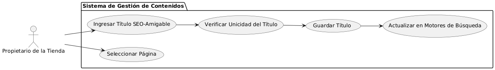

# Epica de Análisis

------
## Diagrama de Actividades
[Creado con plantuml](https://plantuml.com/es/)

{ align=center }
---
El diagrama de actividades describe el proceso de crear títulos de página SEO-amigables. Incluye acceder al CMS, seleccionar la página a editar, ingresar un título único y descriptivo, y verificar su validez. Si el título cumple los criterios, se guarda y se actualiza en los motores de búsqueda.
---

###
###

## Escenario MACP-46
Rubén al buscar una página de ventas de muebles  por medio de palabras claves podrá identificar o encontrar contenidos de nuestra página, encontrando títulos  llamativos y con historias de productos que atraigan a rubén a la investigación de nuestros productos en la página.

<table id="customers">
  <tr class="idtext principal">
    <td>ID MACP-47</td>
  </tr>
  <tr class="single text">
    <td><strong>Requerimiento</strong>: crear títulos de página SEO-amigables ID MACP-47</td>
  </tr>
  <tr class="single gray">
    <td><strong>Historia de usuario</strong></td>
  </tr>
  <tr class="single text">
    <td>Como propietario de una tienda online, quiero mejorar el posicionamiento SEO de mi sitio web implementando títulos de página únicos y descriptivos para cada página.</td>
  </tr>
  <tr class="duo">
    <th class="gray"><strong>Estado de la tarea</strong></th>
    <th>En desarrollo</th>
  </tr>
  <tr class="single gray">
    <td><strong>Caso de uso (Pasos)</strong></td>
  </tr>
  <tr class="single text">
    <td>
        <ol>
            <li>El propietario accede al CMS y selecciona la página que desea editar.</li>
            <li>El sistema permite al propietario editar o crear un nuevo título de página.</li>
            <li>El propietario ingresa un título único y descriptivo, optimizado con palabras clave relevantes.</li>
            <li>El sistema guarda el nuevo título y lo asigna a la página correspondiente.</li>
            <li>El sistema actualiza el sitio web con el nuevo título, haciéndolo visible en el código HTML y en los motores de búsqueda.</li>
        </ol>
    </td>
  </tr>
  <tr class="single gray">
    <td><strong>Criterios de aceptación</strong></td>
  </tr>
  <tr class="single text">
    <td>
        <ol>
            <li>Unicidad del Título: El sistema debe asegurar que cada página tenga un título único y no repetido en el sitio.</li>
            <li>Longitud del Título: El título debe estar entre 50 y 60 caracteres para cumplir con las recomendaciones de SEO.</li>
            <li>Optimización de Palabras Clave: El título debe incluir palabras clave relevantes para mejorar su posicionamiento en buscadore.</li>
            <li>Descripción Precisa: El título debe describir claramente el contenido de la página para facilitar la comprensión del usuario.</li>
            <li>Visualización en Motores de Búsqueda: El título debe ser visible y correctamente formateado en los resultados de búsqueda.</li>
            <li>Accesibilidad del CMS: El propietario debe poder acceder y modificar los títulos en el CMS sin complicaciones.</li>
            <li>Actualización Instantánea: Los cambios en los títulos deben reflejarse en el sitio web y buscadores sin demoras.</li>        
        </ol>
    </td>
  </tr>
 <tr class="duo">
    <th class="gray"><strong>Calidad</strong></th>
    <th>En desarrollo</th>
  </tr>
  <tr class="duo">
    <th class="gray"><strong>Versionamiento</strong></th>
    <th>En desarrollo</th>
  </tr>
</table>

---
## Diagrama de Caso de uso
[Creado con plantuml](https://plantuml.com/es/)

{ align=center }
---
El diagrama de casos de uso muestra cómo el cliente interactúa con el sistema para recibir una confirmación de pedido por correo electrónico. Incluye generar un resumen del pedido, preparar y enviar el correo de confirmación, y manejar notificaciones de errores en caso de fallos en el envío.
---
