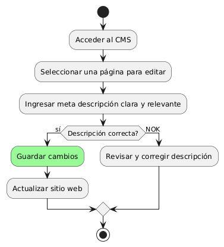
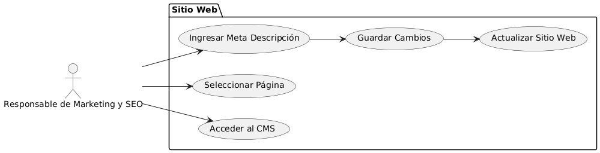

# Epica de Análisis

------
## Diagrama de Actividades
[Creado con plantuml](https://plantuml.com/es/)

{ align=center }
---
El diagrama de actividades ilustra el proceso de implementar descripciones claras en un sitio web. Incluye pasos para acceder al CMS, seleccionar una página, ingresar una meta descripción relevante y guardar los cambios. Si la descripción no es correcta, se revisa y corrige antes de actualizar el sitio web.
---

###
###

## Escenario MACP-46
Rubén al buscar una página de ventas de muebles  por medio de palabras claves podrá identificar o encontrar contenidos de nuestra página, encontrando títulos  llamativos y con historias de productos que atraigan a rubén a la investigación de nuestros productos en la página.

<table id="customers">
  <tr class="idtext principal">
    <td>ID MACP-48</td>
  </tr>
  <tr class="single text">
    <td><strong>Requerimiento</strong>: implementar descripciones claras ID MACP-48</td>
  </tr>
  <tr class="single gray">
    <td><strong>Historia de usuario</strong></td>
  </tr>
  <tr class="single text">
    <td>Como responsable de Marketing y SEO, quiero implementar descripciones claras en el sitio web, para mejorar la optimización y atraer más tráfico orgánico.</td>
  </tr>
  <tr class="duo">
    <th class="gray"><strong>Estado de la tarea</strong></th>
    <th>En desarrollo</th>
  </tr>
  <tr class="single gray">
    <td><strong>Caso de uso (Pasos)</strong></td>
  </tr>
  <tr class="single text">
    <td>
        <ol>
            <li>Acceso al CMS: El responsable de Marketing y SEO accede al CMS.</li>
            <li>Seleccionar Página: El responsable selecciona una página para editar.</li>
            <li>Ingresar Meta Descripción: El responsable introduce una meta descripción clara y relevante.</li>
            <li>Guardar Cambios: El sistema guarda la nueva meta descripción.</li>
            <li>Actualizar Sitio Web: El sitio web se actualiza con la nueva meta descripción.</li>
        </ol>
    </td>
  </tr>
  <tr class="single gray">
    <td><strong>Criterios de aceptación</strong></td>
  </tr>
  <tr class="single text">
    <td>
        <ol>
            <li>Claridad y Relevancia: Las meta descripciones deben ser claras, concisas y relevantes para el contenido de la página.</li>
            <li>Optimización para SEO: Las descripciones deben incluir palabras clave importantes y tener entre 150-160 caracteres.</li>
            <li>Aumento del Tráfico Orgánico: Las nuevas descripciones deben ayudar a aumentar el tráfico orgánico al atraer más clics.</li>
            <li>Accesibilidad del CMS: El CMS debe permitir editar y gestionar las meta descripciones de manera eficiente.</li>
            <li>Actualización Correcta: Los cambios en las descripciones deben reflejarse en el sitio web y en los resultados de búsqueda de forma oportuna.</li>             
        </ol>
    </td>
  </tr>
 <tr class="duo">
    <th class="gray"><strong>Calidad</strong></th>
    <th>En desarrollo</th>
  </tr>
  <tr class="duo">
    <th class="gray"><strong>Versionamiento</strong></th>
    <th>En desarrollo</th>
  </tr>
</table>

---
## Diagrama de Caso de uso
[Creado con plantuml](https://plantuml.com/es/)

{ align=center }
---
El diagrama de casos de uso ilustra el proceso para que el "Responsable de Marketing y SEO" implemente descripciones claras en el sitio web. Incluye la interacción con el CMS para acceder, seleccionar páginas, ingresar y guardar meta descripciones, y actualizar el sitio web para mejorar la optimización y atraer tráfico orgánico.
---
