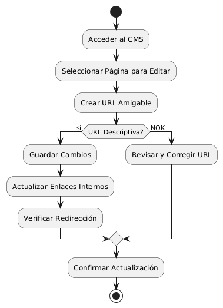
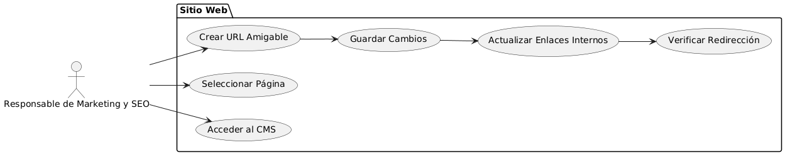

# Epica de Análisis

------
## Diagrama de Actividades
[Creado con plantuml](https://plantuml.com/es/)

{ align=center }
---
El diagrama de actividades ilustra el proceso para crear URLs amigables para SEO. Incluye acceder al CMS, seleccionar y editar páginas, crear URLs descriptivas, guardar cambios, actualizar enlaces internos y verificar redirecciones. También aborda la corrección de URLs no descriptivas para asegurar una optimización efectiva y una navegación fluida.
---

###
###

## Escenario MACP-46
Rubén al buscar una página de ventas de muebles  por medio de palabras claves podrá identificar o encontrar contenidos de nuestra página, encontrando títulos  llamativos y con historias de productos que atraigan a rubén a la investigación de nuestros productos en la página.

<table id="customers">
  <tr class="idtext principal">
    <td>ID MACP-49</td>
  </tr>
  <tr class="single text">
    <td><strong>Requerimiento</strong>: crear urls amigables para SEO ID MACP-49</td>
  </tr>
  <tr class="single gray">
    <td><strong>Historia de usuario</strong></td>
  </tr>
  <tr class="single text">
    <td>Como responsable de Marketing y SEO, quiero crear URLs amigables para SEO, para mejorar el posicionamiento en buscadores y facilitar la navegación del usuario.</td>
  </tr>
  <tr class="duo">
    <th class="gray"><strong>Estado de la tarea</strong></th>
    <th>En desarrollo</th>
  </tr>
  <tr class="single gray">
    <td><strong>Caso de uso (Pasos)</strong></td>
  </tr>
  <tr class="single text">
    <td>
        <ol>
            <li>Acceso al CMS: El responsable de Marketing y SEO accede al CMS.</li>
            <li>Seleccionar Página: El responsable selecciona una página para modificar la URL.</li>
            <li>Crear URL Amigable: El responsable introduce una URL clara, descriptiva y relevante, utilizando palabras clave y evitando caracteres especiales.</li>
            <li>Guardar Cambios: El sistema guarda la nueva URL amigable..</li>
            <li>Actualizar Enlaces Internos: e actualizan los enlaces internos del sitio web para reflejar la nueva URL.</li>
            <li>Verificar Redirección: Se asegura que la redirección desde la antigua URL (si aplica) funcione correctamente.</li>
        </ol>
    </td>
  </tr>
  <tr class="single gray">
    <td><strong>Criterios de aceptación</strong></td>
  </tr>
  <tr class="single text">
    <td>
        <ol>
            <li>Claridad y Descriptividad: Las URLs deben ser claras, descriptivas y reflejar el contenido de la página.</li>
            <li>Uso de Palabras Clave: Las URLs deben incluir palabras clave relevantes para mejorar el SEO.</li>
            <li>Formato Amigable: Las URLs deben ser limpias, sin caracteres especiales, guiones bajos o parámetros innecesarios.</li>
            <li>Actualización de Enlaces: Todos los enlaces internos deben actualizarse para reflejar las nuevas URLs sin errores 404.</li>
            <li>Redirección Adecuada: Las redirecciones 301 deben implementarse correctamente para evitar la pérdida de tráfico y preservar el SEO.</li>             
        </ol>
    </td>
  </tr>
 <tr class="duo">
    <th class="gray"><strong>Calidad</strong></th>
    <th>En desarrollo</th>
  </tr>
  <tr class="duo">
    <th class="gray"><strong>Versionamiento</strong></th>
    <th>En desarrollo</th>
  </tr>
</table>

---
## Diagrama de Caso de uso
[Creado con plantuml](https://plantuml.com/es/)

{ align=center }
---
El diagrama de casos de uso muestra al "Responsable de Marketing y SEO" interactuando con varios casos de uso para crear URLs amigables. Incluye acceder al CMS, seleccionar páginas, crear y guardar URLs amigables, actualizar enlaces internos y verificar redirecciones para mejorar el SEO y la navegación del usuario.
---
