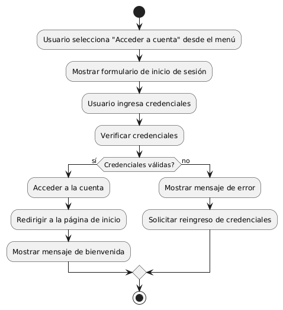

# CREAR ACCESOR RAPIDO A LA CUENTA DE USUARIO DESDE EL MENÚ 
------
## Diagrama de Actividades
[Creado con plantuml](https://plantuml.com/es/)

{ align=center }

El diagrama de actividad describe el proceso de acceso rápido a la cuenta de usuario desde el menú. Comienza con la selección de la opción de inicio de sesión, seguido por la entrada y verificación de credenciales. Dependiendo de la validez, el usuario es redirigido a la página principal o se le solicita reingresar credenciales.
---
###

## Caso de uso historia Crear paginas de Inicio 
El usuario que quiere comprar muebles puede entrar a un menú principal o una página de inicio , el cual tiene enlaces a otras  páginas principales como inicio, catálogos, contactos entre otros más. Dentro de la misma página cuando el usuario pase el ratón sobre las opciones del menú principal se desplegará los submenús con más opciones; la página le proporcionará enlaces rápidos para iniciar sesión o registrarse; si la persona quiere entrar a la página desde su móvil, lo podrá hacer con toda comodidad ya que el menú es responsivo para móviles. También si el usuario quiere consultar las redes sociales lo podrá hacer ya que el menú de inicio tiene enlaces  a las mismas, y no menos importante la capacidad de ver todos los productos recomendados o más vendidos de la página.

<table id="customers">
  <tr class="idtext principal">
    <td>ID MACP-5</td>
  </tr>
  <tr class="single text">
    <td><strong>Requerimiento</strong>:Implementar un acceso rápido a la cuenta de usuario desde el menú ID MACP-5</td>
  </tr>
  <tr class="single gray">
    <td><strong>Historia de usuario</strong></td>
  </tr>
  <tr class="single text">
    <td>Como usuario, quiero acceder a mi cuenta de forma rápida y segura, para poder comenzar a usar la aplicación sin perder tiempo.</td>
  </tr>
  <tr class="duo">
    <th class="gray"><strong>Estado de la tarea</strong></th>
    <th>En desarrollo</th>
  </tr>
  <tr class="single gray">
    <td><strong>Caso de uso (Pasos)</strong></td>
  </tr>
  <tr class="single text">
    <td>
        <ol>
            <li> El usuario abre la aplicación y se encuentra en la pantalla principal.</li>
            <li>El usuario localiza y selecciona la opción de acceso rápido a la cuenta desde el menú.</li>
           <li>La aplicación verifica que el usuario está autenticado. </li>
          <li>La aplicación muestra la pantalla de cuenta del usuario con las opciones disponibles.perfil, configuración, entre otras</li>
          <li>El usuario interactúa con la pantalla de su cuenta según sus necesidades</li>
        </ol>
    </td>
  </tr>
  <tr class="single gray">
    <td><strong>Criterios de aceptación</strong></td>
  </tr>
  <tr class="single text">
    <td>
        <ol>
               <li>Visibilidad del Acceso Rápido:La opción de acceso rápido a la cuenta debe estar visible y accesible desde el menú principal de la aplicación.</li>
              <li>Seguridad: La opción de acceso rápido debe garantizar que el usuario esté autenticado antes de mostrar la pantalla de cuenta.
               <li>Experiencia de Usuario:El acceso a la cuenta debe ser rápido, con tiempos de carga mínimos.fluida y sin errores.
               <li>Consistencia: La funcionalidad de acceso rápido debe estar disponible en todas las plataformas y dispositivos donde la aplicación esté disponible.</li>
               <li>Pruebas: El acceso rápido debe ser probado en diferentes escenarios para asegurar que funciona correctamente en  diversas condiciones.</li>
               <li>Feedback Visual: La interfaz debe proporcionar una confirmación visual clara de que el usuario ha sido redirigido correctamente a su cuenta mostrando un mensaje de bienvenida, nombre de usuario.</li>> 
               <li>Errores y Manejo de Excepciones: La aplicación debe manejar adecuadamente los errores y proporcionar mensajes de error claros y útiles al usuario.</li>>

        </ol>
    </td>
  </tr>
 <tr class="duo">
    <th class="gray"><strong>Calidad</strong></th>
    <th>En desarrollo</th>
  </tr>
  <tr class="duo">
    <th class="gray"><strong>Versionamiento</strong></th>
    <th>En desarrollo</th>
  </tr>
</table>

---
## Diagrama de Caso de uso
[Creado con plantuml](https://plantuml.com/es/)

{ align=center }

El diagrama de casos de uso ilustra cómo un Usuario interactúa con la aplicación a través del menú. Los casos de uso incluyen "Acceder a la cuenta", que permite al usuario ingresar rápidamente a su cuenta, y "Ver perfil", para visualizar detalles adicionales del perfil después de iniciar sesión.
---
