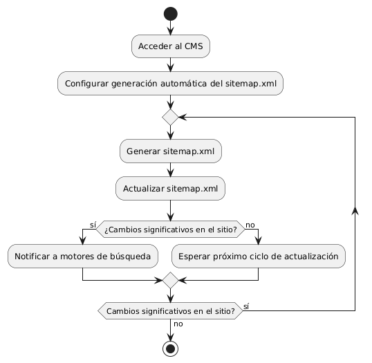
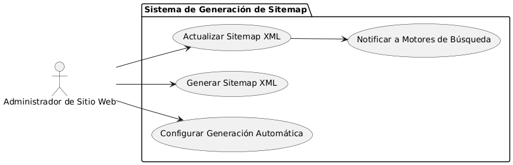

# Epica de Análisis

------
## Diagrama de Actividades
[Creado con plantuml](https://plantuml.com/es/)

{ align=center }
---
El diagrama de actividades ilustra el proceso de generación automática de un sitemap.xml. Inicia con la configuración en el CMS, seguido por la generación y actualización periódica del archivo. Incluye un paso para notificar a los motores de búsqueda en caso de cambios significativos en el sitio web.
---

###
###

## Escenario MACP-46
Rubén al buscar una página de ventas de muebles  por medio de palabras claves podrá identificar o encontrar contenidos de nuestra página, encontrando títulos  llamativos y con historias de productos que atraigan a rubén a la investigación de nuestros productos en la página.

<table id="customers">
  <tr class="idtext principal">
    <td>ID MACP-50</td>
  </tr>
  <tr class="single text">
    <td><strong>Requerimiento</strong>: crear Sitemap xml actualizado automáticamente ID MACP-50</td>
  </tr>
  <tr class="single gray">
    <td><strong>Historia de usuario</strong></td>
  </tr>
  <tr class="single text">
    <td>Como administrador de sitio web, quiero que el sistema genere automáticamente un mapa del sitio (sitemap.xml) para facilitar la indexación de nuestro sitio web por parte de los motores de búsqueda.</td>
  </tr>
  <tr class="duo">
    <th class="gray"><strong>Estado de la tarea</strong></th>
    <th>En desarrollo</th>
  </tr>
  <tr class="single gray">
    <td><strong>Caso de uso (Pasos)</strong></td>
  </tr>
  <tr class="single text">
    <td>
        <ol>
            <li>Acceso al CMS: El administrador accede al CMS.</li>
            <li>Configurar Generación Automática: El administrador configura la opción para la generación automática del sitemap.xml en la configuración del CMS.</li>
            <li>Generar Sitemap: El sistema genera el sitemap.xml automáticamente, incluyendo todas las URLs relevantes del sitio web.</li>
            <li>Actualizar Sitemap: El sistema actualiza el sitemap.xml cada vez que se realiza un cambio significativo en el contenido o estructura del sitio web.</li>
            <li>Guardar y Publicar: El sistema guarda y publica el sitemap.xml en la ubicación estándar (por ejemplo, /sitemap.xml).</li>
            <li>Notificar a Motores de Búsqueda: El sistema envía una notificación a los motores de búsqueda (si está configurado) para informarles sobre la actualización del sitemap.xml.</li>
        </ol>
    </td>
  </tr>
  <tr class="single gray">
    <td><strong>Criterios de aceptación</strong></td>
  </tr>
  <tr class="single text">
    <td>
        <ol>
            <li>Generación Automática: El sitemap.xml se genera automáticamente sin intervención manual tras cambios importantes en el sitio.</li>
            <li>Contenido Completo: El sitemap.xml debe incluir todas las URLs relevantes y estar actualizado con la estructura adecuada.</li>
            <li>Actualización Regular: El sistema debe actualizar el sitemap.xml regularmente o al detectar cambios significativos.</li>
            <li>Accesibilidad: El sitemap.xml debe estar accesible en la ubicación estándar del sitio (por ejemplo, /sitemap.xml).</li>
            <li>Notificación de Motores de Búsqueda: El sistema debe notificar automáticamente a los motores de búsqueda sobre la actualización del sitemap.xml, si está habilitado.</li>             
        </ol>
    </td>
  </tr>
 <tr class="duo">
    <th class="gray"><strong>Calidad</strong></th>
    <th>En desarrollo</th>
  </tr>
  <tr class="duo">
    <th class="gray"><strong>Versionamiento</strong></th>
    <th>En desarrollo</th>
  </tr>
</table>

---
## Diagrama de Caso de uso
[Creado con plantuml](https://plantuml.com/es/)

{ align=center }
---
El diagrama de casos de uso muestra al Administrador de Sitio Web configurando y gestionando un sistema de generación automática de sitemap XML. Incluye casos de uso para configurar la generación, crear y actualizar el sitemap, y notificar a motores de búsqueda sobre cambios importantes para mejorar la indexación del sitio.
---
