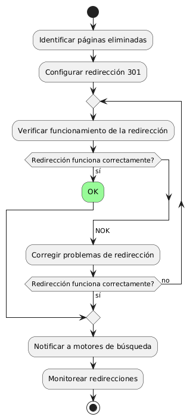
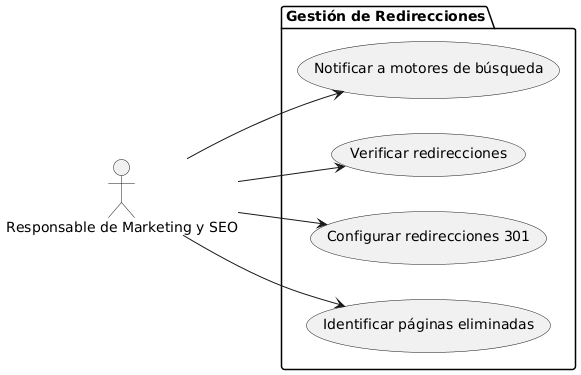

# Epica de Análisis

------
## Diagrama de Actividades
[Creado con plantuml](https://plantuml.com/es/)

{ align=center }
---
La actividad de implementar redirecciones 301 para páginas eliminadas implica identificar las páginas que ya no existen, configurar las redirecciones adecuadas, verificar su correcto funcionamiento, notificar a los motores de búsqueda sobre los cambios y monitorear continuamente las redirecciones para preservar el tráfico y mantener el posicionamiento SEO.
---

###
###

## Escenario MACP-46
Rubén al buscar una página de ventas de muebles  por medio de palabras claves podrá identificar o encontrar contenidos de nuestra página, encontrando títulos  llamativos y con historias de productos que atraigan a rubén a la investigación de nuestros productos en la página.

<table id="customers">
  <tr class="idtext principal">
    <td>ID MACP-51</td>
  </tr>
  <tr class="single text">
    <td><strong>Requerimiento</strong>: implementar redirecciones 301 para páginas eliminadas ID MACP-51</td>
  </tr>
  <tr class="single gray">
    <td><strong>Historia de usuario</strong></td>
  </tr>
  <tr class="single text">
    <td>Como responsable de Marketing y SEO, quiero implementar redirecciones 301 para páginas eliminadas, para preservar el tráfico y mantener el posicionamiento en los motores de búsqueda.</td>
  </tr>
  <tr class="duo">
    <th class="gray"><strong>Estado de la tarea</strong></th>
    <th>En desarrollo</th>
  </tr>
  <tr class="single gray">
    <td><strong>Caso de uso (Pasos)</strong></td>
  </tr>
  <tr class="single text">
    <td>
        <ol>
            <li>Identificación de Páginas Eliminadas.</li>
            <li>Configuración de Redirecciones 301.</li>
            <li>Verificación.</li>
            <li>Notificación a Motores de Búsqueda.</li>
            <li>Monitoreo.</li>
        </ol>
    </td>
  </tr>
  <tr class="single gray">
    <td><strong>Criterios de aceptación</strong></td>
  </tr>
  <tr class="single text">
    <td>
        <ol>
            <li>Correcta Implementación de Redirecciones: Las redirecciones 301 deben configurarse adecuadamente para todas las páginas eliminadas.</li>
            <li>Sin Pérdida de Tráfico: El tráfico debe redirigirse eficientemente a las nuevas páginas sin generar errores 404.</li>
            <li>Mantenimiento del Posicionamiento SEO: Las redirecciones deben preservar o mejorar el posicionamiento en los motores de búsqueda.</li>
            <li>Notificación Exitosa a Motores de Búsqueda: Los motores de búsqueda deben ser notificados correctamente sobre las redirecciones.</li>
            <li>Monitoreo Eficiente: El sistema o equipo responsable debe poder monitorear y solucionar rápidamente cualquier problema relacionado con las redirecciones.</li>             
        </ol>
    </td>
  </tr>
 <tr class="duo">
    <th class="gray"><strong>Calidad</strong></th>
    <th>En desarrollo</th>
  </tr>
  <tr class="duo">
    <th class="gray"><strong>Versionamiento</strong></th>
    <th>En desarrollo</th>
  </tr>
</table>

---
## Diagrama de Caso de uso
[Creado con plantuml](https://plantuml.com/es/)

{ align=center }
---
El caso de uso para implementar redirecciones 301 para páginas eliminadas permite al responsable de Marketing y SEO identificar páginas eliminadas, configurar redirecciones 301, verificar su correcto funcionamiento, y notificar a los motores de búsqueda. Esto asegura la preservación del tráfico y el mantenimiento del posicionamiento SEO.
---
