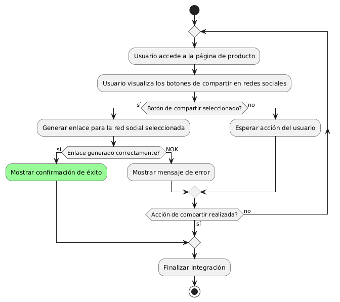
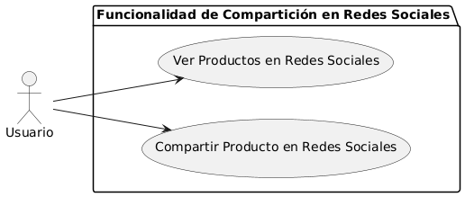

# Epica de Análisis

------
## Diagrama de Actividades
[Creado con plantuml](https://plantuml.com/es/)

{ align=center }
---
El diagrama de actividades describe el proceso de integración de botones para compartir en redes sociales en cada página de producto. Incluye pasos como la visualización de los botones por el usuario, la generación de enlaces para redes sociales, y la confirmación de éxito o el manejo de errores si el enlace no se genera correctamente.
---

###
###

## Escenario MACP-46
Rubén al buscar una página de ventas de muebles  por medio de palabras claves podrá identificar o encontrar contenidos de nuestra página, encontrando títulos  llamativos y con historias de productos que atraigan a rubén a la investigación de nuestros productos en la página.

<table id="customers">
  <tr class="idtext principal">
    <td>ID MACP-52</td>
  </tr>
  <tr class="single text">
    <td><strong>Requerimiento</strong>: implementar integración con redes sociales ID MACP-52</td>
  </tr>
  <tr class="single gray">
    <td><strong>Historia de usuario</strong></td>
  </tr>
  <tr class="single text">
    <td>Como usuario, quiero compartir fácilmente mis productos favoritos con mis amigos y seguidores en redes sociales, por lo que solicito la integración de botones para compartir en cada página de producto.</td>
  </tr>
  <tr class="duo">
    <th class="gray"><strong>Estado de la tarea</strong></th>
    <th>En desarrollo</th>
  </tr>
  <tr class="single gray">
    <td><strong>Caso de uso (Pasos)</strong></td>
  </tr>
  <tr class="single text">
    <td>
        <ol>
            <li>El usuario navega hasta una página de producto en el sitio web.</li>
            <li>El usuario visualiza los botones de compartir en redes sociales.</li>
            <li>El usuario selecciona una red social para compartir el producto.</li>
            <li>El sistema genera un enlace y lo envía a la red social seleccionada.</li>
            <li>La red social muestra el enlace compartido en el perfil del usuario.</li>
            <li>El usuario recibe confirmación de que el producto ha sido compartido correctamente.</li>
        </ol>
    </td>
  </tr>
  <tr class="single gray">
    <td><strong>Criterios de aceptación</strong></td>
  </tr>
  <tr class="single text">
    <td>
        <ol>
            <li>Los botones para compartir deben estar visibles en todas las páginas de producto.</li>
            <li>Al hacer clic en un botón de compartir, debe abrirse una ventana o pestaña que permita al usuario compartir el producto en la red social seleccionada.</li>
            <li>El enlace compartido debe llevar directamente a la página del producto en el sitio web.</li>
            <li>La funcionalidad de compartir debe ser compatible con las principales redes sociales (por ejemplo, Facebook, Twitter, Instagram, Pinterest).</li>
            <li>El sistema debe confirmar que la acción de compartir se realizó con éxito o notificar si hubo algún error.</li>             
        </ol>
    </td>
  </tr>
 <tr class="duo">
    <th class="gray"><strong>Calidad</strong></th>
    <th>En desarrollo</th>
  </tr>
  <tr class="duo">
    <th class="gray"><strong>Versionamiento</strong></th>
    <th>En desarrollo</th>
  </tr>
</table>

---
## Diagrama de Caso de uso
[Creado con plantuml](https://plantuml.com/es/)

{ align=center }
---
El caso de uso "Compartir Producto en Redes Sociales" permite a los usuarios compartir productos directamente en sus redes sociales desde la página del producto. El caso de uso "Ver Productos en Redes Sociales" permite a los usuarios visualizar productos recomendados a través de sus redes sociales. Ambos casos mejoran la visibilidad y el alcance del sitio.
---
