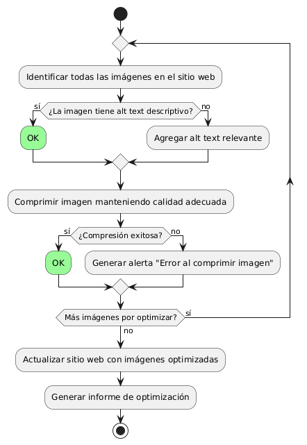
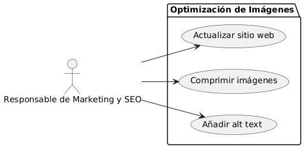

# Epica de Análisis

------
## Diagrama de Actividades
[Creado con plantuml](https://plantuml.com/es/)

{ align=center }
---
El diagrama de actividades representa el proceso de optimización de imágenes para un sitio web. Incluye pasos como la identificación de imágenes, la verificación y adición de alt text, la compresión de imágenes, y la actualización del sitio. Esto mejora la accesibilidad, el rendimiento y el SEO del sitio web.
---

###
###

## Escenario MACP-46
Rubén al buscar una página de ventas de muebles  por medio de palabras claves podrá identificar o encontrar contenidos de nuestra página, encontrando títulos  llamativos y con historias de productos que atraigan a rubén a la investigación de nuestros productos en la página.

<table id="customers">
  <tr class="idtext principal">
    <td>ID MACP-53</td>
  </tr>
  <tr class="single text">
    <td><strong>Requerimiento</strong>: implementar optimización de imágenes (alt text, compresión) ID MACP-53</td>
  </tr>
  <tr class="single gray">
    <td><strong>Historia de usuario</strong></td>
  </tr>
  <tr class="single text">
    <td>Como responsable de Marketing y SEO, quiero implementar la optimización de imágenes, incluyendo alt text y compresión, para mejorar la accesibilidad y el rendimiento del sitio web, además de potenciar el posicionamiento en los motores de búsqueda.</td>
  </tr>
  <tr class="duo">
    <th class="gray"><strong>Estado de la tarea</strong></th>
    <th>En desarrollo</th>
  </tr>
  <tr class="single gray">
    <td><strong>Caso de uso (Pasos)</strong></td>
  </tr>
  <tr class="single text">
    <td>
        <ol>
            <li>El sistema identifica todas las imágenes existentes en el sitio web.</li>
            <li>El sistema analiza si las imágenes tienen un texto alternativo (alt text) descriptivo y relevante.</li>
            <li>El sistema comprime las imágenes manteniendo una calidad adecuada para la web.</li>
            <li>El sistema guarda las imágenes optimizadas y actualiza el sitio web con las versiones comprimidas y el alt text adecuado.</li>
            <li>El sistema verifica que las imágenes optimizadas están correctamente implementadas en el sitio web.</li>
            <li>El sistema genera un informe detallado sobre las optimizaciones realizadas.</li>
        </ol>
    </td>
  </tr>
  <tr class="single gray">
    <td><strong>Criterios de aceptación</strong></td>
  </tr>
  <tr class="single text">
    <td>
        <ol>
            <li>Todas las imágenes del sitio web deben contar con un alt text descriptivo y relevante, mejorando la accesibilidad del sitio.</li>
            <li>Las imágenes deben estar comprimidas de manera que el tamaño de los archivos se reduzca sin comprometer significativamente la calidad visual.</li>
            <li>El rendimiento del sitio web debe mejorar después de la optimización de las imágenes, reflejado en tiempos de carga más rápidos.</li>
            <li>El posicionamiento SEO del sitio debe experimentar una mejora debido a la correcta implementación del alt text y la compresión de imágenes.</li>
            <li>Se debe generar un informe que documente las optimizaciones realizadas, indicando las mejoras en rendimiento y SEO.</li>             
        </ol>
    </td>
  </tr>
 <tr class="duo">
    <th class="gray"><strong>Calidad</strong></th>
    <th>En desarrollo</th>
  </tr>
  <tr class="duo">
    <th class="gray"><strong>Versionamiento</strong></th>
    <th>En desarrollo</th>
  </tr>
</table>

---
## Diagrama de Caso de uso
[Creado con plantuml](https://plantuml.com/es/)

{ align=center }
---
El caso de uso "implementar optimización de imágenes (alt text, compresión)" permite al Responsable de Marketing y SEO mejorar la accesibilidad y el rendimiento del sitio web. Incluye añadir texto alternativo (alt text) a las imágenes y comprimirlas para reducir su tamaño, lo que también favorece el posicionamiento en motores de búsqueda.
---
