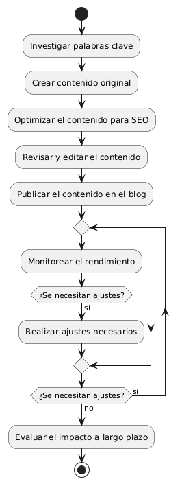
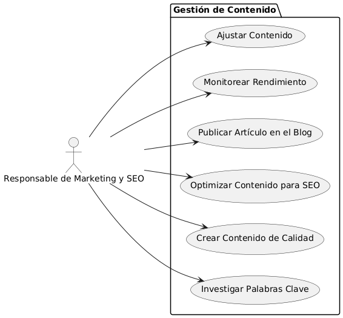

# Epica de Análisis

------
## Diagrama de Actividades
[Creado con plantuml](https://plantuml.com/es/)

{ align=center }
---
El proceso para implementar backlinks de calidad incluye identificar sitios web relevantes, investigar su autoridad, y contactar a sus propietarios. Se envían propuestas para obtener enlaces y, si son aceptadas, se proporciona contenido valioso. Luego, se monitorea el impacto en SEO y se ajusta la estrategia según sea necesario.
---

###
###

## Escenario MACP-46
Rubén al buscar una página de ventas de muebles  por medio de palabras claves podrá identificar o encontrar contenidos de nuestra página, encontrando títulos  llamativos y con historias de productos que atraigan a rubén a la investigación de nuestros productos en la página.

<table id="customers">
  <tr class="idtext principal">
    <td>ID MACP-54</td>
  </tr>
  <tr class="single text">
    <td><strong>Requerimiento</strong>: implementar contenido de calidad en blogs ID MACP-54</td>
  </tr>
  <tr class="single gray">
    <td><strong>Historia de usuario</strong></td>
  </tr>
  <tr class="single text">
    <td>Como responsable de Marketing y SEO, quiero implementar contenido de calidad en los blogs, para mejorar el posicionamiento orgánico y atraer a más usuarios al sitio web.</td>
  </tr>
  <tr class="duo">
    <th class="gray"><strong>Estado de la tarea</strong></th>
    <th>En desarrollo</th>
  </tr>
  <tr class="single gray">
    <td><strong>Caso de uso (Pasos)</strong></td>
  </tr>
  <tr class="single text">
    <td>
        <ol>
            <li>Investigación de Palabras Clave.</li>
            <li>Creación de Contenido.</li>
            <li>Revisión y Edición.</li>
            <li>Publicación.</li>
            <li>Monitoreo y Ajustes.</li>
        </ol>
    </td>
  </tr>
  <tr class="single gray">
    <td><strong>Criterios de aceptación</strong></td>
  </tr>
  <tr class="single text">
    <td>
        <ol>
            <li>Relevancia y Valor: El contenido debe ser relevante y proporcionar valor al público objetivo.</li>
            <li>Optimización SEO: Cada artículo debe estar optimizado con palabras clave, encabezados, y enlaces relevantes.</li>
            <li>Originalidad: El contenido debe ser 100% original, sin duplicados de otras fuentes.</li>
            <li>Frecuencia de Publicación: El contenido debe publicarse regularmente, cumpliendo con el calendario establecido.</li>
            <li>Rendimiento: El contenido debe mejorar métricas clave como el tráfico orgánico y la tasa de conversión.</li>
            <li>Compatibilidad Técnica: El contenido debe estar bien estructurado, optimizado para móviles y carga rápida.</li>          
        </ol>
    </td>
  </tr>
 <tr class="duo">
    <th class="gray"><strong>Calidad</strong></th>
    <th>En desarrollo</th>
  </tr>
  <tr class="duo">
    <th class="gray"><strong>Versionamiento</strong></th>
    <th>En desarrollo</th>
  </tr>
</table>

---
## Diagrama de Caso de uso
[Creado con plantuml](https://plantuml.com/es/)

{ align=center }
---
El caso de uso describe el proceso para que el Responsable de Marketing y SEO implemente contenido de calidad en los blogs. Incluye investigar palabras clave, crear y optimizar el contenido para SEO, publicarlo, y monitorear y ajustar el rendimiento para mejorar el posicionamiento orgánico y atraer más usuarios.
---
